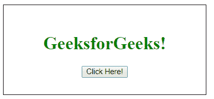
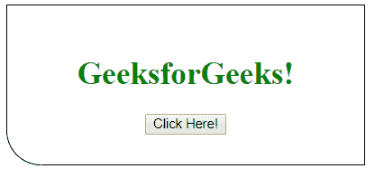
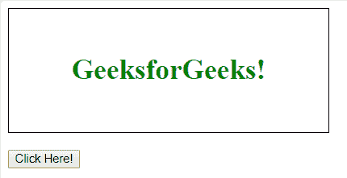
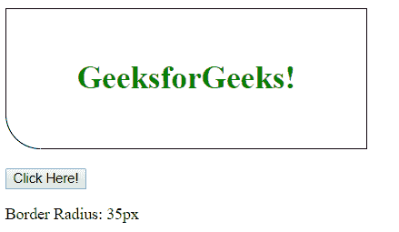

# html | DOM style borderbolotomleftradius property

> 哎哎哎:# t0]https://www . geeksforgeeks . org/html-DOM-style-borderrbotomleftradius-property/

HTML DOM 中的 **borderBottomLeftRadius** 属性用于设置或返回左下角边框的半径。

**语法:**

*   它返回 borderBottomLeftRadius 属性。

    ```html
    object.style.borderBottomLeftRadius
    ```

    *   It is used to set the borderBottomLeftRadius property.

    ```html
    object.style.borderBottomLeftRadius = "length|%|initial|inherit"
    ```

    **参数:**

    *   **长度:**这将定义左下角的形状，默认值为 0。
    *   **%:** 这也是做同样的工作但是用百分比的格式。
    *   **初始值:**这会将属性设置为默认值。
    *   **inherit:** 这将从其父元素继承属性。

    **返回值:**返回左下角边框的半径值。

    **例 1:**

    ```html
    <!DOCTYPE html>
    <html>

    <head>
        <style>
            div {
                border: 1px solid black;
                width: 300px;
                text-align:center;
                padding:30px;
                color: green;
            }
        </style>
    </head>

    <body>

        <div id = "main">
            <h1>GeeksforGeeks!</h1>

            <button onclick="myGeeks()">
                Click Here!
            </button>
        </div>

        <script>
            function myGeeks() {
                document.getElementById("main").style.borderBottomLeftRadius
                        = "35px";
            }
        </script>

    </body>

    </html>                    
    ```

    **输出:**
    **之前点击按钮:**
    
    **之后点击按钮:**
    

    **例 2:**

    ```html
    <!DOCTYPE html>
    <html>

    <head>
        <style>
            div {
                border: 1px solid black;
                width: 300px;
                text-align:center;
                padding:30px;
                color: green;
            }
        </style>
    </head>

    <body>

        <div id = "main">
            <h1>GeeksforGeeks!</h1>
        </div><br>
            <button onclick="myGeeks()">
                Click Here!
            </button>

        <p id="val"></p>

        <script>
            function myGeeks() {
                document.getElementById("main").style.borderBottomLeftRadius
                        = "35px";
                var x = 
                document.getElementById("main").style.borderBottomLeftRadius;

                document.getElementById("val").innerHTML 
                = "Border Radius: " + x;
            }
        </script>

    </body>

    </html>                    
    ```

    **输出:**
    **之前点击按钮:**
    
    **之后点击按钮:**
    

    **支持的浏览器:***borderBottomLeftRadius 属性*支持的浏览器如下:

    *   谷歌 Chrome 5.0，4.0 -webkit-
    *   Internet Explorer 9.0
    *   火狐 4.0， 3.0 -moz-
    *   歌剧 10.5
    *   Safari 5.0、3.1 -webkit-