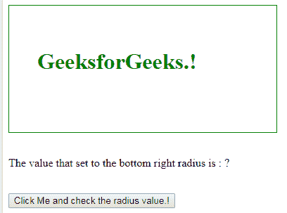
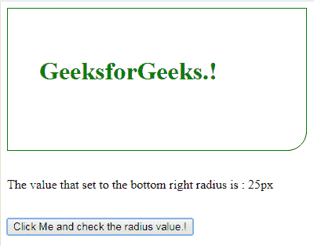

# HTML | DOM 样式边框右半径属性

> 哎哎哎:# t0]https://www . geeksforgeeks . org/html-DOM-style-borderborotomright radius-property/

DOM**borderBottomRightRadius**属性用于从 DOM 树中选择任意元素，并设置其边框右下角的半径样式。

**语法:**

*   它返回 borderBottomRightRadius 属性。

    ```html
    object.style.borderBottomRightRadius

    ```

*   它用于设置 borderBottom 属性。

    ```html
    object.style.borderBottomRightRadius = "length|% [length|%]|
    initial|inherit"

    ```

**参数:**

*   **长度:**定义右下角的轴。
*   **%:** 以百分比形式做同样的丁字裤。
*   **初始值:**将属性设置为默认值。
*   **继承:**它从它的 parrent 元素继承属性

**返回值:**设置或返回右下角边框的半径值。

以下示例说明了 borderBottomRightRadius 属性:

**示例 1:**
这将把右下半径值设置为 25px。

```html
<!DOCTYPE html>
<html>

<head>
    <title>
        HTML | DOM Style borderBottomRightRadius Property
    </title>
    <style>
        div {
            border: 1px solid green;
            width: 300px;
            padding: 40px;
            height: 100px;
            color: green;
        }
    </style>
</head>

<body>

    <div id="mainDiv">
        <h1 onclick="myFunction()">
          GeeksforGeeks.!
        </h1>
    </div>

    <script>
        function myFunction() {
            document.getElementById("mainDiv").style.borderBottomRightRadius =
                                                                        "25px";
        }
    </script>

</body>

</html>
```

**输出:**
之前点击里面的【div】元素。

点击 div 元素后。


**示例 2:**
这将把右下半径值设置为 25px，然后返回设置的值。

```html
<!DOCTYPE html>
<html>

<head>
    <title>
        HTML | DOM Style borderBottomRightRadius Property
    </title>
    <style>
        div {
            border: 1px solid green;
            width: 300px;
            padding: 40px;
            height: 100px;
            color: green;
        }
    </style>
</head>

<body>

    <div id="mainDiv">
        <h1>GeeksforGeeks.!</h1>
    </div>
    <br>
    <p id="val">
      The value that set to the bottom right radius is :
      <span id="value">?</span>
    </p>
    <br>
    <input type="button" onclick="myFunction()" 
           value="Click Me and check the radius value.!" />
    <script>
        function myFunction() {
            document.getElementById("mainDiv").style.borderBottomRightRadius = "25px";
            var x = document.getElementById("mainDiv").style.borderBottomRightRadius;
            document.getElementById("value").innerHTML = x;

        }
    </script>

</body>

</html>
```

**输出:**
之前点击按钮。

点击按钮后。


**支持的浏览器:**以下列出了*HTML | DOM Style borderBottomRightRadius 属性*支持的浏览器:

*   Google Chromeb 5.0
*   Internet Explorer 9.0
*   Firefox 4.0
*   歌剧 10.5
*   Safari 5.0