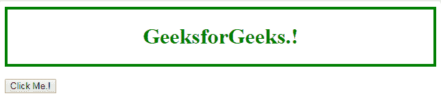
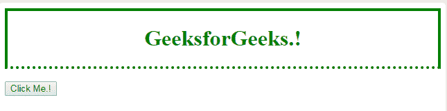
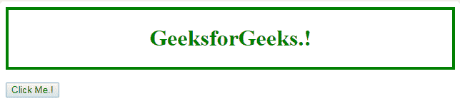
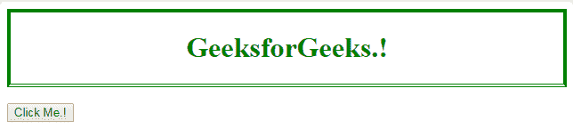

# HTML | DOM 样式 borderBottomStyle 属性

> 原文:[https://www . geesforgeks . org/html-DOM-style-borderbottomstyle-property/](https://www.geeksforgeeks.org/html-dom-style-borderbottomstyle-property/)

HTML DOM 中的 style **borderBottomStyle** 属性用于设置或返回元素下边框的样式。

**语法:**

*   它返回下边框的样式。

    ```html
    object.style.borderBottomStyle
    ```

*   它设置下边框的样式。

    ```html
    border-bottom-style: value;
    ```

**属性值:**

*   **无:**为默认值，使下边框宽度为零。因此，它是不可见的。
*   **隐藏:**用于使下边框不可见。除了在表元素的边界冲突解决的情况下，它类似于无值。
*   **虚线:**指定虚线边框。
*   **虚线:**指定虚线边框。
*   **实心:**指定实心边框。
*   **双:**使下边框变为双实线。在这种情况下，边框宽度等于两条线段的宽度和它们之间的间距之和。
*   **凹槽:**它指定了一个 3D 凹槽边框，但该效果取决于边框颜色值。
*   **脊:**它指定了一个 3D 脊状边框，但这种效果取决于边框颜色值。
*   **嵌入:**它指定了一个 3D 嵌入边框，但该效果取决于边框颜色值。
*   **开始:**它指定了一个 3D 开始边框，但是这个效果取决于边框颜色值。
*   **初始值:**它将 borderBottomStyle 属性设置为默认值。
*   **inherit:** 这将从其父元素继承属性。

**返回值:**返回选中样式的下边框。

**示例 1:** 本示例描述了 borderBottomStyle 属性的虚线值。

```html
<!DOCTYPE html>
<html>
<head>
    <title>
        HTML | DOM Style borderBottomStyle Property
    </title>
    <style>
        div {
            color: green;
            text-align: center;
            border: 4px solid green;
        }
    </style>
</head>

<body>
    <div id = "main">
        <h1>GeeksforGeeks.!</h1>
    </div>
    <br>

    <input type = "button" value = "Click Me.!"
        onclick = "geeks()" />

    <script>
        function geeks() {
            document.getElementById("main").style.borderBottomStyle
                    = "dotted";
        }
    </script>
</body>
</html>                    
```

**输出:**

*   **之前点击按钮:**
    
*   **点击按钮后:**
    

**示例 2:** 本示例描述了 borderBottomStyle 属性的双精度值。

```html
<!DOCTYPE html>
<html>

<head>
    <title>
        HTML | DOM Style borderBottomStyle Property
    </title>
    <style>
        div {
            color: green;
            text-align: center;
            border: 4px solid green;
        }
    </style>
</head>

<body>
    <div id = "main">
        <h1>GeeksforGeeks.!</h1>
    </div>
    <br>

    <input type = "button" value = "Click Me.!"
        onclick = "geeks()" />

    <script>
        function geeks() {
            document.getElementById("main").style.borderBottomStyle 
                    = "double";
        }
    </script>
</body>

</html>                    
```

**输出:**

*   **之前点击按钮:**
    
*   **点击按钮后:**
    

**支持的浏览器:**T2 DOM 样式 borderBottomStyle 属性支持的浏览器如下:

*   谷歌 Chrome 1.0
*   Internet Explorer 5.5
*   Firefox 1.0
*   歌剧 9.2
*   Safari 1.0