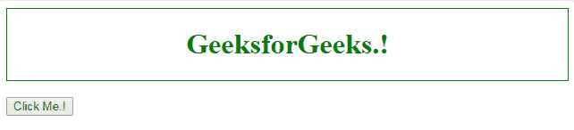
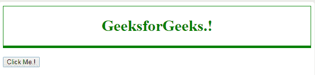
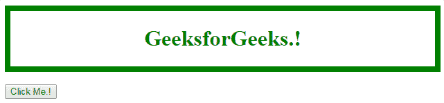
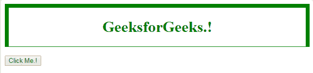

# HTML | DOM 样式 borderBottomWidth 属性

> 原文:[https://www . geesforgeks . org/html-DOM-style-borderbottomwidth-property/](https://www.geeksforgeeks.org/html-dom-style-borderbottomwidth-property/)

HTML DOM 中的样式 **borderBottomWidth** 属性用于设置或返回元素下边框的宽度。

**语法:**

*   它用于返回下边框的宽度。

    ```html
    object.style.borderBottomWidth
    ```

*   它用于设置下边框的宽度。

    ```html
    border-bottom-width: "medium|thin|thick|length|initial|inherit";
    ```

**返回值:**返回所选元素的下边框宽度。

**属性值:**

*   **中:**设置中等大小的下边框。这是默认值。
*   **薄:**设置底部的薄边框。
*   **粗:**设置粗底边框。
*   **长度:**设置边框的宽度。它不取负值。
*   **初始值:**将 borderBottomWidth 属性设置为默认值。
*   **inherit:** 用于从其父元素继承。

**示例 1:** 本示例使用 borderBottomWidth 属性的厚值。

```html
<!DOCTYPE html>
<html>

<head>
    <title>
        HTML | DOM Style borderBottomWidth Property
    </title>
    <style>
        div {
            color: green;
            border: 1px solid green;
            text-align: center;
        }
    </style>
</head>

<body>
    <div id="main">
        <h1>GeeksforGeeks.!</h1>
    </div>
    <br>

    <input type="button" value="Click Me.!" onclick="geeks()" />

    <script>
     function geeks() {
        document.getElementById("main").style.borderBottomWidth 
                                                     = "thick";
        }
    </script>
</body>

</html>
```

**输出:**
**之前点击按钮:**

**之后点击按钮:**


**示例 2:** 本示例使用 borderBottomWidth 属性的精简值。

```html
<!DOCTYPE html>
<html>
<head>
    <title>
        HTML | DOM Style borderBottomWidth Property
    </title>
    <style>
        div {
            color: green;
            border: 8px solid green;
            text-align: center;
        }
    </style>
</head>

<body>
    <div id = "main">
        <h1>GeeksforGeeks.!</h1>
    </div>
    <br>

    <input type = "button" value = "Click Me.!" 
        onclick = "geeks()" />

    <script>
    function geeks() {
        document.getElementById("main").style.borderBottomWidth
                    = "thin";
    }
    </script>
</body>
</html>                    
```

**输出:**
**之前点击按钮:**

**之后点击按钮:**


**支持的浏览器:**下面列出了*样式 borderBottomWidth 属性*支持的浏览器:

*   谷歌 Chrome 1.0
*   Internet Explorer 4.0
*   Firefox 1.0
*   歌剧 3.5
*   Safari 1.0