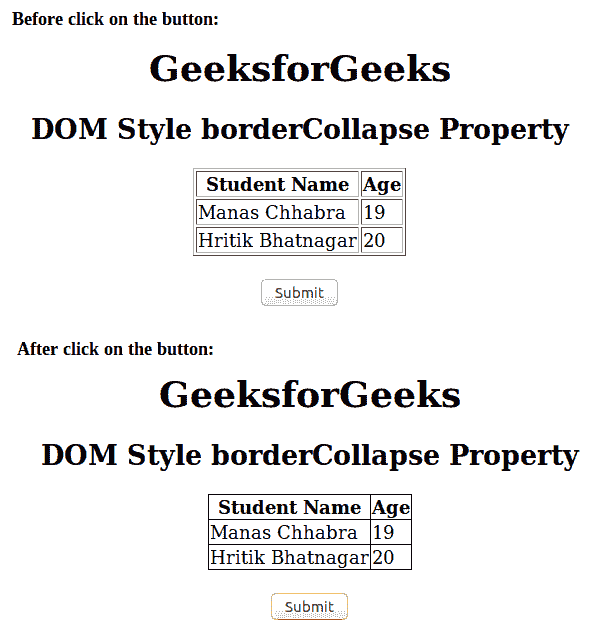
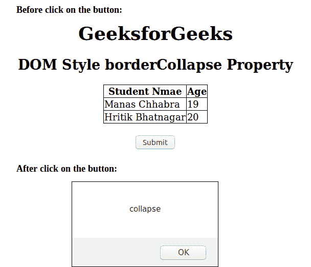

# HTML | DOM 样式 borderCollapse 属性

> 原文:[https://www . geesforgeks . org/html-DOM-style-bordercollapse-property/](https://www.geeksforgeeks.org/html-dom-style-bordercollapse-property/)

HTML 中的 DOM Style **borderCollapse** 属性用于设置或返回是否折叠成单个边框的表格边框。

**语法:**

*   它用于返回 borderCollapse 属性。

    ```html
    object.style.borderCollapse 
    ```

*   它用于设置 borderCollapse 属性。

    ```html
    object.style.borderCollapse = "separate|collapse|initial|inherit" 
    ```

**返回值:**返回一个代表表格边框的字符串值。

**示例:**

```html
<!DOCTYPE html>
<html>

<head>
    <title>
        DOM Style borderCollapse Property
    </title>
</head>

<body>
    <center>
        <h1>GeeksforGeeks</h1>
        <h2>DOM Style borderCollapse Property</h2>

        <table id="gfg" border="1">
            <tr>
                <th>Student Name</th>
                <th>Age</th>
            </tr>
            <tr>
                <td>Manas Chhabra</td>
                <td>19</td>
            </tr>
            <tr>
                <td>Hritik Bhatnagar</td>
                <td>20</td>
            </tr>
        </table>
        <br>

        <button type="button" onclick="geeks()">
            Submit
        </button>

        <!-- script to collapse border -->
        <script>
            function geeks() {
                document.getElementById("gfg").style.borderCollapse =
                                                          "collapse";
            }
        </script>
    </center>
</body>

</html>                            
```

**输出:**


**例 2:**

```html
<!DOCTYPE html>
<html>

<head>
    <title>
        DOM Style borderCollapse Property
    </title>
</head>

<body>
    <center>
        <h1>GeeksforGeeks</h1>
        <h2>DOM Style borderCollapse Property</h2>

        <table id="gfg" border="1" 
               style="border-collapse:collapse;">

            <tr>
                <th>Student Name </th>
                <th>Age</th>
            </tr>
            <tr>
                <td>Manas Chhabra</td>
                <td>19</td>
            </tr>
            <tr>
                <td>Hritik Bhatnagar</td>
                <td>20</td>
            </tr>
        </table>
        <br>

        <button type="button" onclick="geeks()">
            Submit
        </button>

        <!-- script to return borderCollapse value -->
        <script>
            function geeks() {
                alert(document.getElementById("gfg").style.borderCollapse);
            }
        </script>
    </center>
</body>

</html>   
```

**输出:**


**支持的浏览器:**T2 DOM Style borderCollapse 属性支持的浏览器如下:

*   谷歌 Chrome 1.2
*   Internet Explorer 4.0
*   Firefox 1.0
*   Opera 4.0
*   Safari 1.0