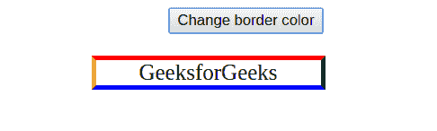

# HTML | DOM 样式边框颜色属性

> 原文:[https://www . geesforgeks . org/html-DOM-style-bordercolor-property/](https://www.geeksforgeeks.org/html-dom-style-bordercolor-property/)

**DOM 样式边框颜色**属性指定元素边框的颜色。它可以显式给定，从父级继承，或者默认情况下采用默认值。

**语法:**

*   要获取边框颜色属性:

```html
object.style.borderColor
```

*   要设置边框颜色属性:

```html
object.style.borderColor = "color | transparent | initial |
inherit"
```

**返回值:**返回代表边框颜色的字符串值。
**房产价值**

*   **颜色:**指定对应元素的边框颜色。黑色是默认颜色。
*   **透明:**将对应元素的边框颜色设置为透明。
*   **继承:**当没有为此字段指定值时，从元素的父元素继承。如果没有父元素意味着这个元素是根元素，那么它采用初始值(或缺省值)。
*   **初始值:**此关键字将属性的初始值(或默认值)应用于元素。初始值不应与浏览器样式表指定的值混淆。当边框颜色设置为初始时，它显示为黑色(默认)。
    *   **语法:**

```html
borderColor: "red";
```

*   **程序:**

## 超文本标记语言

```html
<!DOCTYPE html>
<html>

<head>
    <style>
        #GFG_Div {
            width: 200px;
            text-align: center;
            font-size: 20px;
            margin-left: 210px;
            margin-top: 20px;
            border: thick solid red;
        }
    </style>
</head>

<body align="center">
    <button onclick="GFG_Function()">
        Change border color
    </button>
    <div id="GFG_Div">GeeksforGeeks</div>
    <br>
    <script>
        function GFG_Function() {
            document.getElementById("GFG_Div")
                .style.borderColor = "green";
        }
    </script>

</body>

</html>
```

*   **输出:**
    之前点击按钮:


*   点击按钮后:


*   **语法:**

```html
borderColor: "red green";
```

*   **程序:**

## 超文本标记语言

```html
<!DOCTYPE html>
<html>

<head>
    <style>
        #GFG_Div {
            width: 200px;
            text-align: center;
            font-size: 20px;
            margin-left: 210px;
            margin-top: 20px;
            border: thick solid red;
        }
    </style>
</head>

<body align="center">
    <button onclick="GFG_Function()">
        Change border color
    </button>
    <div id="GFG_Div">GeeksforGeeks</div>
    <br>
    <script>
        function GFG_Function() {
            document.getElementById("GFG_Div")
                .style.borderColor = "red green";
        }
    </script>

</body>

</html>
```

*   **输出:**
    之前点击按钮:


*   点击按钮后:


*   **语法:**

```html
borderColor: "red green blue";
```

*   **程序:**

## 超文本标记语言

```html
<!DOCTYPE html>
<html>

<head>
    <style>
        #GFG_Div {
            width: 200px;
            text-align: center;
            font-size: 20px;
            margin-left: 210px;
            margin-top: 20px;
            border: thick solid red;
        }
    </style>
</head>

<body align="center">
    <button onclick="GFG_Function()">
        Change border color
    </button>
    <div id="GFG_Div">GeeksforGeeks</div>
    <br>
    <script>
        function GFG_Function() {
            document.getElementById("GFG_Div")
                .style.borderColor = "red green blue";
        }
    </script>

</body>

</html>
```

*   **输出:**
    之前点击按钮:


*   点击按钮后:


*   **语法:**

```html
borderColor: "red green blue orange"; 
```

*   **程序:**

## 超文本标记语言

```html
<!DOCTYPE html>
<html>

<head>
    <style>
        #GFG_Div {
            width: 200px;
            text-align: center;
            font-size: 20px;
            margin-left: 210px;
            margin-top: 20px;
            border: thick solid red;
        }
    </style>
</head>

<body align="center">
    <button onclick="GFG_Function()">
        Change border color
    </button>
    <div id="GFG_Div">GeeksforGeeks</div>
    <br>
    <script>
        function GFG_Function() {
            document.getElementById("GFG_Div")
                .style.borderColor = "red green blue orange";
        }
    </script>

</body>

</html>
```

**输出:**
之前点击按钮:


点击按钮后:



**示例:**这里会看到透明的使用，它将对应元素的边框颜色设置为透明。

*   **语法:**

```html
borderColor = "transparent"
```

*   **程序:**

## 超文本标记语言

```html
<!DOCTYPE html>
<html>

<head>
    <style>
        #GFG_Div {
            width: 200px;
            text-align: center;
            font-size: 20px;
            margin-left: 210px;
            margin-top: 20px;
            border: thick solid red;
        }
    </style>
</head>

<body align="center">
    <button onclick="GFG_Function()">
        Transparent border color
    </button>
    <div id="GFG_Div">GeeksforGeeks</div>
    <br>
    <script>
        function GFG_Function() {
            document.getElementById("GFG_Div")
                .style.borderColor = "transparent";
        }
    </script>

</body>

</html>
```

*   **输出:**
    之前点击按钮:


*   点击按钮后:


**浏览器支持:**T2 DOM Style borderColor 属性支持的浏览器如下:

*   谷歌 Chrome 1.0
*   Internet Explorer 4.0
*   Mozilla firefox 1.0
*   歌剧 3.5
*   Safari 1.0