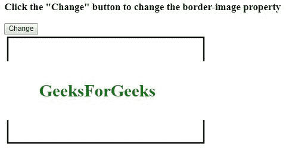
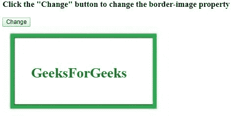
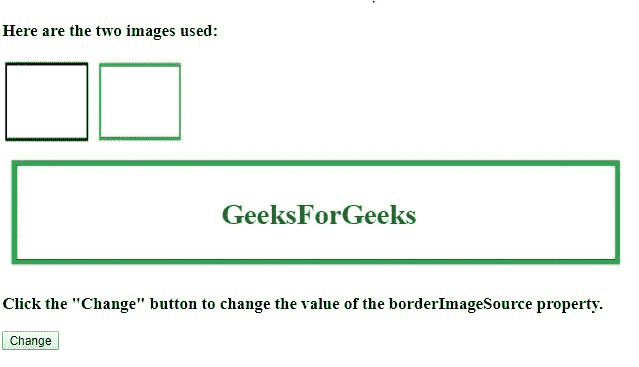
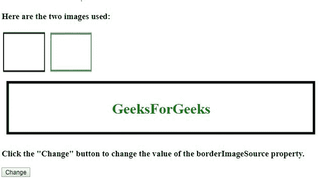

# HTML | DOM 样式边框属性

> 原文:[https://www . geesforgeks . org/html-DOM-style-borderimage-property/](https://www.geeksforgeeks.org/html-dom-style-borderimage-property/)

HTML 中的 **DOM 样式边框**属性是一个简写属性，用于设置边框来源、边框切片、边框宽度、边框开始和边框结束属性。
**语法:**

*   它用于返回边框属性。

```html
object.style.borderImage
```

*   它用于设置边框属性。

```html
object.style.borderImage = "source slice width outset repeat|
initial|inherit"
```

**属性值:**在边界边界属性中有 7 个属性值，如上所述，如下所述:

*   [边框-图像-源:](https://www.geeksforgeeks.org/html-dom-style-borderimagesource-property/)此参数保存将要使用的源图像。
*   [边框-图像-切片:](https://www.geeksforgeeks.org/html-dom-style-borderimageslice-property/)此参数指定图像-边框的向内偏移。
*   [边框-图像-宽度:](https://www.geeksforgeeks.org/html-dom-style-borderimagewidth-property/)此参数保存所用图像边框的宽度。
*   [边界-图像-开始:](https://www.geeksforgeeks.org/html-dom-style-borderimageoutset-property/)此参数定义应该延伸哪个边界区域。
*   [边框-图像-重复:](https://www.geeksforgeeks.org/html-dom-style-borderimagerepeat-property/)此参数定义边框应该重复、圆角或拉伸。
*   **初始值:**该属性值用于将该属性设置为默认值。
*   **inherit:** 该属性值用于从其父元素继承该属性。

**返回值:**
它返回一个代表元素**边框图像**属性的字符串值。
**示例-1:** 这显示了如何更改边框图像。

## 超文本标记语言

```html
<!DOCTYPE html>
<html>

<head>
    <style>
        #my {
            border: 50px solid transparent;
            width: 250px;
            padding: 15px 15px;

             <!-- Safari 5 -->
            -webkit-border-image:
url(https://media.geeksforgeeks.org/wp-content/uploads/bord-1-300x161.jpg)
              100 100 stretch;

             <!-- Opera 12 -->
            -o-border-image:
url(https://media.geeksforgeeks.org/wp-content/uploads/bord-1-300x161.jpg)
              100 100 stretch;

             border-image:
url(https://media.geeksforgeeks.org/wp-content/uploads/bord-1-300x161.jpg)
               100 100 stretch;
        }
    </style>
</head>

<body>

    <h3>Click the "Change" button to change the border-image property</h3>

    <button onclick="myFunction()">Change</button>

    <div id="my">
        <h1><font color="green">GeeksForGeeks</font></h1>
    </div>

    <script>
        function myFunction() {
              <!-- Code for Safari 5 -->
            document.getElementById("my").style.WebkitBorderImage =
"url(https://media.geeksforgeeks.org/wp-content/uploads/bord1-1-300x162.jpg)30 30 round";

             <!-- Code for Opera 12 -->
            document.getElementById("my").style.OBorderImage =
"url(https://media.geeksforgeeks.org/wp-content/uploads/bord1-1-300x162.jpg)30 30 round";

            document.getElementById("my").style.borderImage =
"url(https://media.geeksforgeeks.org/wp-content/uploads/bord1-1-300x162.jpg)30 30 round";
        }
    </script>

</body>

</html>
```

**输出:**
**之前点击按钮:**



**点击按钮后:**“图像边框发生变化”



**示例-2:** 样式边框来源属性。

## 超文本标记语言

```html
<!DOCTYPE html>
<html>

<head>
    <style>
        div {
            border: 30px solid transparent;
            border-image:
              url(https://media.geeksforgeeks.org/wp-content/uploads/bord1-1-300x162.jpg);
            border-image-slice: 30;
            border-image-width: 1 1 1 1;
            border-image-outset: 0;
            border-image-repeat: round;
        }
    </style>
</head>

<body>
    <h3>Here are the two images used:</h3>
    

    

    <div id="main">
        <h1><center><font color="green" >
          GeeksForGeeks
         </font></center></h1>
    </div>

    <h3>Click the "Change" button to change the value of the borderImageSource property.</h3>

    <button onclick="myFunction()">Change</button>

    <script>
        function myFunction() {
            document.getElementById("main").style.borderImageSource =
              "url(https://media.geeksforgeeks.org/wp-content/uploads/bord-1-300x161.jpg)";
        }
    </script>
</body>

</html>
```

**输出:**
**之前点击按钮:**



**点击按钮后:**



**支持的浏览器:**T2 DOM 样式边框属性支持的浏览器如下:

*   谷歌 Chrome 1.0
*   Internet Explorer 4.0
*   Firefox 1.0
*   歌剧 3.5
*   Safari 1.0