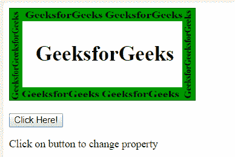
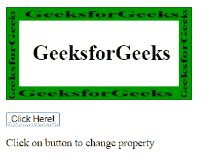
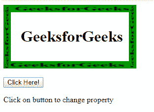
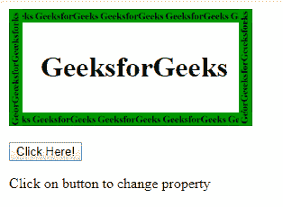
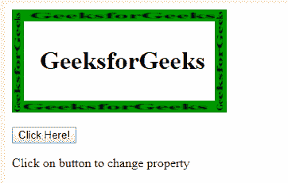
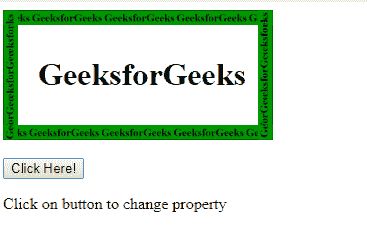
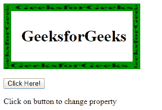
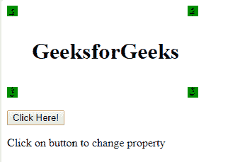

# HTML | DOM 样式边框标记属性

> 原文:[https://www . geeksforgeeks . org/html-DOM-style-borderimagerepeat-property/](https://www.geeksforgeeks.org/html-dom-style-borderimagerepeat-property/)

HTML DOM 中的**borderimagerepat**属性用于设置或返回 borderimagerepat 属性。它指定边框图像是否应该重复填充区域、拉伸填充区域、设置为初始值、从其父级继承属性等。根据需要，它将相应地设置，使图像边框看起来更有吸引力。

**语法:**

*   它返回 borderImageRepeat 属性。

```html
object.style.borderImageRepeat
```

*   它设置 borderImageRepeat 属性。

```html
object.style.borderImageRepeat="stretch|repeat|round|
initial | inherit"
```

**返回值:**返回边框-图像重复属性。

**属性值:**

*   **拉伸:**此属性用于拉伸图像以填充区域。这是默认值。

**语法:**

```html
object.style.borderImageRepeat="stretch";
```

*   **示例:**

## 超文本标记语言

```html
<!DOCTYPE html>
<html>

<head>
    <style>
        #GFG {
            border: 20px solid transparent;
            width: 200px;
            padding: 10px 20px;

            /* For Safari Browser */
            -webkit-border-image: url(
"https://media.geeksforgeeks.org/wp-content/uploads/bir1.png")
            50 50 round;

            /* For Opera Browser */
            -o-border-image: url(
"https://media.geeksforgeeks.org/wp-content/uploads/bir1.png")
            50 50 round;

            border-image: url(
"https://media.geeksforgeeks.org/wp-content/uploads/bir1.png")
            50 50 round;
        }
    </style>
</head>

<body>

    <div id = "GFG">
        <h1>GeeksforGeeks</h1>
    </div><br>

    <button onclick = "myGeeks()">
        Click Here!
    </button>

<p>
        Click on button to change property
    </p>

    <script>
        function myGeeks() {

            /* For Safari Browser */
            document.getElementById("GFG").style.WebkitBorderImage =
"url(https://media.geeksforgeeks.org/wp-content/uploads/bir1.png)
            50 50 stretch";

            /* For Opera Browser */
            document.getElementById("GFG").style.OBorderImage =
"url(https://media.geeksforgeeks.org/wp-content/uploads/bir1.png)
            50 50 stretch";

            document.getElementById("GFG").style.borderImage =
"url(https://media.geeksforgeeks.org/wp-content/uploads/bir1.png)
            50 50 stretch";
        }
    </script>

</body>
</html>                   
```

*   **输出:**
    **之前点击按钮:**



*   **点击按钮后:**



*   **重复:**此属性用于重复边框图像来填充区域。
    **语法:**

```html
object.style.borderImageRepeat =  "repeat";
```

*   **示例:**

## 超文本标记语言

```html
<!DOCTYPE html>
<html>

<head>
    <style>
        #GFG {
            border: 15px solid transparent;
            width: 200px;
            padding: 10px 20px;

            /* For Safari Browser */
            -webkit-border-image: url(
"https://media.geeksforgeeks.org/wp-content/uploads/bir1.png")
            50 50 stretch;

            /* For Opera Browser */
            -o-border-image: url(
"https://media.geeksforgeeks.org/wp-content/uploads/bir1.png")
            50 50 stretch;

            border-image: url(
"https://media.geeksforgeeks.org/wp-content/uploads/bir1.png")
            50 50 stretch;
        }
    </style>
</head>

<body>

    <div id = "GFG">
        <h1>GeeksforGeeks</h1>
    </div><br>

    <button onclick="myGeeks()">
        Click Here!
    </button>

<p>
        Click on button to change property
    </p>

    <script>
        function myGeeks() {

            /* For Safari Browser */
            document.getElementById("GFG").style.WebkitBorderImage =
"url(https://media.geeksforgeeks.org/wp-content/uploads/bir1.png)
            50 50 repeat";

            /* For Opera Browser */
            document.getElementById("GFG").style.OBorderImage =
"url(https://media.geeksforgeeks.org/wp-content/uploads/bir1.png)
            50 50 repeat";

            document.getElementById("GFG").style.borderImage =
"url(https://media.geeksforgeeks.org/wp-content/uploads/bir1.png)
            50 50 repeat";
        }
    </script>
</body>

</html>                   
```

*   **输出:**
    **之前点击按钮:**



*   **点击按钮后:**



*   **round:** 用于重复图像填充区域。如果图像没有填满整幅图块中的区域，图像将被重新缩放。

**语法:**

```html
object.style.borderImageRepeat = "round";
```

*   **例:**

## 超文本标记语言

```html
<!DOCTYPE html>
<html>

<head>
    <style>
        #GFG {
            border: 15px solid transparent;
            width: 200px;
            padding: 10px 20px;

            /* For Safari Browser */
            -webkit-border-image: url(
"https://media.geeksforgeeks.org/wp-content/uploads/bir1.png")
            50 50 stretch;

            /* For Opera Browser */
            -o-border-image: url(
"https://media.geeksforgeeks.org/wp-content/uploads/bir1.png")
            50 50 stretch;

            border-image: url(
"https://media.geeksforgeeks.org/wp-content/uploads/bir1.png")
            50 50 stretch;
        }
    </style>
</head>

<body>

    <div id = "GFG">
        <h1>GeeksforGeeks</h1>
    </div><br>

    <button onclick="myGeeks()">
        Click Here!
    </button>

<p>
        Click on button to change property
    </p>

    <script>
        function myGeeks() {

            /* For Safari Browser */
            document.getElementById("GFG").style.WebkitBorderImage =
"url(https://media.geeksforgeeks.org/wp-content/uploads/bir1.png)
            50 50 round";

            /* For Opera Browser */
            document.getElementById("GFG").style.OBorderImage =
"url(https://media.geeksforgeeks.org/wp-content/uploads/bir1.png)
            50 50 round";

            document.getElementById("GFG").style.borderImage =
"url(https://media.geeksforgeeks.org/wp-content/uploads/bir1.png)
            50 50 round";
        }
    </script>
</body>

</html>                   
```

*   **输出:**
    **点击按钮前:**



*   **点击按钮后:**



*   **空间:**与 repeat 值的唯一区别是，如果它没有用整块瓷砖填充该区域，则多余的空间会分布在瓷砖周围。
    **语法:**

```html
object.style.borderImageRepeat = "space";
```

*   **示例:**

## 超文本标记语言

```html
<!DOCTYPE html>
<html>
<head>
    <style>
        #GFG {
            border: 15px solid transparent;
            width: 200px;
            padding: 10px 20px;

            /* For Safari Browser */
            -webkit-border-image: url(
"https://media.geeksforgeeks.org/wp-content/uploads/bir1.png")
            50 50 stretch;

            /* For Opera Browser */
            -o-border-image: url(
"https://media.geeksforgeeks.org/wp-content/uploads/bir1.png")
            50 50 stretch;

            border-image: url(
"https://media.geeksforgeeks.org/wp-content/uploads/bir1.png")
            50 50 stretch;
        }
    </style>
</head>

<body>

    <div id="GFG">
        <h1>GeeksforGeeks</h1>
    </div><br>

    <button onclick="myGeeks()">
        Click Here!
    </button>

<p>
        Click on button to change property
    </p>

    <script>
        function myGeeks() {

            /* For Safari Browser */
            document.getElementById("GFG").style.WebkitBorderImage =
"url(https://media.geeksforgeeks.org/wp-content/uploads/bir1.png)
    50 50 space";

            /* For Opera Browser */
            document.getElementById("GFG").style.OBorderImage =
"url(https://media.geeksforgeeks.org/wp-content/uploads/bir1.png)
        50 50 space";
            document.getElementById("GFG").style.borderImage =
"url(https://media.geeksforgeeks.org/wp-content/uploads/bir1.png)
        50 50 space";
        }
    </script>
</body>

</html>                   
```

*   **输出:**
    **点击按钮前:**



*   **点击按钮后:**



*   **初始值:**用于将 borderImageRepeat 属性设置为默认值。
*   **inherit:** 用于从其父元素设置 borderImageRepeat 属性。

**浏览器支持:**以下列出了 *DOM 样式 borderImageRepeat 属性*支持的浏览器:

*   谷歌 Chrome
*   Internet Explorer 11.0
*   Mozilla firefox
*   Safari 6.0