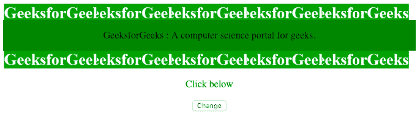
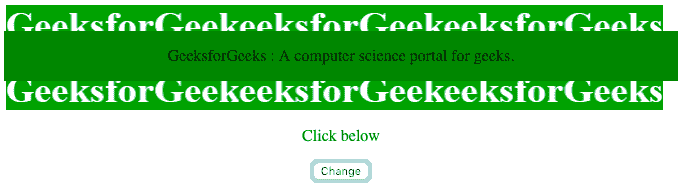
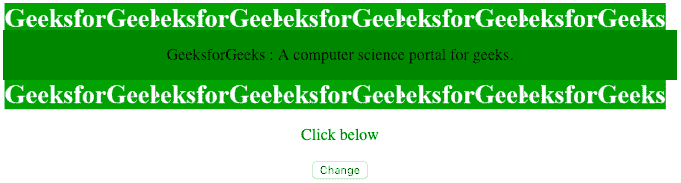
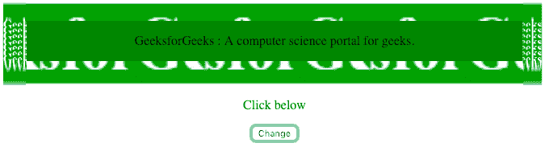
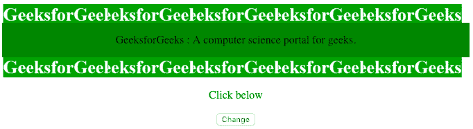
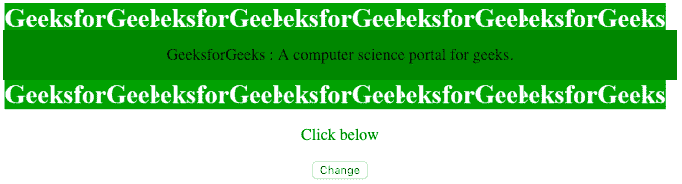
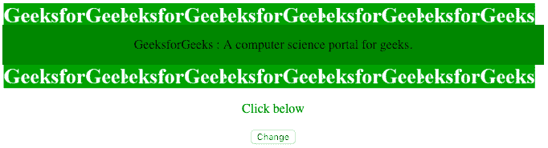
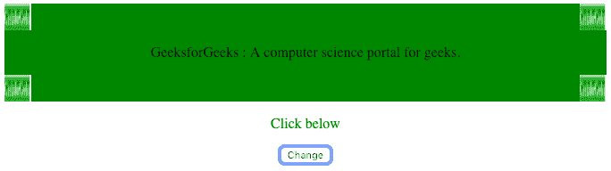

# HTML | DOM 样式边框切片属性

> 原文:[https://www . geeksforgeeks . org/html-DOM-style-borderimageslice-property/](https://www.geeksforgeeks.org/html-dom-style-borderimageslice-property/)

**边界边缘切片属性**用于指定*图像边界*的向内偏移。用户可以用*百分比*、*数字*或*全局值*来指定该属性的值。

**语法:**

```html
object.style.borderImageSlice = "number|%|fill|initial|inherit"
```

**返回值:**返回一个字符串值，代表元素的边框图像切片属性

**属性值:**

*   数字
*   %
*   充满
*   最初的
*   继承

**1。number:**borderImageSlice 属性可以将数字作为值，其中该数字表示图像或矢量坐标中的像素(如果图像是矢量图像)。

**示例-1:**

## 超文本标记语言

```html
<!DOCTYPE html>
<html>

<head>
    <style>
        div {
            background-color: green;
            border: 30px solid transparent;
            border-image: url(
'https://media.geeksforgeeks.org/wp-content/uploads/border-3.png');
            border-image-slice: 40;
            border-image-width: 1 1 1 1;
            border-image-outset: 0;
            border-image-repeat: round;
        }
    </style>
</head>

<body>
    <center>
        <div id="main">

<p>
                GeeksforGeeks :
              A computer science portal for geeks.
            </p>

        </div>
        <p style="color:green;">Click below</p>

        <button onclick="myFunction()">Change</button>
    </center>

    <script>
        function myFunction() {

            document.getElementById(
              "main").style.borderImageSlice = "30";
        }
    </script>
</body>

</html>
```

**输出:**

*   **点击前:**



*   **点击后:**



**2。百分比(%):** 百分比相对于默认值为 100%的图像大小。

**示例-2:**

## 超文本标记语言

```html
<!DOCTYPE html>
<html>

<head>
    <style>
        div {
            background-color: green;
            border: 30px solid transparent;
            border-image: url(
'https://media.geeksforgeeks.org/wp-content/uploads/border-3.png');
            border-image-slice: 40;
            border-image-width: 1 1 1 1;
            border-image-outset: 0;
            border-image-repeat: round;
        }
    </style>
</head>

<body>
    <center>
        <div id="main">

<p>
                GeeksforGeeks : 
              A computer science portal for geeks.
            </p>

        </div>
        <p style="color:green;">Click below</p>

        <button onclick="myFunction()">Change</button>
    </center>

    <script>
        function myFunction() {

            document.getElementById(
              "main").style.borderImageSlice = "30% 30%";
        }
    </script>
</body>

</html>
```

**输出:**

*   **点击前:**



*   **点击后:**



**3。填充:**使边框的中间部分得以保留。

**示例-3:**

## 超文本标记语言

```html
<!DOCTYPE html>
<html>

<head>
    <style>
        div {
            background-color: green;
            border: 30px solid transparent;
            border-image: url(
'https://media.geeksforgeeks.org/wp-content/uploads/border-3.png');
            border-image-slice: 40;
            border-image-width: 1 1 1 1;
            border-image-outset: 0;
            border-image-repeat: round;
        }
    </style>
</head>

<body>
    <center>
        <div id="main">

<p>
                GeeksforGeeks :
              A computer science portal for geeks.
            </p>

        </div>
        <p style="color:green;">Click below</p>

        <button onclick="myFunction()">Change</button>
    </center>

    <script>
        function myFunction() {

            document.getElementById(
              "main").style.borderImageSlice = "fill";
        }
    </script>
</body>

</html>
```

**输出:**

*   **点击前:**



*   **点击后:**


**4。initial:** 将属性设置为默认值。这里的默认值是 100%。

**示例-4:**

## 超文本标记语言

```html
<!DOCTYPE html>
<html>

<head>
    <style>
        div {
            background-color: green;
            border: 30px solid transparent;
            border-image: url(
'https://media.geeksforgeeks.org/wp-content/uploads/border-3.png');
            border-image-slice: 40;
            border-image-width: 1 1 1 1;
            border-image-outset: 0;
            border-image-repeat: round;
        }
    </style>
</head>

<body>
    <center>
        <div id="main">

<p>
                GeeksforGeeks : 
              A computer science portal for geeks.
            </p>

        </div>
        <p style="color:green;">Click below</p>

        <button onclick="myFunction()">Change</button>
    </center>

    <script>
        function myFunction() {

            document.getElementById(
              "main").style.borderImageSlice = "initial";
        }
    </script>
</body>

</html> 
```

**输出:**

*   **点击前:**



*   **点击后:**


**5。inherit:** 从其父元素继承该属性。

**示例-5:**

## 超文本标记语言

```html
<!DOCTYPE html>
<html>

<head>
    <style>
        div {
            background-color: green;
            border: 30px solid transparent;
            border-image: url(
'https://media.geeksforgeeks.org/wp-content/uploads/border-3.png');
            border-image-slice: 40;
            border-image-width: 1 1 1 1;
            border-image-outset: 0;
            border-image-repeat: round;
        }
    </style>
</head>

<body>
    <center>
        <div id="main">

<p>
                GeeksforGeeks : 
              A computer science portal for geeks.
            </p>

        </div>
        <p style="color:green;">Click below</p>

        <button onclick="myFunction()">Change</button>
    </center>

    <script>
        function myFunction() {

            document.getElementById(
          "main").style.borderImageSlice = "inherit";
        }
    </script>
</body>

</html>
```

**输出:**

*   **点击前:**



*   **点击后:**



**支持的浏览器:**以下列出的 *DOM 样式边框切片属性*支持的浏览器:

*   谷歌 Chrome
*   边缘
*   Mozilla Firefox
*   歌剧
*   旅行队