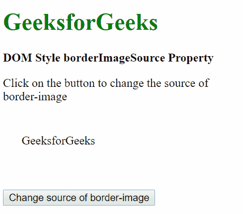

# HTML | DOM 样式边框来源属性

> 原文:[https://www . geeksforgeeks . org/html-DOM-style-borderimagesource-property/](https://www.geeksforgeeks.org/html-dom-style-borderimagesource-property/)

DOM 样式**边框来源**属性用于**设置**或**返回**要使用的图像，而不是边框样式属性给出的样式。

**语法:**

*   获取边框来源属性

    ```html
    object.style.borderImageSource
    ```

*   设置边框来源属性

    ```html
    object.style.borderImageSource = "none | image | initial |
    inherit"
    ```

**返回值:**返回一个字符串值，代表元素的边框图像源属性。

**属性值**

1.  **none:** This sets the property to use no image.

    **示例-1:**

    ```html
    <!DOCTYPE html>
    <html lang="en">

    <head>
        <title>DOM Style borderImageSource Property</title>
        <style>
            .item {
                height: 50px;
                border: 25px solid transparent;

                /* Setting the border before demonstrate
                   the effect of 'none' */
                border-image: 
    url('https://media.geeksforgeeks.org/wp-content/uploads/border-img.png');
            }
        </style>
    </head>

    <body>
        <h1 style="color: green">GeeksforGeeks</h1>
        <b>DOM Style borderImageSource Property</b>

        <p>Click on the button to change 
          the source of border-image</p>

        <div class="item">GeeksforGeeks</div>

        <button onclick="changeSource()">
          Change source of border-image
        </button>

        <script>
            function changeSource() {
                elem = document.querySelector('.item');

                // Setting the border image source to none
                elem.style.borderImageSource = "none";
            }
        </script>
    </body>

    </html>
    ```

    **输出:**

    *   **点击按钮前:**
        
    *   **按下按钮后:**
        
2.  **image:** This sets the image to the path specified.

    **示例-2:**

    ```html
    <!DOCTYPE html>
    <html lang="en">

    <head>
        <title>DOM Style borderImageSource Property</title>
        <style>
            .item {
                height: 50px;
                border: 25px solid transparent;
            }
        </style>
    </head>

    <body>
        <h1 style="color: green">GeeksforGeeks</h1>
        <b>DOM Style borderImageSource Property</b>

        <p>Click on the button to change the source of border-image</p>

        <div class="item">GeeksforGeeks</div>
        <button onclick="changeSource()">
          Change source of border-image
        </button>

        <script>
            function changeSource() {
                elem = document.querySelector('.item');

                // Setting the border image source to another image
                elem.style.borderImageSource =
    "url('https://media.geeksforgeeks.org/wp-content/uploads/border-img.png')";
            }
        </script>
    </body>

    </html>
    ```

    **输出:**

    *   **点击按钮前:**
        
    *   **点击按钮后:**
        
3.  **initial**: This is used to set this property to its default value.

    **示例-3:**

    ```html
    <!DOCTYPE html>
    <html lang="en">

    <head>
        <title>DOM Style borderImageSource Property</title>
        <style>
            .item {
                height: 50px;
                border: 25px solid transparent;
                /* Setting the border before to 
                   demonstrate the effect of 'initial' */
                border-image: 
    url('https://media.geeksforgeeks.org/wp-content/uploads/border-img.png');
            }
        </style>
    </head>

    <body>
        <h1 style="color: green">GeeksforGeeks</h1>
        <b>DOM Style borderImageSource Property</b>
        <p>Click on the button to change the source of border-image</p>
        <div class="item">GeeksforGeeks</div>
        <button onclick="changeSource()">
           Change source of border-image
        </button>

        <script>
            function changeSource() {
                elem = document.querySelector('.item');

                // Setting the border image source to initial
                elem.style.borderImageSource = "initial";
            }
        </script>
    </body>

    </html>
    ```

    **输出:**

    *   **点击按钮前:**
        
    *   **按下按钮后:**
        
4.  **inherit**: This is used to inherit the property from its parent.

    **示例-4:**

    ```html
    <!DOCTYPE html>
    <html lang="en">

    <head>
        <title>DOM Style borderImageSource Property</title>
        <style>
            .item {
                height: 50px;
                border: 25px solid transparent;
            }

            #parent {
                /* Setting the border of parent 
                   demonstrate the effect of 'inherit' */
                border-image: 
    url('https://media.geeksforgeeks.org/wp-content/uploads/border-img.png');
            }
        </style>
    </head>

    <body>
        <h1 style="color: green">GeeksforGeeks</h1>
        <b>DOM Style borderImageSource Property</b>
        <p>Click on the button to change 
           the source of border-image</p>
        <div id="parent">
            <div class="item">GeeksforGeeks</div>
        </div>

        <button onclick="changeSource()">
          Change source of border-image
        </button>

        <script>
            function changeSource() {
                elem = document.querySelector('.item');

                // Setting the border image source
                // to inherit from its parent
                elem.style.borderImageSource = "inherit";
            }
        </script>
    </body>

    </html>
    ```

    **输出:**

    **点击按钮前:**
    

    *   **按下按钮后:**
        

**支持的浏览器:***边框来源属性*支持的浏览器如下:

*   铬
*   Internet Explorer 11.0
*   火狐浏览器
*   Safari 6.0