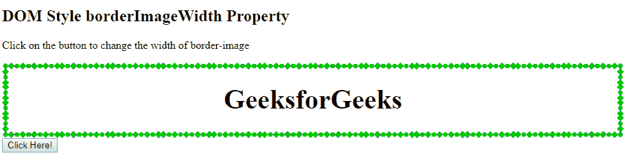
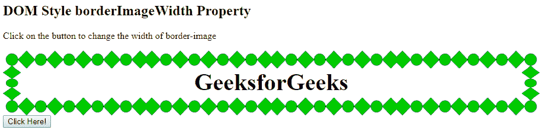
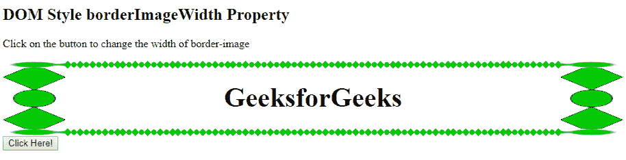
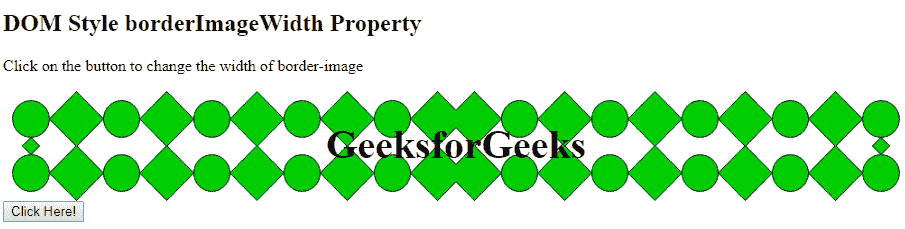

# HTML | DOM 样式边框宽度属性

> 原文:[https://www . geeksforgeeks . org/html-DOM-style-borderimagewidth-property/](https://www.geeksforgeeks.org/html-dom-style-borderimagewidth-property/)

HTML DOM 中的 Style **borderImageWidth** 属性用于设置或返回边框图像的宽度。

**语法:**

*   它返回 borderImageWidth 属性

    ```html
    object.style.borderImageWidth
    ```

*   用于设置边框宽度属性

    ```html
    object.style.borderImageWidth = "number|percentage|auto|
    initial|inherit"
    ```

**返回值:**返回一个字符串值，代表元素的边框图像宽度属性。

**属性值**

*   **number:** It is used to set the width as a multiple of corresponding computed value of border-width. This is the default value when set to 1.

    **例 1:**

    ```html
    <!DOCTYPE html>
    <html>

    <head>
        <title>
            DOM Style borderImageWidth Property
        </title>

        <style>
            .item {
                height: 70px;
                border: 10px solid transparent;
                border-image: 
    url('https://media.geeksforgeeks.org/wp-content/uploads/border-2.png');
                border-image-slice: 60;
                border-image-repeat: round;
                text-align:center;
                padding-top:20px;
                font-size:40px;
                font-weight:bold;
            }
        </style>
    </head>

    <body>
        <h2>
            DOM Style borderImageWidth Property
        </h2>

        <p>
            Click on the button to change the 
            width of border-image
        </p>

        <div class = "item">
            GeeksforGeeks
        </div>

        <button onclick = "changeWidth()">
            Click Here!
        </button>

        <script>
            function changeWidth() {
                elem = document.querySelector('.item');

                // Setting the image width to a multiple of 3
                elem.style.borderImageWidth = '3';
            }
        </script>
    </body>

    </html>                    
    ```

    **输出:**
    **点击按钮前:**
    
    **点击按钮后:**
    

*   **length:** It is used to set the width in terms of a length unit.

    **示例:**

    ```html
    <!DOCTYPE html>
    <html>

    <head>
        <title>
            DOM Style borderImageWidth Property
        </title>

        <style>
            .item {
                height: 70px;
                border: 10px solid transparent;
                border-image: 
    url('https://media.geeksforgeeks.org/wp-content/uploads/border-2.png');
                border-image-slice: 60;
                border-image-repeat: round;
                text-align:center;
                padding-top:20px;
                font-size:40px;
                font-weight:bold;
            }
        </style>
    </head>

    <body>
        <h2>
            DOM Style borderImageWidth Property
        </h2>

        <p>
            Click on the button to change the 
            width of border-image
        </p>

        <div class = "item">
            GeeksforGeeks
        </div>

        <button onclick = "changeWidth()">
            Click Here!
        </button>

        <script>
            function changeWidth() {
                elem = document.querySelector('.item');

                // Setting the image width to a multiple of 3
                elem.style.borderImageWidth = '30px';
            }
        </script>
    </body>

    </html>                    
    ```

    **输出:**
    **点击按钮前:**
    
    **点击按钮后:**
    

*   **percentage:** It is used to set the width in terms of percentage. Percentage is relative to the width of the border image area for horizontal offsets and the height of the border image area for vertical offsets.

    **示例:**

    ```html
    <!DOCTYPE html>
    <html>

    <head>
        <title>
            DOM Style borderImageWidth Property
        </title>

        <style>
            .item {
                height: 70px;
                border: 10px solid transparent;
                border-image: 
    url('https://media.geeksforgeeks.org/wp-content/uploads/border-2.png');
                border-image-slice: 60;
                border-image-repeat: round;
                text-align:center;
                padding-top:20px;
                font-size:40px;
                font-weight:bold;
            }
        </style>
    </head>

    <body>
        <h2>
            DOM Style borderImageWidth Property
        </h2>

        <p>
            Click on the button to change the 
            width of border-image
        </p>

        <div class = "item">
            GeeksforGeeks
        </div>

        <button onclick = "changeWidth()">
            Click Here!
        </button>

        <script>
            function changeWidth() {
                elem = document.querySelector('.item');

                // Setting the image width to a multiple of 3
                elem.style.borderImageWidth = '10%';
            }
        </script>
    </body>

    </html>                    
    ```

    **输出:**
    **点击按钮前:**
    
    **点击按钮后:**
    

*   **auto:** It makes width of the border equal to the intrinsic width or height of the corresponding image slice.

    **示例:**

    ```html
    <!DOCTYPE html>
    <html>

    <head>
        <title>
            DOM Style borderImageWidth Property
        </title>

        <style>
            .item {
                height: 70px;
                border: 10px solid transparent;
                border-image: 
    url('https://media.geeksforgeeks.org/wp-content/uploads/border-2.png');
                border-image-slice: 60;
                border-image-repeat: round;
                text-align:center;
                padding-top:20px;
                font-size:40px;
                font-weight:bold;
            }
        </style>
    </head>

    <body>
        <h2>
            DOM Style borderImageWidth Property
        </h2>

        <p>
            Click on the button to change the 
            width of border-image
        </p>

        <div class = "item">
            GeeksforGeeks
        </div>

        <button onclick = "changeWidth()">
            Click Here!
        </button>

        <script>
            function changeWidth() {
                elem = document.querySelector('.item');

                // Setting the image width to a multiple of 3
                elem.style.borderImageWidth = 'auto';
            }
        </script>
    </body>

    </html>                    
    ```

    **输出:**
    **点击按钮前:**
    
    **点击按钮后:**
    

*   **initial:** It is used to set borderImageWidth property to its default value.

    **示例:**

    ```html
    <!DOCTYPE html>
    <html>

    <head>
        <title>
            DOM Style borderImageWidth Property
        </title>

        <style>
            .item {
                height: 70px;
                border: 10px solid transparent;
                border-image: 
    url('https://media.geeksforgeeks.org/wp-content/uploads/border-2.png');
                border-image-slice: 60;
                border-image-repeat: round;
                text-align:center;
                padding-top:20px;
                font-size:40px;
                font-weight:bold;
            }
        </style>
    </head>

    <body>
        <h2>
            DOM Style borderImageWidth Property
        </h2>

        <p>
            Click on the button to change the 
            width of border-image
        </p>

        <div class = "item">
            GeeksforGeeks
        </div>

        <button onclick = "changeWidth()">
            Click Here!
        </button>

        <script>
            function changeWidth() {
                elem = document.querySelector('.item');

                // Setting the image width to a multiple of 3
                elem.style.borderImageWidth = 'initial';
            }
        </script>
    </body>

    </html>                    
    ```

    **输出:**
    **点击按钮前:**
    
    **点击按钮后:**
    

*   **inherit**: It inherits the property from its parent.

    **示例:**

    ```html
    <!DOCTYPE html>
    <html>

    <head>
        <title>
            DOM Style borderImageWidth Property
        </title>

        <style>
            .item {
                height: 70px;
                border: 10px solid transparent;
                border-image: 
    url('https://media.geeksforgeeks.org/wp-content/uploads/border-2.png');
                border-image-slice: 60;
                border-image-repeat: round;
                text-align:center;
                padding-top:20px;
                font-size:40px;
                font-weight:bold;
            }

            .Geeks {

                /* Setting the border-width to of parent */
                border-image-width: 30px;
            }
        </style>
    </head>

    <body>

        <h2>
            DOM Style borderImageWidth Property
        </h2>

        <p>
            Click on the button to change the 
            width of border-image
        </p>

        <div class = "Geeks">
            <div class = "item">
                GeeksforGeeks
            </div>
        </div>

        <button onclick = "changeWidth()">
            Click Here!
        </button>

        <script>
            function changeWidth() {
                elem = document.querySelector('.item');

                // Setting the image width to inherit
                elem.style.borderImageWidth = 'inherit';
            }
        </script>
    </body>
    </html>                    
    ```

    **输出:**
    **点击按钮前:**
    
    **点击按钮后:**
    

**支持的浏览器:***边框宽度属性*支持的浏览器如下:

*   铬
*   Internet Explorer 11
*   火狐浏览器
*   Safari 6