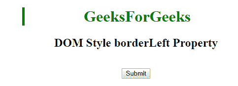

# HTML | DOM 样式边框属性

> 原文:[https://www . geesforgeks . org/html-DOM-style-border eft-property/](https://www.geeksforgeeks.org/html-dom-style-borderleft-property/)

DOM style**bordereft**属性用于设置或返回元素的三种不同的左边框属性，如左边框宽度、左边框样式和左边框颜色。

**语法:**

*   它用于返回边框属性。

    ```html
    object.style.borderLeft
    ```

*   它用于设置边框属性。

    ```html
    object.style.borderLeft = "width style color|initial|inherit"
    ```

**属性值:**

*   **宽度:**这将设置左边框的宽度。
*   **样式:**这将设置左边框的样式。
*   **颜色:**这将设置左边框的颜色。
*   **初始值:**这会将属性设置为默认值。
*   **inherit:** 这将从其父元素继承属性

**返回值:**返回一个字符串值，代表元素左边框的宽度、样式和/或颜色。

**例 1:**

```html
<!DOCTYPE html> 
<html> 
    <head> 
        <title>
            DOM Style borderLeft Property 
        </title> 
    </head> 

    <body> 
        <center> 
            <h1 style = "color:green;width:50%;" id = "sudo"> 
                GeeksForGeeks 
            </h1> 

            <h2>DOM Style borderLeft Property </h2><br>

            <button type = "button" onclick = "geeks()"> 
                Submit 
            </button> 

            <script> 
                function geeks() { 
                document.getElementById("sudo").style.borderLeft 
                                            = "thick solid green"; 
            } 
            </script> 
        </center> 
    </body> 
</html>                    
```

**输出:**
**点击按钮前:**

**点击按钮后:**


**例 2:**

```html
<!DOCTYPE html> 
<html> 
    <head> 
        <title>
            DOM Style borderLeft Property
        </title> 
    </head> 

    <body> 
        <center> 
            <h1 style = "color:green;"> 
                GeeksForGeeks 
            </h1> 

            <h2>DOM Style borderLeft Property </h2> 

            <h3 style = "border:2px solid red;width:50%;"
                id = "sudo">geksforgeeks</h3> 
            <br> 

            <button type = "button" onclick = "geeks()"> 
                Submit 
            </button> 

            <script> 
                function geeks() { 
                    document.getElementById("sudo").style.borderLeft
                                            = "thick dotted green"; 
                } 
            </script> 
        </center> 
    </body> 
</html>                    
```

**输出:**
**点击按钮前:**

**点击按钮后:**


**支持的浏览器:***DOM 无国界属性*支持的浏览器如下:

*   谷歌 Chrome
*   微软公司出品的 web 浏览器
*   火狐浏览器
*   歌剧
*   苹果 Safari