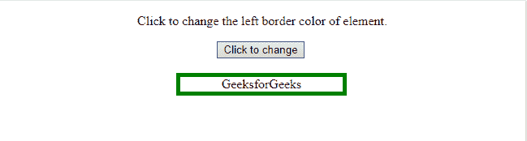
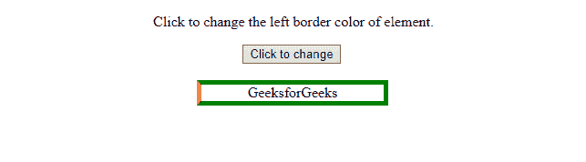
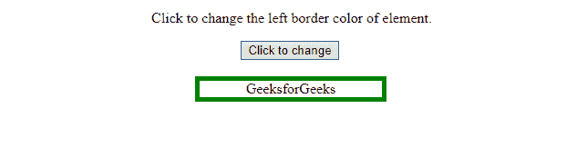
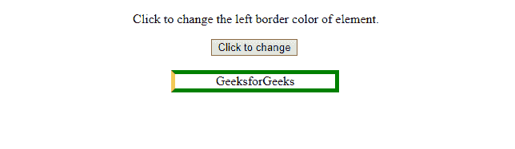
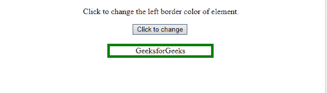
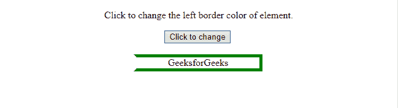

# HTML | DOM 样式边框颜色属性

> 原文:[https://www . geesforgeks . org/html-DOM-style-bordereftcolor-property/](https://www.geeksforgeeks.org/html-dom-style-borderleftcolor-property/)

**边框颜色**属性允许我们设置/获取元素左边框的颜色。
**语法:**

*   它用于返回 borderLeftColor 属性。

```html
object.style.borderLeftColor
```

*   它用于返回 borderLeftColor 属性。

```html
object.style.borderLeftColor = "color|transparent|initial|
inherit"
```

**返回值:**bordereftcolor 属性返回元素左边框的颜色。
**房产价值:**

*   **颜色:**指定对应元素的边框颜色。黑色是默认颜色。
    *   **语法:**

```html
borderLeftColor = "red"
```

*   **示例:**

## 超文本标记语言

```html
<!DOCTYPE html>
<html>

<head>
    <style>
        #GFG_Div {
            width: 200px;
            margin-left: 210px;
            border: thick solid green;
        }
    </style>
</head>

<body align="center">

<p>
     Click to change the left border
     color of element.
    </p>

    <button type="button" onclick="myGeeks()">
        Click to change
    </button>
    <br>
    <br>
    <div id="GFG_Div">GeeksforGeeks</div>
    <script>
        function myGeeks() {
            document.getElementById("GFG_Div")
                .style.borderLeftColor = "red";
        }
    </script>

</body>

</html>
```

*   **输出:**
    *   点击按钮
        前



*   点击按钮后



*   **语法:**

```html
borderLeftColor = "yellow"
```

*   **示例:**

## 超文本标记语言

```html
<!DOCTYPE html>
<html>

<head>
    <style>
        #GFG_Div {
            width: 200px;
            margin-left: 210px;
            border: thick solid green;
        }
    </style>
</head>

<body align="center">

<p>
     Click to change the left border
     color of element.
    </p>

    <button type="button" onclick="myGeeks()">
        Click to change
    </button>
    <br>
    <br>
    <div id="GFG_Div">GeeksforGeeks</div>
    <script>
        function myGeeks() {
            document.getElementById("GFG_Div")
                .style.borderLeftColor = "yellow";
        }
    </script>

</body>

</html>
```

*   **输出:**
    *   点击按钮前



*   点击按钮后



*   **透明:**将对应元素的边框颜色设置为透明。
    *   **语法:**

```html
borderLeftColor = "transparent"
```

*   **示例:**

## 超文本标记语言

```html
<!DOCTYPE html>
<html>

<head>
    <style>
        #GFG_Div {
            width: 200px;
            margin-left: 210px;
            border: thick solid green;
        }
    </style>
</head>

<body align="center">

<p>
     Click to change the left border
     color of element.
    </p>

    <button type="button" onclick="myGeeks()">
        Click to change
    </button>
    <br>
    <br>
    <div id="GFG_Div">GeeksforGeeks</div>
    <script>
        function myGeeks() {
            document.getElementById("GFG_Div")
                .style.borderLeftColor = "transparent";
        }
    </script>

</body>

</html>
```

*   **输出:**
    *   点击按钮前



*   点击按钮后



*   **初始值:**当没有为此字段指定值时，从元素的父元素继承。如果没有父元素意味着这个元素是根元素，那么它采用初始值(或缺省值)。
*   **inherit:** 此关键字将属性的初始值(或默认值)应用于元素。初始值不应与浏览器样式表指定的值混淆。当边框颜色设置为初始时，它显示为黑色(默认)。

**浏览器支持:**以下是*DOM Style bordereftcolor 属性*支持的浏览器:

*   谷歌 Chrome
*   微软公司出品的 web 浏览器
*   Mozilla firefox
*   歌剧
*   旅行队