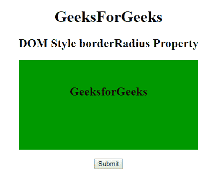
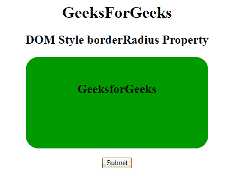

# HTML | DOM 样式边框属性

> 原文:[https://www . geeksforgeeks . org/html-DOM-style-borderradius-property/](https://www.geeksforgeeks.org/html-dom-style-borderradius-property/)

**[DOM](https://www.geeksforgeeks.org/dom-document-object-model/) 样式 borderRadius** 属性用于设置或返回一个元素的四个不同的 border arrdius 属性，如 borderTopRightRadius、borderBottomRightRadius、borderBottomLeftRadius。它用于在元素中添加圆角。

**语法:**

*   它用于获取边框半径属性。

    ```html
    object.style.borderRadius

    ```

    *   It is used to set the borderRadius property.

    ```html
    object.style.borderRadius = "1-4 length|% / 1-4 length|%
    |initial|inherit" 
    ```

    **属性值:**

    *   **长度:**这将定义拐角的形状默认值为 0。
    *   **%:** 这也将以百分比的形式定义拐角的形状。
    *   **初始值:**这会将属性设置为默认值。
    *   **inherit:** 这将从其父元素继承属性。

    **返回值:**返回一个字符串值，代表元素的上、左、下边框。

    **示例:**

    ```html
    <!DOCTYPE html>
    <html>

    <head>
        <title>DOM Style borderRadius Property</title>
        <style>
            '
     h1 {
                color: green;
                font-size: 35px;
            }

            #GFG {
                background: #009900;
                padding: 30px;
                text-align: center;
                width: 300px;
                height: 120px;
            }
        </style>
    </head>

    <body>
        <center>
            <h1>GeeksForGeeks</h1>
            <h2>DOM Style borderRadius Property</H2>
            <div id="GFG">
                <h2>GeeksforGeeks</h2> </div>
            <br>
            <button onclick="Geeks()">Submit</button>
            <script>
                function Geeks() {
                    document.getElementById("GFG").style.borderRadius 
                                                            = "25px";
                }
            </script>
        </center>
    </body>

    </html>
    ```

    **输出:**
    **点击按钮前:**
    

    **点击按钮后:**
    

    **支持的浏览器:**T2 DOM Style borderRadius 属性支持的浏览器如下:

    *   谷歌 Chrome 1.0
    *   Internet Explorer 4.0
    *   Firefox 1.0
    *   歌剧 3.5
    *   苹果 Safari 1.0