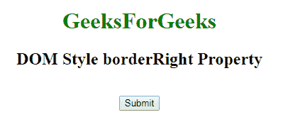
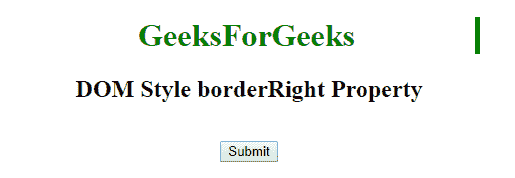
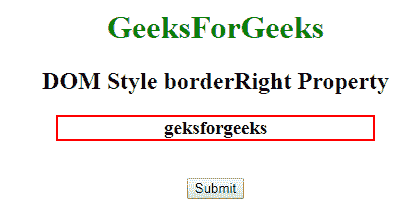
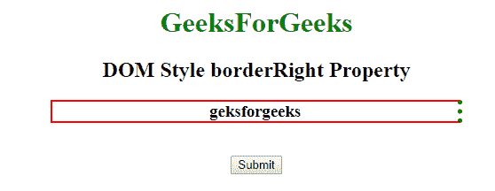

# HTML | DOM 样式边框属性

> 原文:[https://www . geesforgeks . org/html-DOM-style-borderright-property/](https://www.geeksforgeeks.org/html-dom-style-borderright-property/)

DOM style **borderRight** 属性用于设置或返回元素的三种不同的边框右向属性，如边框右向宽度、边框右向样式和边框右向颜色。

**语法:**

*   它返回 borderRight 属性。

    ```html
    object.style.borderRight
    ```

*   它用于设置 borderRight 属性。

    ```html
    object.style.borderRight = "width style color|initial|inherit"
    ```

**属性值:**

*   **宽度:**这将设置右边框的宽度。
*   **样式:**这将设置右边框的样式。
*   **颜色:**这将设置右边框的颜色。
*   **初始值:**这会将属性设置为默认值。
*   **inherit:** 这将从其父元素继承属性

**返回值:**该属性返回一个字符串，该字符串表示元素右边框的宽度、样式和颜色。

**例 1:**

```html
<!DOCTYPE html>
<html>

<head>
    <title>DOM Style borderRight Property </title>
</head>

<body>
    <center>
        <h1 style="color:green;width:50%;" id="sudo"> 
                GeeksForGeeks 
            </h1>

        <h2>DOM Style borderRight Property </h2>
        <br>
        <button type="button" onclick="geeks()">
            Submit
        </button>

        <script>
            function geeks() {
                document.getElementById("sudo").style.borderRight
                                    = "thick solid green";
            }
        </script>
    </center>
</body>

</html>  
```

**输出:**
**点击按钮前:**

**点击按钮后:**


**例 2:**

```html
<!DOCTYPE html>
<html>

<head>
    <title>DOM Style borderRight Property</title>
</head>

<body>
    <center>
        <h1 style="color:green;"> 
                GeeksForGeeks 
            </h1>

        <h2>DOM Style borderRight Property </h2>

        <h3 style="border:2px solid red;width:50%;" 
            id="sudo">
          geksforgeeks
        </h3>
        <br>
        <button type="button" onclick="geeks()">
            Submit
        </button>

        <script>
            function geeks() {
                document.getElementById("sudo").style.borderRight
                              = "thick dotted green";
            }
        </script>
    </center>
</body>

</html>     
```

**输出:**
**点击按钮前:**

**点击按钮后:**


**支持的浏览器:**T2 DOM borderRight 属性支持的浏览器如下:

*   谷歌 Chrome
*   微软公司出品的 web 浏览器
*   火狐浏览器
*   歌剧
*   苹果 Safari