# HTML | DOM 样式边框样式属性

> 原文:[https://www . geeksforgeeks . org/html-DOM-style-borderrightstyle-property/](https://www.geeksforgeeks.org/html-dom-style-borderrightstyle-property/)

HTML DOM 中的**样式边框样式属性**用于设置或返回元素右边框的样式。

**语法:**

*   它返回 borderRightStyle 属性。

    ```html
    object.style.borderRightStyle
    ```

*   它用于设置 borderRightStyle 属性。

    ```html
    object.style.borderRightStyle="none|hidden|dotted|dashed|solid|
    double|groove|ridge|inset|outset|initial|inherit"
    ```

**返回值:**表示元素右边框样式的字符串。

**属性值:**

| 价值 | 影响 |
| --- | --- |
| 没有人 | 没有创建边框。这是默认值。 |
| 隐藏的 | 它与' none '属性相同，只是它在表元素的边界冲突解决过程中有所帮助。 |
| 有点的 | 它使用虚线作为边框。 |
| 虚线 | 虚线用作边框。 |
| 固体 | 一条实线用作边框。 |
| 两倍 | 两条线用作边框。 |
| 律动 | 将显示三维凹槽边框。效果取决于边框颜色值。 |
| 山脉 | 将显示三维脊状边框。效果取决于边框颜色值。 |
| 插入物 | 将显示三维插入边框。效果取决于边框颜色值。 |
| 开始 | 将显示三维起始边框。效果取决于边框颜色值。 |
| 最初的 | 它将属性设置为默认值。 |
| 继承 | 它从其父元素将属性设置为。 |

所有属性值示例如下:
**示例 1:** 本示例不使用属性值。

```html
<!DOCTYPE html>
<html>

<head>
    <title>
        DOM Style borderRightStyle Property
    </title>

    <style>
        .item {
            padding: 10px;
            border: 15px solid green;
        }
    </style>
</head>

<body>
    <h1 style="color: green">GeeksforGeeks</h1>
    <b>DOM Style borderRightStyle Property</b>

    <p class="item">
        GeeksforGeeks is a computer science 
        portal with a huge variety of well 
        written and explained computer science 
        and programming articles, quizzes and 
        interview questions.
    </p>

    <button onclick="changeBorderStyle()">
        Change style
    </button>

    <!-- Script to uses DOM Style borderRightStyle
        Property -->
    <script>
        function changeBorderStyle() {
            elem = document.querySelector('.item');

            // Set the border style
            elem.style.borderRightStyle = 'none';
        }
    </script>
</body>

</html>                    
```

**输出:**
**点击按钮前:**
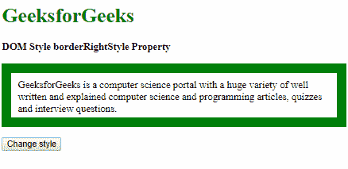
**点击按钮后:**
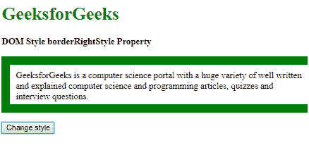

**示例 2:** 本示例使用隐藏属性值。

```html
<!DOCTYPE html>
<html>

<head>
    <title>
        DOM Style borderRightStyle Property
    </title>

    <style>
        .item {
            padding: 10px;
            border: 15px solid green;
        }
    </style>
</head>

<body>
    <h1 style="color: green">GeeksforGeeks</h1>
    <b>DOM Style borderRightStyle Property</b>

    <p class="item">
        GeeksforGeeks is a computer science 
        portal with a huge variety of well 
        written and explained computer science 
        and programming articles, quizzes and 
        interview questions.
    </p>

    <button onclick="changeBorderStyle()">
        Change style
    </button>

    <!-- Script to uses DOM Style borderRightStyle
        Property -->
    <script>
        function changeBorderStyle() {
            elem = document.querySelector('.item');

            // Set the border style
            elem.style.borderRightStyle = 'hidden';
        }
    </script>
</body>

</html>                    
```

**输出:**
**点击按钮前:**

**点击按钮后:**


**示例 3:** 本示例使用虚线属性值。

```html
<!DOCTYPE html>
<html>

<head>
    <title>
        DOM Style borderRightStyle Property
    </title>

    <style>
        .item {
            padding: 10px;
            border: 15px solid green;
        }
    </style>
</head>

<body>
    <h1 style="color: green">GeeksforGeeks</h1>
    <b>DOM Style borderRightStyle Property</b>

    <p class="item">
        GeeksforGeeks is a computer science 
        portal with a huge variety of well 
        written and explained computer science 
        and programming articles, quizzes and 
        interview questions.
    </p>

    <button onclick="changeBorderStyle()">
        Change style
    </button>

    <!-- Script to uses DOM Style borderRightStyle
        Property -->
    <script>
        function changeBorderStyle() {
            elem = document.querySelector('.item');

            // Set the border style
            elem.style.borderRightStyle = 'dotted';
        }
    </script>
</body>

</html>                    
```

**输出:**
**点击按钮前:**

**点击按钮后:**
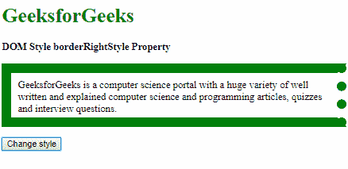

**示例 4:** 本示例使用虚线属性值。

```html
<!DOCTYPE html>
<html>

<head>
    <title>
        DOM Style borderRightStyle Property
    </title>

    <style>
        .item {
            padding: 10px;
            border: 15px solid green;
        }
    </style>
</head>

<body>
    <h1 style="color: green">GeeksforGeeks</h1>
    <b>DOM Style borderRightStyle Property</b>

    <p class="item">
        GeeksforGeeks is a computer science 
        portal with a huge variety of well 
        written and explained computer science 
        and programming articles, quizzes and 
        interview questions.
    </p>

    <button onclick="changeBorderStyle()">
        Change style
    </button>

    <!-- Script to uses DOM Style borderRightStyle
        Property -->
    <script>
        function changeBorderStyle() {
            elem = document.querySelector('.item');

            // Set the border style
            elem.style.borderRightStyle = 'dashed';
        }
    </script>
</body>

</html>                    
```

**输出:**
**点击按钮前:**

**点击按钮后:**
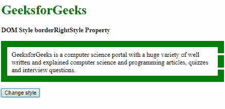

**示例 5:** 本示例使用实体属性值。

```html
<!DOCTYPE html>
<html>

<head>
    <title>
        DOM Style borderRightStyle Property
    </title>

    <style>
        .item {
            padding: 10px;
            border: 15px dotted green;
        }
    </style>
</head>

<body>
    <h1 style="color: green">GeeksforGeeks</h1>
    <b>DOM Style borderRightStyle Property</b>

    <p class="item">
        GeeksforGeeks is a computer science 
        portal with a huge variety of well 
        written and explained computer science 
        and programming articles, quizzes and 
        interview questions.
    </p>

    <button onclick="changeBorderStyle()">
        Change style
    </button>

    <!-- Script to uses DOM Style borderRightStyle
        Property -->
    <script>
        function changeBorderStyle() {
            elem = document.querySelector('.item');

            // Set the border style
            elem.style.borderRightStyle = 'solid';
        }
    </script>
</body>

</html>                    
```

**输出:**
**点击按钮前:**
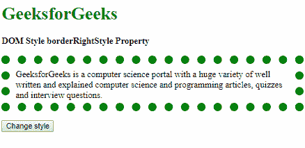
**点击按钮后:**
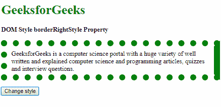

**示例 6:** 本示例使用双属性值。

```html
<!DOCTYPE html>
<html>

<head>
    <title>
        DOM Style borderRightStyle Property
    </title>

    <style>
        .item {
            padding: 10px;
            border: 15px solid green;
        }
    </style>
</head>

<body>
    <h1 style="color: green">GeeksforGeeks</h1>
    <b>DOM Style borderRightStyle Property</b>

    <p class="item">
        GeeksforGeeks is a computer science 
        portal with a huge variety of well 
        written and explained computer science 
        and programming articles, quizzes and 
        interview questions.
    </p>

    <button onclick="changeBorderStyle()">
        Change style
    </button>

    <!-- Script to uses DOM Style borderRightStyle
        Property -->
    <script>
        function changeBorderStyle() {
            elem = document.querySelector('.item');

            // Set the border style
            elem.style.borderRightStyle = 'double';
        }
    </script>
</body>

</html>                    
```

**输出:**
**点击按钮前:**

**点击按钮后:**
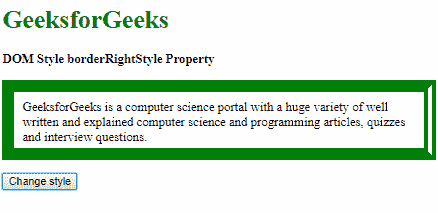

**示例 7:** 本示例使用凹槽属性值。

```html
<!DOCTYPE html>
<html>

<head>
    <title>
        DOM Style borderRightStyle Property
    </title>

    <style>
        .item {
            padding: 10px;
            border: 15px solid green;
        }
    </style>
</head>

<body>
    <h1 style="color: green">GeeksforGeeks</h1>
    <b>DOM Style borderRightStyle Property</b>

    <p class="item">
        GeeksforGeeks is a computer science 
        portal with a huge variety of well 
        written and explained computer science 
        and programming articles, quizzes and 
        interview questions.
    </p>

    <button onclick="changeBorderStyle()">
        Change style
    </button>

    <!-- Script to uses DOM Style borderRightStyle
        Property -->
    <script>
        function changeBorderStyle() {
            elem = document.querySelector('.item');

            // Set the border style
            elem.style.borderRightStyle = 'groove';
        }
    </script>
</body>

</html>                    
```

**输出:**
**点击按钮前:**

**点击按钮后:**
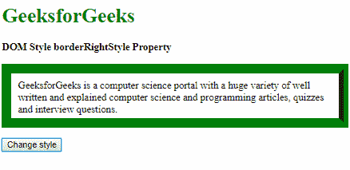

**示例 8:** 本示例使用脊线属性值。

```html
<!DOCTYPE html>
<html>

<head>
    <title>
        DOM Style borderRightStyle Property
    </title>

    <style>
        .item {
            padding: 10px;
            border: 15px solid green;
        }
    </style>
</head>

<body>
    <h1 style="color: green">GeeksforGeeks</h1>
    <b>DOM Style borderRightStyle Property</b>

    <p class="item">
        GeeksforGeeks is a computer science 
        portal with a huge variety of well 
        written and explained computer science 
        and programming articles, quizzes and 
        interview questions.
    </p>

    <button onclick="changeBorderStyle()">
        Change style
    </button>

    <!-- Script to uses DOM Style borderRightStyle
        Property -->
    <script>
        function changeBorderStyle() {
            elem = document.querySelector('.item');

            // Set the border style
            elem.style.borderRightStyle = 'ridge';
        }
    </script>
</body>

</html>                    
```

**输出:**
**点击按钮前:**

**点击按钮后:**
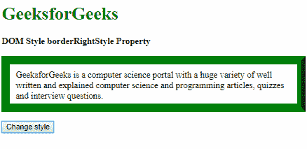

**示例 9:** 本示例使用插图属性值。

```html
<!DOCTYPE html>
<html>

<head>
    <title>
        DOM Style borderRightStyle Property
    </title>

    <style>
        .item {
            padding: 10px;
            border: 15px outset green;
        }
    </style>
</head>

<body>
    <h1 style="color: green">GeeksforGeeks</h1>
    <b>DOM Style borderRightStyle Property</b>

    <p class="item">
        GeeksforGeeks is a computer science 
        portal with a huge variety of well 
        written and explained computer science 
        and programming articles, quizzes and 
        interview questions.
    </p>

    <button onclick="changeBorderStyle()">
        Change style
    </button>

    <!-- Script to uses DOM Style borderRightStyle
        Property -->
    <script>
        function changeBorderStyle() {
            elem = document.querySelector('.item');

            // Set the border style
            elem.style.borderRightStyle = 'inset';
        }
    </script>
</body>

</html>                    
```

**输出:**
**点击按钮前:**
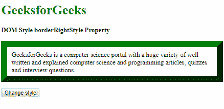
**点击按钮后:**
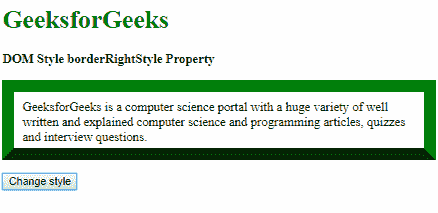

**示例 10:** 本示例使用 start 属性值。

```html
<!DOCTYPE html>
<html>

<head>
    <title>
        DOM Style borderRightStyle Property
    </title>

    <style>
        .item {
            padding: 10px;
            border: 15px inset green;
        }
    </style>
</head>

<body>
    <h1 style="color: green">GeeksforGeeks</h1>
    <b>DOM Style borderRightStyle Property</b>

    <p class="item">
        GeeksforGeeks is a computer science 
        portal with a huge variety of well 
        written and explained computer science 
        and programming articles, quizzes and 
        interview questions.
    </p>

    <button onclick="changeBorderStyle()">
        Change style
    </button>

    <!-- Script to uses DOM Style borderRightStyle
        Property -->
    <script>
        function changeBorderStyle() {
            elem = document.querySelector('.item');

            // Set the border style
            elem.style.borderRightStyle = 'outset';
        }
    </script>
</body>

</html>                    
```

**输出:**
**点击按钮前:**
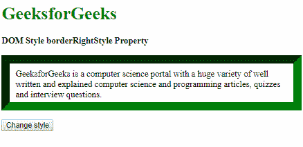
**点击按钮后:**
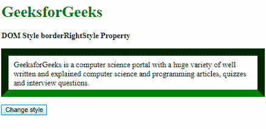

**示例 11:** 本示例使用初始属性值。

```html
<!DOCTYPE html>
<html>

<head>
    <title>
        DOM Style borderRightStyle Property
    </title>

    <style>
        .item {
            padding: 10px;
            border: 15px solid green;
        }
    </style>
</head>

<body>
    <h1 style="color: green">GeeksforGeeks</h1>
    <b>DOM Style borderRightStyle Property</b>

    <p class="item">
        GeeksforGeeks is a computer science 
        portal with a huge variety of well 
        written and explained computer science 
        and programming articles, quizzes and 
        interview questions.
    </p>

    <button onclick="changeBorderStyle()">
        Change style
    </button>

    <!-- Script to uses DOM Style borderRightStyle
        Property -->
    <script>
        function changeBorderStyle() {
            elem = document.querySelector('.item');

            // Set the border style
            elem.style.borderRightStyle = 'initial';
        }
    </script>
</body>

</html>                    
```

**输出:**
**点击按钮前:**

**点击按钮后:**


**示例 12:** 本示例使用 inherit 属性值。

```html
<!DOCTYPE html>
<html>

<head>
    <title>
        DOM Style borderRightStyle Property
    </title>

    <style>
        #parent {
            border-right-style: dotted;
            padding: 10px;
        }
        .item {
            padding: 10px;
            border: 15px solid green;
        }
    </style>
</head>

<body>
    <h1 style="color: green">GeeksforGeeks</h1>
    <b>DOM Style borderRightStyle Property</b>

    <div id="parent">
        <p class="item">
            GeeksforGeeks is a computer science 
            portal with a huge variety of well 
            written and explained computer 
            science and programming articles, 
            quizzes and interview questions.
        </p>
    </div>

    <button onclick="changeBorderStyle()">
        Change style
    </button>

    <!-- Script to uses DOM Style borderRightStyle
        Property -->
    <script>
        function changeBorderStyle() {
            elem = document.querySelector('.item');

            // Set the border style
            elem.style.borderRightStyle = 'inherit';
        }
    </script>
</body>

</html>                    
```

**输出:**
**点击按钮前:**
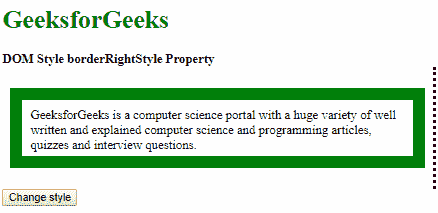
**点击按钮后:**
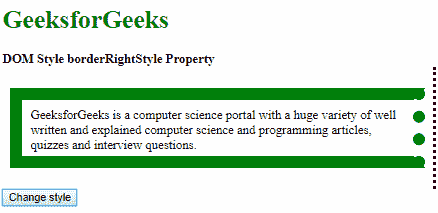

**支持的浏览器:**以下列出了 *DOM Style borderRightStyle 属性*支持的浏览器:

*   谷歌 Chrome
*   微软公司出品的 web 浏览器
*   火狐浏览器
*   歌剧
*   苹果 Safari