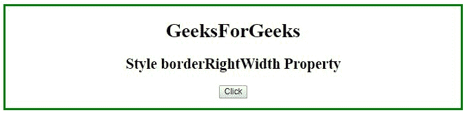
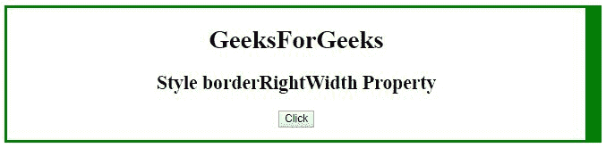
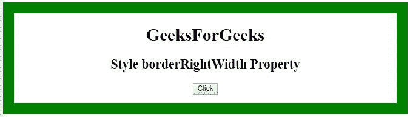
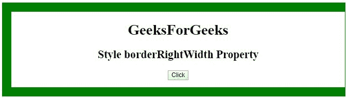

# HTML | DOM 样式边框宽度属性

> 原文:[https://www . geeksforgeeks . org/html-DOM-style-borderrightwidth-property/](https://www.geeksforgeeks.org/html-dom-style-borderrightwidth-property/)

HTML DOM 中的 **borderRightWidth 属性**用于设置或返回元素右边框的宽度。

**语法:**

*   它返回 borderRightWidth 属性。

    ```html
    object.style.borderRightWidth
    ```

*   它用于设置 borderRightWidth 属性。

    ```html
    object.style.borderRightWidth = "thin|medium|thick|length|
    initial|inherit"
    ```

**属性值:**

*   **细:**用于定义细边框。
*   **中:**用于定义中边框，为默认值。
*   **粗:**用于定义粗边框。
*   **长度:**以长度单位表示的边框宽度。
*   **初始值:**用于设置为默认值。
*   **inherit:** 用于从其父元素继承。

**示例 1:** 本示例使用样式 borderRightWidth 属性将右边框的宽度设置为 20px。

```html
<!DOCTYPE html>
<html>
<head> 
    <title>
        Style borderRightWidth Property
    </title>
</head> 

<body style="text-align:center;">

    <div id="GFG" style="border:solid green;">

        <h1>GeeksForGeeks</h1>

        <h2>
            Style borderRightWidth Property
        </h2>

        <button type="button" onclick="myFunction()">
            Click
        </button>

        <br><br>
    </div>

    <!-- Script to set border right width -->
    <script>
        function myFunction() {
            document.getElementById("GFG").style.borderRightWidth
                    = "20px";
        }
    </script>
</body>

</html>
```

**输出:**
**点击按钮前:**

**点击按钮后:**


**示例 2:** 本示例使用样式 borderRightWidth 属性将右边框的宽度设置为“细”。

```html
<!DOCTYPE html>
<html>

<head> 
    <title>
        Style borderRightWidth Property
    </title>
</head> 

<body style="text-align:center;">

    <div id="GFG" style = "border:20px solid green">
        <h1>
            GeeksForGeeks
        </h1>
        <h2>
            Style borderRightWidth Property
        </h2>

        <button type="button" onclick="myFunction()">
            Click
        </button>

        <br><br>
    </div>

    <!-- Script to set border right width to thin -->
    <script>
        function myFunction() {
            document.getElementById("GFG").style.borderRightWidth
                    = "thin";
        }
    </script>
</body>

</html>
```

**输出:**
**点击按钮前:**

**点击按钮后:**


**支持的浏览器:**以下列出了 *DOM Style borderRightWidth 属性*支持的浏览器:

*   谷歌 Chrome
*   微软公司出品的 web 浏览器
*   火狐浏览器
*   歌剧
*   旅行队