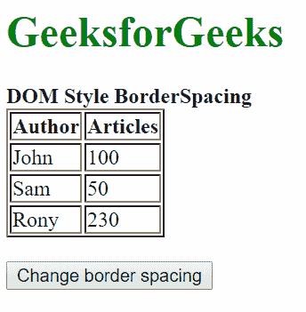
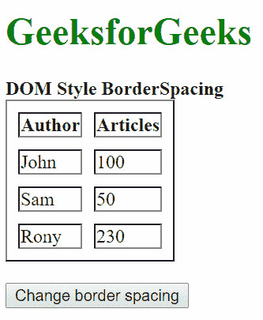
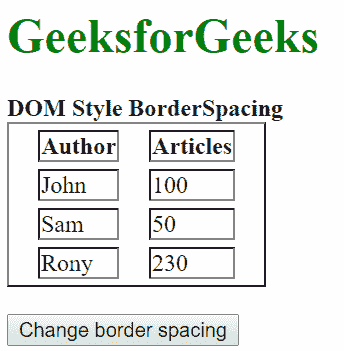
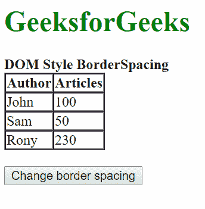
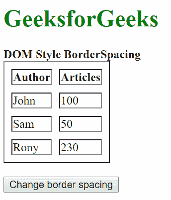

# HTML | DOM 样式边框间距属性

> 原文:[https://www . geesforgeks . org/html-DOM-style-borderspacing-property/](https://www.geeksforgeeks.org/html-dom-style-borderspacing-property/)

DOM Style**borderspace**属性用于**设置**或**返回**表格中*单元格之间的间距*。

**语法:**

*   获取边框间距属性

    ```html
    object.style.borderSpacing
    ```

*   设置边框间距属性

    ```html
    object.style.borderSpacing = "length | initial | inherit"
    ```

**返回值:**返回一个字符串值，代表表格中单元格之间的间距。

**属性值**

*   **长度:**用于以固定单位指定单元格之间的长度。不允许负值。默认值为 0。
*   **初始值:**用于将属性设置为默认值。
*   **inherit:** 用于从元素的父元素继承值。

演示这些值的一些示例如下所示:
**示例-1:** 使用一个值同时指定水平和垂直间距。

```html
<!DOCTYPE html>
<html>
<head>
    <title>DOM Style BorderSpacing</title>
</head>
<body>
    <h1 style="color: green">GeeksforGeeks</h1>
    <b>DOM Style BorderSpacing</b>

    <table id="table" border="1">
        <tr>
            <th>Author</th>
            <th>Articles</th>
        </tr>
        <tr>
            <td>John</td>
            <td>100</td>
        </tr>
        <tr>
            <td>Sam</td>
            <td>50</td>
        </tr>
        <tr>
            <td>Rony</td>
            <td>230</td>
        </tr>
    </table>
    <br>

    <button type="button" onclick="changeSpacing()">
      Change border spacing
    </button>

    <script>
        function changeSpacing() {
            elem = document.querySelector("#table");

            // setting the border spacing
            elem.style.borderSpacing = "10px";
        }
    </script>

</body>

</html>
```

**输出:**

**点击按钮前:**



**点击按钮后:**



**示例-2:** 使用两个值分别指定水平和垂直间距。

```html
<!DOCTYPE html>
<html>
<head>
    <title>DOM Style BorderSpacing</title>
</head>
<body>
    <h1 style="color: green">GeeksforGeeks</h1>
    <b>DOM Style BorderSpacing</b>

    <table id="table" border="1">
        <tr>
            <th>Author</th>
            <th>Articles</th>
        </tr>
        <tr>
            <td>John</td>
            <td>100</td>
        </tr>
        <tr>
            <td>Sam</td>
            <td>50</td>
        </tr>
        <tr>
            <td>Rony</td>
            <td>230</td>
        </tr>
    </table>
    <br>

    <button type="button" onclick="changeSpacing()">
      Change border spacing
    </button>

    <script>
        function changeSpacing() {
            elem = document.querySelector("#table");

            // setting the border spacing
            elem.style.borderSpacing = "20px 5px";
        }
    </script>

</body>

</html>
```

**输出:**

**点击按钮前:**


**点击按钮后:**



**示例-3:** 使用初始值。

```html
<!DOCTYPE html>
<html>
<head>
    <title>DOM Style BorderSpacing</title>
</head>
<body>
    <h1 style="color: green">GeeksforGeeks</h1>
    <b>DOM Style BorderSpacing</b>

    <table id="table" border="1">
        <tr>
            <th>Author</th>
            <th>Articles</th>
        </tr>
        <tr>
            <td>John</td>
            <td>100</td>
        </tr>
        <tr>
            <td>Sam</td>
            <td>50</td>
        </tr>
        <tr>
            <td>Rony</td>
            <td>230</td>
        </tr>
    </table>
    <br>

    <button type="button" onclick="changeSpacing()">
      Change border spacing
    </button>

    <script>
        function changeSpacing() {
            elem = document.querySelector("#table");

            // setting the border spacing
            elem.style.borderSpacing = "initial";
        }
    </script>

</body>

</html>
```

**输出:**

**点击按钮前:**


**点击按钮后:**



**示例-4:** 使用继承值。

```html
<!DOCTYPE html>
<html>
<head>
    <title>DOM Style BorderSpacing</title>
    <style>

         /* setting the border spacing of the parent */
        #parent {
                border-spacing: 10px;
         }
    </style>
</head>
<body>
    <h1 style="color: green">GeeksforGeeks</h1>
    <b>DOM Style BorderSpacing</b>
    <div id="parent">
        <table id="table" border="1">
            <tr>
                <th>Author</th>
                <th>Articles</th>
            </tr>
            <tr>
                <td>John</td>
                <td>100</td>
            </tr>
            <tr>
                <td>Sam</td>
                <td>50</td>
            </tr>
            <tr>
                <td>Rony</td>
                <td>230</td>
            </tr>
        </table>
    </div>
    <br>

    <button type="button" onclick="changeSpacing()">
      Change border spacing
    </button>

    <script>
        function changeSpacing() {
            elem = document.querySelector("#table");

            // setting the border spacing
            elem.style.borderSpacing = "inherit";
        }
    </script>

</body>

</html>
```

**输出:**

**点击按钮前:**


**点击按钮后:**



**支持的浏览器:**支持的浏览器*边框间距*属性如下:

*   铬
*   Internet Explorer 9.0
*   火狐浏览器
*   歌剧
*   旅行队