# HTML | DOM 样式边框样式属性

> 原文:[https://www . geesforgeks . org/html-DOM-style-border style-property/](https://www.geeksforgeeks.org/html-dom-style-borderstyle-property/)

DOM Style **边框样式**属性用于**设置**或**返回** *元素的边框样式*。

**语法:**

*   要获得边框样式

    ```html
    object.style.borderStyle
    ```

*   设置边框样式

    ```html
    object.style.borderStyle = "none | hidden | dotted | dashed | 
    solid | double | groove | ridge | inset | outset | initial |
    inherit"
    ```

**返回值:**返回一个字符串值，代表元素边框的样式。

**属性值:**各属性值同例。

| 价值 | 影响 |
| --- | --- |
| 没有人 | 没有创建边框。这是默认值。 |
| 隐藏的 | 视觉上与“无”相同，只是它在表格元素的边界冲突解决过程中有所帮助。 |
| 有点的 | 圆点用作边框。 |
| 虚线 | 虚线用作边框。 |
| 固体 | 一条实线用作边框。 |
| 两倍 | 两条线用作边框。 |
| 律动 | 将显示三维凹槽边框。效果取决于边框颜色值。 |
| 山脉 | 将显示三维脊状边框。效果取决于边框颜色值。 |
| 插入物 | 将显示三维插入边框。效果取决于边框颜色值。 |
| 开始 | 将显示三维起始边框。效果取决于边框颜色值。 |
| 最初的 | 将属性设置为其初始值。 |
| 继承 | 设置从其父级继承的属性。 |

这些值通过以下示例进行了演示:

**示例-1:** 使用 none 值。

```html
<!DOCTYPE html>
<html lang="en">

<head>
    <title>
      DOM Style borderStyle Property
    </title>
    <style>
        .item {
            padding: 10px;
            border: 15px solid green;
        }
    </style>
</head>

<body>
    <h1 style="color: green">
      GeeksforGeeks
    </h1>
    <b>
      DOM Style borderStyle Property
    </b>
    <p class="item">
        GeeksforGeeks is a computer science 
      portal with a huge variety of well written
      and explained computer science and
      programming articles, quizzes and
      interview questions.
    </p>
    <button onclick="changeBorderStyle()">
      Change style
    </button>

    <script>
        function changeBorderStyle() {

            elem = document.querySelector('.item');

            // Setting the border style
            elem.style.borderStyle = 'none';
        }
    </script>
</body>

</html>
```

**输出:**
**点击按钮前:**


**点击按钮后:**
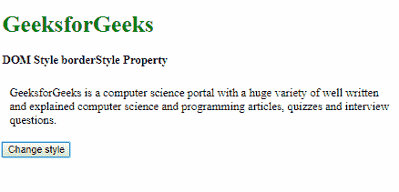

**示例-2:** 使用隐藏值。

```html
<!DOCTYPE html>
<html lang="en">

<head>
    <title>
      DOM Style borderStyle Property
    </title>
    <style>
        .item {
            padding: 10px;
            border: 15px solid green;
        }
    </style>
</head>

<body>
    <h1 style="color: green">
      GeeksforGeeks
    </h1>
    <b>
      DOM Style borderStyle Property
    </b>
    <p class="item">  
      GeeksforGeeks is a computer science
      portal with a huge variety of well 
      written and explained computer science
      and programming articles, quizzes and
      interview questions.
    </p>
    <button onclick="changeBorderStyle()">
        Change style
    </button>

    <script>
        function changeBorderStyle() {
            elem = document.querySelector('.item');

            // Setting the border style
            elem.style.borderStyle = 'hidden';
        }
    </script>
</body>

</html>
```

**输出:**
**点击按钮前:**


**点击按钮后:**


**示例-3:** 使用虚线值。

```html
<!DOCTYPE html>
<html lang="en">

<head>
    <title>
      DOM Style borderStyle Property
    </title>
    <style>
        .item {
            padding: 10px;
            border: 15px solid green;
        }
    </style>
</head>

<body>
    <h1 style="color: green">
      GeeksforGeeks
    </h1>
    <b>
      DOM Style borderStyle Property
    </b>
    <p class="item">
      GeeksforGeeks is a computer science
      portal with a huge variety of well 
      written and explained computer science
      and programming articles, quizzes 
      and interview questions.
    </p>
    <button onclick="changeBorderStyle()">
      Change style
    </button>

    <script>
        function changeBorderStyle() {
            elem = document.querySelector('.item');

            // Setting the border style
            elem.style.borderStyle = 'dotted';
        }
    </script>
</body>

</html>
```

**输出:**

**点击按钮前:**
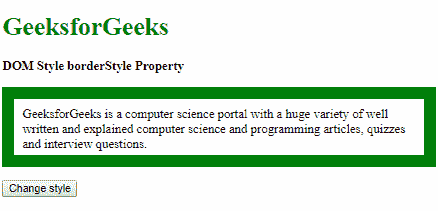

**点击按钮后:**
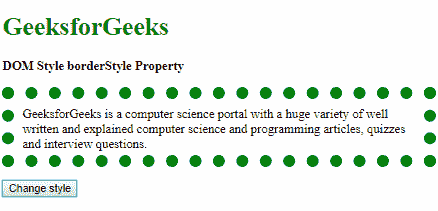

**示例-4:** 使用虚线值。

```html
<!DOCTYPE html>
<html lang="en">

<head>
    <title>
      DOM Style borderStyle Property
    </title>
    <style>
        .item {
            padding: 10px;
            border: 15px solid green;
        }
    </style>
</head>

<body>
    <h1 style="color: green">
      GeeksforGeeks
    </h1>
    <b>
      DOM Style borderStyle Property
    </b>
    <p class="item">
      GeeksforGeeks is a computer science 
      portal with a huge variety of well 
      written and explained computer 
      science and programming articles, 
      quizzes and interview questions.
    </p>
    <button onclick="changeBorderStyle()">
      Change style
    </button>

    <script>
        function changeBorderStyle() {
            elem = document.querySelector('.item');

            // Setting the border style
            elem.style.borderStyle = 'dashed';
        }
    </script>
</body>

</html>
```

**输出:**
**点击按钮前:**


**点击按钮后:**

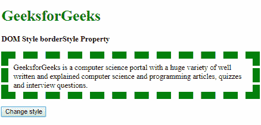

**示例-5:** 使用实线值。

```html
<!DOCTYPE html>
<html lang="en">

<head>
    <title>
      DOM Style borderStyle Property
    </title>
    <style>
        .item {
            padding: 10px;
            border: 15px dotted green;
        }
    </style>
</head>

<body>
    <h1 style="color: green">
      GeeksforGeeks
    </h1>
    <b>
      DOM Style borderStyle Property
    </b>
    <p class="item">
      GeeksforGeeks is a computer science portal
      with a huge variety of well written and
      explained computer science and programming
      articles, quizzes and interview questions.
    </p>
    <button onclick="changeBorderStyle()">
      Change style
    </button>

    <script>
        function changeBorderStyle() {
            elem = document.querySelector('.item');

            // Setting the border style
            elem.style.borderStyle = 'solid';
        }
    </script>
</body>

</html>
```

**输出:**
**点击按钮前:**
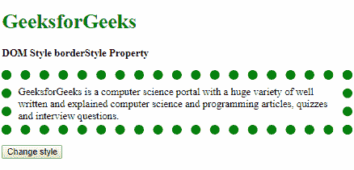

**点击按钮后:**

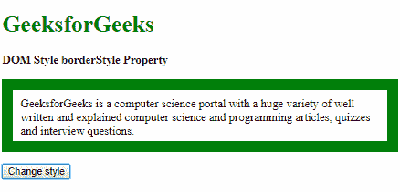

**示例-6:** 使用双精度值。

```html
<!DOCTYPE html>
<html lang="en">

<head>
    <title>
      DOM Style borderStyle Property
    </title>
    <style>
        .item {
            padding: 10px;
            border: 15px solid green;
        }
    </style>
</head>

<body>
    <h1 style="color: green">
      GeeksforGeeks
    </h1>
    <b>
      DOM Style borderStyle Property
    </b>
    <p class="item">
      GeeksforGeeks is a computer science 
      portal with a huge variety of well 
      written and explained computer science
      and programming articles, quizzes and
      interview questions.
    </p>
    <button onclick="changeBorderStyle()">
      Change style
    </button>

    <script>
        function changeBorderStyle() {
            elem = document.querySelector('.item');

            // Setting the border style
            elem.style.borderStyle = 'double';
        }
    </script>
</body>

</html>
```

**输出:**

**点击按钮前:**


**点击按钮后:**

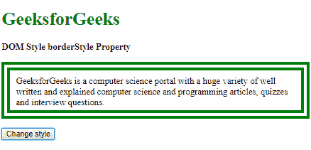

**示例-7:** 使用凹槽值。

```html
<!DOCTYPE html>
<html lang="en">

<head>
    <title>
      DOM Style borderStyle Property
    </title>
    <style>
        .item {
            padding: 10px;
            border: 15px solid green;
        }
    </style>
</head>

<body>
    <h1 style="color: green">
      GeeksforGeeks
    </h1>
    <b>
      DOM Style borderStyle Property
    </b>
    <p class="item">
      GeeksforGeeks is a computer science portal
      with a huge variety of well written and 
      explained computer science and programming
      articles, quizzes and interview questions.
    </p>
    <button onclick="changeBorderStyle()">
      Change style
    </button>

    <script>
        function changeBorderStyle() {
            elem = document.querySelector('.item');

            // Setting the border style
            elem.style.borderStyle = 'groove';
        }
    </script>
</body>

</html>
```

**输出:**

**点击按钮前:**


**点击按钮后:**

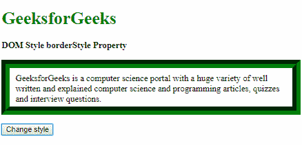

**示例-8:** 使用脊线值。

```html
<!DOCTYPE html>
<html lang="en">

<head>
    <title>
      DOM Style borderStyle Property
    </title>
    <style>
        .item {
            padding: 10px;
            border: 15px solid green;
        }
    </style>
</head>

<body>
    <h1 style="color: green">
      GeeksforGeeks
    </h1>
    <b>
      DOM Style borderStyle Property
  </b>
    <p class="item"> 
      GeeksforGeeks is a computer science 
      portal with a huge variety of well 
      written and explained computer science
      and programming articles, quizzes 
      and interview questions.
    </p>
    <button onclick="changeBorderStyle()">
      Change style
    </button>

    <script>
        function changeBorderStyle() {
            elem = document.querySelector('.item');

            // Setting the border style
            elem.style.borderStyle = 'ridge';
        }
    </script>
</body>

</html>
```

**输出:**

**点击按钮前:**


**点击按钮后:**

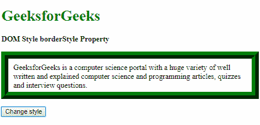

**示例-9:** 使用插入值。

```html
<!DOCTYPE html>
<html lang="en">

<head>
    <title>
        DOM Style borderStyle Property
    </title>
    <style>
        .item {
            padding: 10px;
            border: 15px solid green;
        }
    </style>
</head>

<body>
    <h1 style="color: green">
      GeeksforGeeks
    </h1>
    <b>
      DOM Style borderStyle Property
    </b>
    <p class="item">
      GeeksforGeeks is a computer science 
      portal with a huge variety of well
      written and explained computer science
      and programming articles, quizzes and
      interview questions.
    </p>
    <button onclick="changeBorderStyle()">
      Change style
    </button>

    <script>
        function changeBorderStyle() {
            elem = document.querySelector('.item');

            // Setting the border style
            elem.style.borderStyle = 'inset';
        }
    </script>
</body>

</html>
```

**输出:**

**点击按钮前:**


**点击按钮后:**

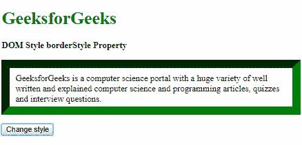

**示例-10:** 使用起始值。

```html
<!DOCTYPE html>
<html lang="en">

<head>
    <title>
      DOM Style borderStyle Property
    </title>
    <style>
        .item {
            padding: 10px;
            border: 15px inset green;
        }
    </style>
</head>

<body>
    <h1 style="color: green">
      GeeksforGeeks
    </h1>
    <b>
      DOM Style borderStyle Property
    </b>
    <p class="item">  
      GeeksforGeeks is a computer science portal
      with a huge variety of well written and 
      explained computer science and programming
      articles, quizzes and interview questions.
    </p>
    <button onclick="changeBorderStyle()">
      Change style
    </button>

    <script>
        function changeBorderStyle() {
            elem = document.querySelector('.item');

            // Setting the border style
            elem.style.borderStyle = 'outset';
        }
    </script>
</body>

</html>
```

**输出:**

**点击按钮前:**

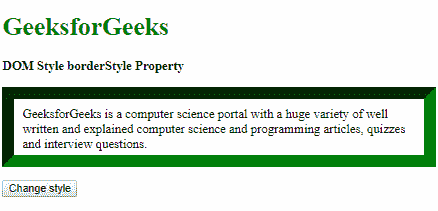

**点击按钮后:**

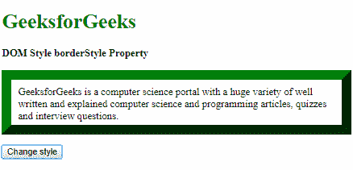

**示例-11:** 使用初始值。

```html
<!DOCTYPE html>
<html lang="en">

<head>
    <title>
      DOM Style borderStyle Property
    </title>
    <style>
        .item {
            padding: 10px;
            border: 15px solid green;
        }
    </style>
</head>

<body>
    <h1 style="color: green">
      GeeksforGeeks
    </h1>
    <b>
      DOM Style borderStyle Property
    </b>
    <p class="item">
      GeeksforGeeks is a computer science 
      portal with a huge variety of well 
      written and explained computer science
      and programming articles, quizzes and
      interview questions.
    </p>
    <button onclick="changeBorderStyle()">
      Change style
    </button>

    <script>
        function changeBorderStyle() {
            elem = document.querySelector('.item');

            // Setting the border style
            elem.style.borderStyle = 'initial';
        }
    </script>
</body>

</html>
```

**输出:**

**点击按钮前:**


**点击按钮后:**


**示例-12:** 使用继承值。

```html
<!DOCTYPE html>
<html lang="en">

<head>
    <title>
      DOM Style borderStyle Property
    </title>
    <style>
        #parent {
            border-style: dotted;
            padding: 10px;
        }

        .item {
            padding: 10px;
            border: 15px solid green;
        }
    </style>
</head>

<body>
    <h1 style="color: green">
      GeeksforGeeks
    </h1>
    <b>
      DOM Style borderStyle Property
    </b>

    <div id="parent">
        <p class="item"> 
          GeeksforGeeks is a computer science portal
          with a huge variety of well written and 
          explained computer science and programming
          articles, quizzes and interview questions.
        </p>
    </div>

    <button onclick="changeBorderStyle()">
      Change style
    </button>

    <script>
        function changeBorderStyle() {
            elem = document.querySelector('.item');

            // Setting the border style
            elem.style.borderStyle = 'inherit';
        }
    </script>
</body>

</html>
```

**输出:**

**点击按钮前:**

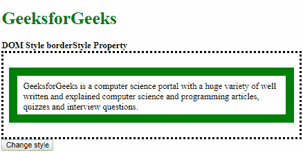

**点击按钮后:**

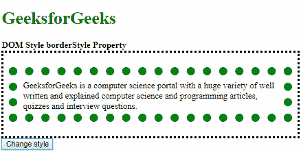

**支持的浏览器:**由 *borderStyle* 属性支持的浏览器如下:

*   谷歌 Chrome
*   微软公司出品的 web 浏览器
*   火狐浏览器
*   歌剧
*   苹果 Safari