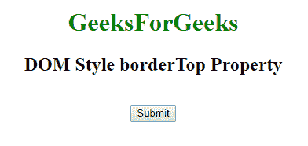
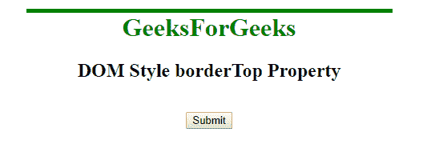
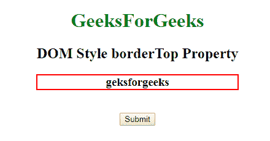
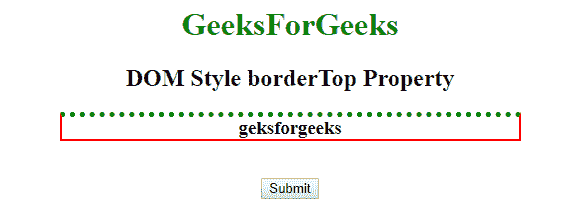

# HTML | DOM 样式边框图属性

> 原文:[https://www . geesforgeks . org/html-DOM-style-border top-property/](https://www.geeksforgeeks.org/html-dom-style-bordertop-property/)

DOM style **borderTop** 属性用于设置或返回元素的三种不同的边框-顶部属性，如边框-顶部宽度、边框-顶部样式和边框-顶部颜色。
**语法:**

*   它返回 borderTop 属性。

```html
object.style.borderTop
```

*   它用于设置 borderTop 属性。

```html
object.style.borderTop = "width style color|initial|inherit"
```

**房产价值:**

*   **宽度:**这将设置上边框的宽度。
*   **样式:**这将设置上边框的样式。
*   **颜色:**这将设置上边框的颜色。
*   **初始值:**这会将属性设置为默认值。
*   **inherit:** 这将从其父元素继承属性

**返回值:**返回一个字符串值，代表元素上边框的宽度、样式和/或颜色。
**例 1:**

## 超文本标记语言

```html
<!DOCTYPE html>
<html>
    <head>
        <title>DOM Style borderTop Property</title>
    </head>

    <body>
        <center>
            <h1 style = "color:green;width:50%;" id = "sudo">
                GeeksForGeeks
            </h1>

            <h2>DOM Style borderTop Property </h2>        
            <br>
            <button type = "button" onclick = "geeks()">
                Submit
            </button>

            <script>
            function geeks() {
            document.getElementById("sudo").style.borderTop
                                        = "thick solid green";
            }
            </script>
        </center>
    </body>
</html>                    
```

**输出:**
**之前点击按钮:**



**点击按钮后:**



**例 2:**

## 超文本标记语言

```html
<!DOCTYPE html>
<html>
    <head>
        <title>DOM Style borderTop Property</title>
    </head>
    <body>
        <center>
            <h1 style = "color:green;">
                GeeksForGeeks
            </h1>

            <h2>DOM Style borderTop Property </h2>

            <h3 style = "border:2px solid red;width:50%;"
                id = "sudo">geksforgeeks</h3>
            <br>
            <button type = "button" onclick = "geeks()">
                Submit
            </button>

            <script>
                function geeks() {
                    document.getElementById("sudo").style.borderTop
                                            = "thick dotted green";
                }
            </script>
        </center>
    </body>
</html>                    
```

**输出:**
**之前点击按钮:**



**点击按钮后:**



**支持的浏览器:**由 *DOM 样式 borderTop* 属性支持的浏览器如下:

*   谷歌 Chrome
*   微软公司出品的 web 浏览器
*   火狐浏览器
*   歌剧
*   苹果 Safari