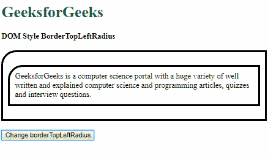

# HTML | DOM 样式边框半径属性

> 原文:[https://www . geeksforgeeks . org/html-DOM-style-bordertopleftradius-property/](https://www.geeksforgeeks.org/html-dom-style-bordertopleftradius-property/)

DOM Style**borderTopLeftRadius**属性用于**设置**或**返回** *元素左上角边框的半径。*

**语法:**

*   获取 borderTopLeftRadius 属性

    ```html
    object.style.borderTopLeftRadius
    ```

*   设置 borderTopLeftRadius 属性

    ```html
    object.style.borderTopLeftRadius = "length | percentage | 
    initial | inherit"
    ```

**返回值:**它返回一个字符串，代表元素的左上角半径属性

**属性值:**

1.  **length:** This is used to define the radius in fixed length units. Two values may be used to specify the radii of the quarter ellipse, the first value being the horizontal radius and the second value being the vertical radius.

    **示例-1:** 使用一个值指定半径。

    ```html
    <!DOCTYPE html>
    <html lang="en">

    <head>
        <title>
            DOM Style BorderTopLeftRadius
        </title>

        <style>
            .elem {
                padding: 10px;
                border-style: solid;
            }
        </style>
    </head>

    <body>
        <h1 style="color: green">
          GeeksforGeeks
        </h1>
        <b>
          DOM Style BorderTopLeftRadius
        </b>
        <p class="elem">
            GeeksforGeeks is a computer science portal
          with a huge variety of well written and 
          explained computer science and programming 
          articles, quizzes and interview questions.
        </p>
        <button onclick="changeRadius()">
          Change borderTopLeftRadius
        </button>

        <!-- Script to change borderTopLeftRadius -->
        <script>
            function changeRadius() {
                elem = document.querySelector('.elem');
                elem.style.borderTopLeftRadius = '30px';
            }
        </script>
    </body>

    </html>
    ```

    **输出:**

    **点击按钮前:**

    

    **点击按钮后:**

    

    **示例-2:** 使用两个值指定半径。

    ```html
    <!DOCTYPE html>
    <html lang="en">

    <head>
        <title>
            DOM Style BorderTopLeftRadius
        </title>
        <style>
            .elem {
                padding: 10px;
                border-style: solid;
            }
        </style>
    </head>

    <body>
        <h1 style="color: green">
          GeeksforGeeks
        </h1>
        <b>
          DOM Style BorderTopLeftRadius
        </b>
        <p class="elem">
          GeeksforGeeks is a computer science portal
          with a huge variety of well written and
          explained computer science and programming
          articles, quizzes and interview questions.
        </p>
        <button onclick="changeRadius()">
          Change borderTopLeftRadius
        </button>

        <!-- Script to change borderTopLeftRadius -->
        <script>
            function changeRadius() {
                elem = document.querySelector('.elem');
                elem.style.borderTopLeftRadius = '30px 60px';
            }
        </script>
    </body>

    </html>
    ```

    **输出:**

    **点击按钮前:**

    

    **点击按钮后:**

    

2.  **percentage:** This is used to define the radius in percentage units. Two values may be used to specify the radii of the quarter ellipse, the first value being the horizontal radius which is the percentage of the width of the border box, and the second value being the vertical radius which is the percentage of the height of border-box.

    **示例-3:** 使用一个值指定半径。

    ```html
    <!DOCTYPE html>
    <html lang="en">

    <head>
        <title>
            DOM Style BorderTopLeftRadius
        </title>
        <style>
            .elem {
                padding: 10px;
                border-style: solid;
            }
        </style>
    </head>

    <body>
        <h1 style="color: green">
          GeeksforGeeks
        </h1>
        <b>
          DOM Style BorderTopLeftRadius
        </b>
        <p class="elem">
          GeeksforGeeks is a computer science
          portal with a huge variety of well 
          written and explained computer 
          science and programming articles, 
          quizzes and interview questions.
        </p>
        <button onclick="changeRadius()">
          Change borderTopLeftRadius
        </button>

        <!-- Script to change borderTopLeftRadius -->
        <script>
            function changeRadius() {
                elem = document.querySelector('.elem');
                elem.style.borderTopLeftRadius = '20%';
            }
        </script>
    </body>

    </html>
    ```

    **输出:**

    **点击按钮前:**

    

    **点击按钮后:**

    

    **示例-4:** 使用两个值指定半径。

    ```html
    <!DOCTYPE html>
    <html lang="en">

    <head>
        <title>
            DOM Style BorderTopLeftRadius
        </title>
        <style>
            .elem {
                padding: 10px;
                border-style: solid;
            }
        </style>
    </head>

    <body>
        <h1 style="color: green">
          GeeksforGeeks
        </h1>
        <b>
          DOM Style BorderTopLeftRadius
        </b>
        <p class="elem">
         GeeksforGeeks is a computer science portal
          with a huge variety of well written and 
          explained computer science and programming
          articles, quizzes and interview questions.
        </p>
        <button onclick="changeRadius()">
          Change borderTopLeftRadius
        </button>

        <!-- Script to change borderTopLeftRadius -->
        <script>
            function changeRadius() {
                elem = document.querySelector('.elem');
                elem.style.borderTopLeftRadius = '30% 90%';
            }
        </script>
    </body>

    </html>
    ```

    **输出:**

    **点击按钮前:**

    

    **点击按钮后:**

    

3.  **initial:** This is used to set this property to its default value.

    **示例-5:**

    ```html
    <!DOCTYPE html>
    <html lang="en">

    <head>
        <title>
            DOM Style BorderTopLeftRadius
        </title>
        <style>
            .elem {
                padding: 10px;
                border-style: solid;
                border-top-left-radius: 30px;
            }
        </style>
    </head>

    <body>
        <h1 style="color: green">
          GeeksforGeeks
        </h1>
        <b>
          DOM Style BorderTopLeftRadius
        </b>
        <p class="elem">
          GeeksforGeeks is a computer science portal
          with a huge variety of well written and 
          explained computer science and programming 
          articles, quizzes and interview questions.
        </p>
        <button onclick="changeRadius()">
          Change borderTopLeftRadius
        </button>

        <!-- Script to change borderTopLeftRadius -->
        <script>
            function changeRadius() {
                elem = document.querySelector('.elem');
                elem.style.borderTopLeftRadius = 'initial';
            }
        </script>
    </body>

    </html>
    ```

    **输出:**

    **点击按钮前:**

    

    **点击按钮后:**

    

4.  **inherit-6:** This inherits the property from its parent.

    **示例:**

    ```html
    <!DOCTYPE html>
    <html lang="en">

    <head>
        <title>
            DOM Style BorderTopLeftRadius
        </title>
        <style>
            #parent {
                padding: 10px;
                border-style: solid;
                /* Setting the borderTopLeftRadius of the parent */
                border-top-left-radius: 30px;
            }

            .elem {
                padding: 10px;
                border-style: solid;
            }
        </style>
    </head>

    <body>
        <h1 style="color: green">
          GeeksforGeeks
        </h1>
        <b>
          DOM Style BorderTopLeftRadius
        </b>
        <br>
        <br>
        <div id="parent">
            <p class="elem">
              GeeksforGeeks is a computer science portal
              with a huge variety of well written and 
              explained computer science and programming
              articles, quizzes and interview questions.
            </p>
        </div>
        <br>
        <button onclick="changeRadius()">
          Change borderTopLeftRadius
        </button>

        <!-- Script to change borderTopLeftRadius -->
        <script>
            function changeRadius() {
                elem = document.querySelector('.elem');
                elem.style.borderTopLeftRadius = 'inherit';
            }
        </script>
    </body>

    </html>
    ```

    **输出:**

    **点击按钮前:**

    

    **点击按钮后:**

    

**支持的浏览器:**由 *borderTopLeftRadius* 属性支持的浏览器如下:

*   谷歌 Chrome
*   Internet Explorer 9.0
*   火狐浏览器
*   歌剧
*   苹果 Safari