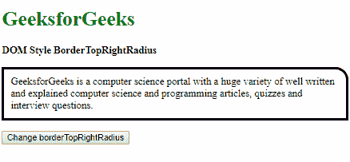
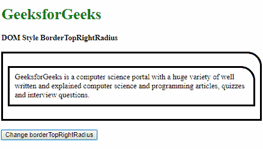

# HTML | DOM 样式 borderTopRightRadius 属性

> 原文:[https://www . geeksforgeeks . org/html-DOM-style-bordertoprightzerm-property/](https://www.geeksforgeeks.org/html-dom-style-bordertoprightradius-property/)

DOM Style**bordertoprightlradius**属性用于**设置**或**返回** *元素右上角边框的半径*。

**语法:**

*   要获取 borderTopRightRadius 属性

    ```html
    object.style.borderTopRightRadius
    ```

*   要设置边框半径属性

    ```html
    object.style.borderTopRightRadius = "length | percentage | 
    initial | inherit"
    ```

**返回值:**返回一个字符串值，代表元素的边框右上角半径属性。

**属性值:**

*   **length:** This is used to define the radius in fixed length units. Two values may be used to specify the radii of the quarter ellipse, the first value being the horizontal radius and the second value being the vertical radius.

    **示例-1:** 使用一个值指定半径。

    ```html
    <!DOCTYPE html>
    <html lang="en">

    <head>
        <title>
          DOM Style BorderTopRightRadius
        </title>

        <style>
            .elem {
                padding: 10px;
                border-style: solid;
            }
        </style>
    </head>

    <body>
        <h1 style="color: green">
          GeeksforGeeks
        </h1>
        <b>
          DOM Style BorderTopRightRadius
        </b>
        <p class="elem">
          GeeksforGeeks is a computer science 
          portal with a huge variety of well 
          written and explained computer science
          and programming articles, quizzes and 
          interview questions.
        </p>
        <button onclick="changeRadius()">
          Change borderTopRightRadius
        </button>

        <!-- Script to change borderTopRightRadius -->
        <script>
            function changeRadius() {
                elem = document.querySelector('.elem');
                elem.style.borderTopRightRadius = '30px';
            }
        </script>
    </body>

    </html>
    ```

    **输出:**

    **点击按钮前:**

    

    **点击按钮后:**

    

    **示例-2:** 使用两个值指定半径。

    ```html
    <!DOCTYPE html>
    <html lang="en">

    <head>
        <title>
          DOM Style BorderTopRightRadius
        </title>

        <style>
            .elem {
                padding: 10px;
                border-style: solid;
            }
        </style>
    </head>

    <body>
        <h1 style="color: green">
          GeeksforGeeks
        </h1>
        <b>
          DOM Style BorderTopRightRadius
      </b>
        <p class="elem">
          GeeksforGeeks is a computer science
          portal with a huge variety of well written
          and explained computer science and
          programming articles, quizzes and
          interview questions.
        </p>
        <button onclick="changeRadius()">
          Change borderTopRightRadius
        </button>

        <!-- Script to change borderTopRightRadius -->
        <script>
            function changeRadius() {
                elem = document.querySelector('.elem');
                elem.style.borderTopRightRadius = '10px 30px';
            }
        </script>
    </body>

    </html>
    ```

    **输出:**

    **点击按钮前:**

    

    **点击按钮后:**

    

*   **percentage:** This is used to define the radius in percentage units. Two values may be used to specify the radii of the quarter ellipse, the first value being the horizontal radius which is the percentage of the width of the border box, and the second value being the vertical radius which is the percentage of the height of border-box.

    **示例-3:** 使用一个值指定半径。

    ```html
    <!DOCTYPE html>
    <html lang="en">

    <head>
        <title>
          DOM Style BorderTopRightRadius
        </title>
        <style>
            .elem {
                padding: 10px;
                border-style: solid;
            }
        </style>
    </head>

    <body>
        <h1 style="color: green">
          GeeksforGeeks
        </h1>
        <b>
          DOM Style BorderTopRightRadius
        </b>
        <p class="elem">
          GeeksforGeeks is a computer science 
          portal with a huge variety of well 
          written and explained computer science
          and programming articles, quizzes and
          interview questions.
        </p>
        <button onclick="changeRadius()">
          Change borderTopRightRadius
        </button>

        <!-- Script to change borderTopRightRadius -->
        <script>
            function changeRadius() {
                elem = document.querySelector('.elem');
                elem.style.borderTopRightRadius = '20%';
            }
        </script>
    </body>

    </html>
    ```

    **输出:**

    **点击按钮前:**

    

    **点击按钮后:**

    

    **示例-4:** 使用两个值指定半径。

    ```html
    <!DOCTYPE html>
    <html lang="en">

    <head>
        <title>
          DOM Style BorderTopRightRadius
        </title>
        <style>
            .elem {
                padding: 10px;
                border-style: solid;
            }
        </style>
    </head>

    <body>
        <h1 style="color: green">
          GeeksforGeeks
        </h1>
        <b>
          DOM Style BorderTopRightRadius
        </b>
        <p class="elem">
          GeeksforGeeks is a computer science portal
          with a huge variety of well written and 
          explained computer science and programming 
          articles, quizzes and interview questions.
        </p>>
        <button onclick="changeRadius()">
          Change borderTopRightRadius
        </button>

        <!-- Script to change borderTopRightRadius -->
        <script>
            function changeRadius() {
                elem = document.querySelector('.elem');
                elem.style.borderTopRightRadius = '10% 50%';
            }
        </script>
    </body>

    </html>
    ```

    **输出:**

    **点击按钮前:**

    

    **点击按钮后:**

    

*   **initial:** This is used to set this property to its default value.

    **示例-5:**

    ```html
    <!DOCTYPE html>
    <html lang="en">

    <head>
        <title>
          DOM Style BorderTopRightRadius
        </title>
        <style>
            .elem {
                padding: 10px;
                border-style: solid;
                border-top-right-radius: 20px;
            }
        </style>
    </head>

    <body>
        <h1 style="color: green">
          GeeksforGeeks
        </h1>
        <b>
          DOM Style BorderTopRightRadius
        </b>
        <p class="elem">
          GeeksforGeeks is a computer science 
          portal with a huge variety of well 
          written and explained computer science
          and programming articles, quizzes and 
          interview questions.
        </p>
        <button onclick="changeRadius()">
          Change borderTopRightRadius
        </button>

        <!-- Script to change borderTopRightRadius -->
        <script>
            function changeRadius() {
                elem = document.querySelector('.elem');
                elem.style.borderTopRightRadius = 'initial';
            }
        </script>
    </body>

    </html>
    ```

    **输出:**

    **点击按钮前:**

    

    **点击按钮后:**

    

*   **inherit:** This inherits the property from its parent.

    **示例-6:**

    ```html
    <!DOCTYPE html>
    <html lang="en">

    <head>
        <title>
          DOM Style BorderTopRightRadius
        </title>

        <style>
            #parent {
                padding: 10px;
                border-style: solid;
                /* Setting the borderTopRightRadius of the parent */
                border-top-right-radius: 30px;
            }

            .elem {
                padding: 10px;
                border-style: solid;
            }
        </style>
    </head>

    <body>
        <h1 style="color: green">
          GeeksforGeeks
        </h1>
        <b>
          DOM Style BorderTopRightRadius
        </b>
        <br>
        <br>
        <div id="parent">
            <p class="elem">
              GeeksforGeeks is a computer science
              portal with a huge variety of well
              written and explained computer 
              science and programming articles,
              quizzes and interview questions.
            </p>
        </div>
        <br>
        <button onclick="changeRadius()">
          Change borderTopRightRadius
        </button>

        <!-- Script to change borderTopRightRadius -->
        <script>
            function changeRadius() {
                elem = document.querySelector('.elem');
                elem.style.borderTopRightRadius = 'inherit';
            }
        </script>
    </body>

    </html>
    ```

    **输出:**

    **点击按钮前:**

    

    **点击按钮后:**

    

**支持的浏览器:**以下列出了*bordertoprightlradius*属性支持的浏览器:

*   谷歌 Chrome
*   Internet Explorer 9.0
*   火狐浏览器
*   苹果 Safari
*   歌剧