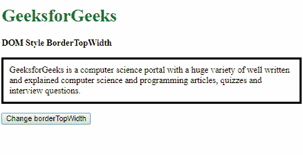
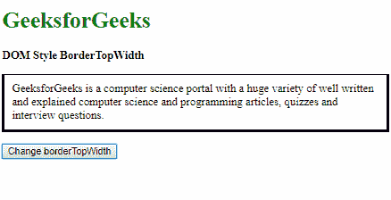
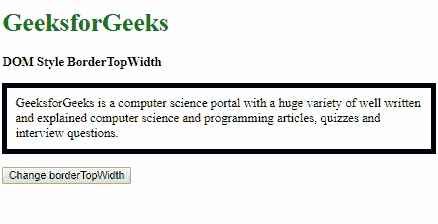
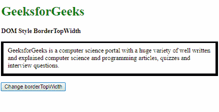
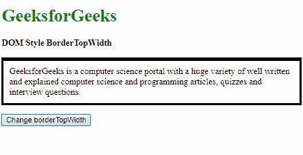
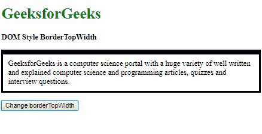
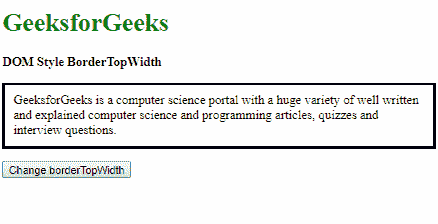
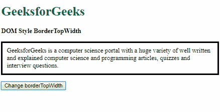
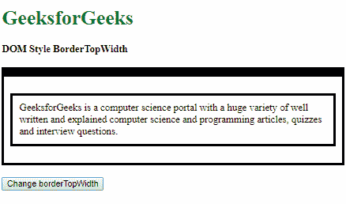
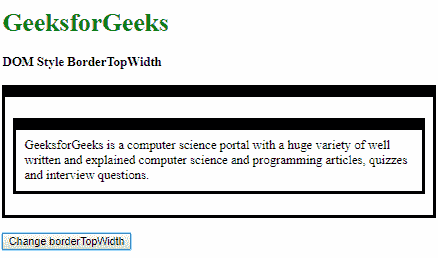

# HTML | DOM 样式 borderTopWidth 属性

> 原文:[https://www . geesforgeks . org/html-DOM-style-bordertopwidth-property/](https://www.geeksforgeeks.org/html-dom-style-bordertopwidth-property/)

HTML DOM 中的**样式边框宽度属性**用于**设置**或**返回** *元素顶部边框的宽度*。

**语法:**

*   要获得 borderTopWidth 属性

    ```html
    object.style.borderTopWidth
    ```

*   设置边框宽度属性

    ```html
    object.style.borderTopWidth = "thin | medium | thick | length |
    initial | inherit"
    ```

**返回值:**返回一个字符串值，代表元素上边框的宽度。

**属性值:**

1.  **thin:** This is used to define a thin top border.

    **示例:**

    ```html
    <!DOCTYPE html>
    <html lang="en">

    <head>
        <title>
          DOM Style BorderTopWidth
        </title>

        <style>
            .elem {
                border-style: solid;
                padding: 10px;
            }
        </style>
    </head>

    <body>
        <h1 style="color: green">
          GeeksforGeeks
        </h1>
        <b>
          DOM Style BorderTopWidth
        </b>
        <p class="elem">
          GeeksforGeeks is a computer science
          portal with a huge variety of well 
          written and explained computer 
          science and programming articles,
          quizzes and interview questions.
        </p>
        <button onclick="changeWidth()">
          Change borderTopWidth
        </button>

        <!-- Script to change borderTopWidth -->
        <script>
            function changeWidth() {
                elem = document.querySelector('.elem');
                elem.style.borderTopWidth = 'thin';
            }
        </script>
    </body>

    </html>
    ```

    **输出:**

    **点击按钮前:**

    

    **点击按钮后:**

    

2.  **medium:** This is used to define a medium top border. This is the default value.

    **示例:**

    ```html
    <!DOCTYPE html>
    <html lang="en">

    <head>
        <title>
          DOM Style BorderTopWidth
        </title>
        <style>
            .elem {
                border: thick solid;
                padding: 10px;
            }
        </style>
    </head>

    <body>
        <h1 style="color: green">
          GeeksforGeeks
        </h1>
        <b>
          DOM Style BorderTopWidth
      </b>
        <p class="elem">
          GeeksforGeeks is a computer 
          science portal with a huge 
          variety of well written and 
          explained computer science
          and programming articles,
          quizzes and interview questions.
        </p>
        <button onclick="changeWidth()">
          Change borderTopWidth
        </button>

        <!-- Script to change borderTopWidth -->
        <script>
            function changeWidth() {
                elem = document.querySelector('.elem');
                elem.style.borderTopWidth = 'medium';
            }
        </script>
    </body>

    </html>
    ```

    **输出:**

    **点击按钮前:**

    

    **点击按钮后:**

    

3.  **thick:** This is used to define a thick top border.

    **示例-3:**

    ```html
    <!DOCTYPE html>
    <html lang="en">

    <head>
        <title>
          DOM Style BorderTopWidth
        </title>

        <style>
            .elem {
                border-style: solid;
                padding: 10px;
            }
        </style>
    </head>

    <body>
        <h1 style="color: green">
          GeeksforGeeks
        </h1>
        <b>
          DOM Style BorderTopWidth
      </b>
        <p class="elem">
          GeeksforGeeks is a computer 
          science portal with a huge 
          variety of well written and
          explained computer science 
          and programming articles, 
          quizzes and interview questions.
        </p>
        <button onclick="changeWidth()">
          Change borderTopWidth
        </button>

        <!-- Script to change borderTopWidth -->
        <script>
            function changeWidth() {
                elem = document.querySelector('.elem');
                elem.style.borderTopWidth = 'thick';
            }
        </script>
    </body>

    </html>
    ```

    **输出:**

    **点击按钮前:**

    

    **点击按钮后:**

    

4.  **length:** This is used to define the top border width in terms of length units.

    **示例-4:**

    ```html
    <!DOCTYPE html>
    <html lang="en">

    <head>
        <title>
          DOM Style BorderTopWidth
        </title>

        <style>
            .elem {
                border-style: solid;
                padding: 10px;
            }
        </style>
    </head>

    <body>
        <h1 style="color: green">
          GeeksforGeeks
      </h1>
        <b>
          DOM Style BorderTopWidth
        </b>
        <p class="elem">
          GeeksforGeeks is a computer science
          portal with a huge variety of well 
          written and explained computer science
          and programming articles, quizzes and
          interview questions.
        </p>
        <button onclick="changeWidth()">
          Change borderTopWidth
        </button>

        <!-- Script to change borderTopWidth -->
        <script>
            function changeWidth() {
                elem = document.querySelector('.elem');
                elem.style.borderTopWidth = '10px';
            }
        </script>
    </body>

    </html>
    ```

    **输出:**

    **点击按钮前:**
    

    **点击按钮后:**
    

5.  **initial:** This is used to set this property to its default value.

    **示例-5:**

    ```html
    <!DOCTYPE html>
    <html lang="en">

    <head>
        <title>
          DOM Style BorderTopWidth
        </title>

        <style>
            .elem {
                border-style: solid;
                padding: 10px;
                border-top-width: 2px;
            }
        </style>
    </head>

    <body>
        <h1 style="color: green">
          GeeksforGeeks
        </h1>
        <b>
          DOM Style BorderTopWidth
        </b>
        <p class="elem">
          GeeksforGeeks is a computer science
          portal with a huge variety of well 
          written and explained computer 
          science and programming articles,
          quizzes and interview questions.
        </p>
        <button onclick="changeWidth()">
          Change borderTopWidth
        </button>

        <!-- Script to change borderTopWidth -->
        <script>
            function changeWidth() {
                elem = document.querySelector('.elem');
                elem.style.borderTopWidth = 'initial';
            }
        </script>
    </body>

    </html>
    ```

    **输出:**

    **点击按钮前:**

    

    **点击按钮后:**

    

6.  **inherit:** This inherits the property from its parent.

    **示例-6:**

    ```html
    <!DOCTYPE html>
    <html lang="en">

    <head>
        <title>
          DOM Style BorderTopWidth
        </title>

        <style>
            #parent {
                padding: 10px;
                border-style: solid;
                /* Setting the borderTopWidth
                 of the parent */
                border-top-width: 15px;
            }

            .elem {
                border-style: solid;
                padding: 10px;
            }
        </style>
    </head>

    <body>
        <h1 style="color: green">
          GeeksforGeeks
        </h1>
        <b>
          DOM Style BorderTopWidth
        </b>
        <br>
        <br>
        <div id="parent">
            <p class="elem">
              GeeksforGeeks is a computer science 
              portal with a huge variety of well 
              written and explained computer science
              and programming articles, quizzes and
              interview questions.
            </p>
        </div>
        <br>
        <button onclick="changeWidth()">
          Change borderTopWidth
        </button>

        <!-- Script to change borderTopWidth -->
        <script>
            function changeWidth() {
                elem = document.querySelector('.elem');
                elem.style.borderTopWidth = 'inherit';
            }
        </script>
    </body>

    </html>
    ```

    **输出:**

    **点击按钮前:**

    

    **点击按钮后:**

    

    **支持的浏览器:**由 *borderTopWidth* 属性支持的浏览器如下:

    *   谷歌 Chrome
    *   微软公司出品的 web 浏览器
    *   火狐浏览器
    *   歌剧
    *   苹果 Safari