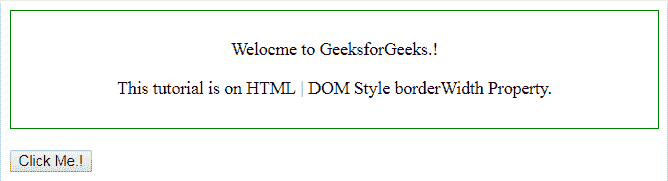
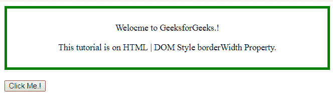
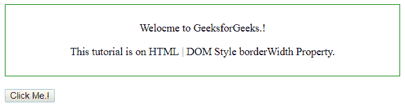
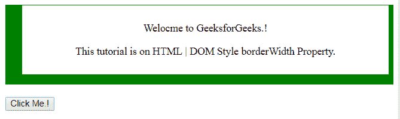
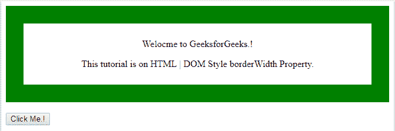
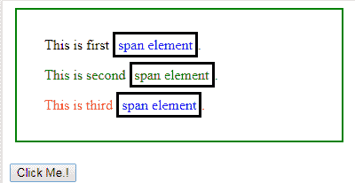
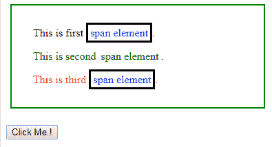
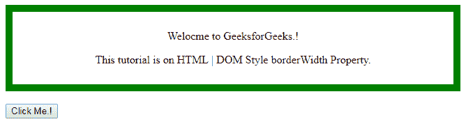
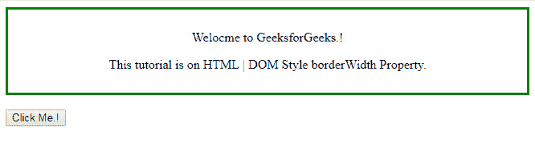

# HTML | DOM 样式边框属性

> 原文:[https://www . geesforgeks . org/html-DOM-style-border width-property/](https://www.geeksforgeeks.org/html-dom-style-borderwidth-property/)

HTML DOM 中的**边框宽度**属性用于设置或返回边框元素的宽度。

**语法:**

*   用于设置宽度的边框。

```html
object.style.borderWidth = value
```

*   它返回边框宽度属性。

```html
object.style.borderWidth
```

**返回值:**返回给定样式的选中边框元素。

边框宽度属性有六个不同值，如下所示:

**粗:**设置边框宽度为粗。

**语法:**

```html
document.getElementById("id_name").style.borderWidth = "thick";
```

**示例:**

## 超文本标记语言

```html
<!DOCTYPE html>
<html>

<head>
    <title>
        HTML | DOM Style borderWidth Property
    </title>
    <style>
        div {
            border: 1px solid green;
            padding: 10px;
            text-align: center;
        }
    </style>
</head>

<body>

    <div id="d1">

<p>Welcome to GeeksforGeeks.!</p>

<p>
          This tutorial is on
          HTML | DOM Style borderWidth Property.
        </p>

    </div>
    <br>
    <input type="button" onclick="myFunction()"
                         value="Click Me.!" />

    <script>
        function myFunction() {
            document.getElementById("d1").style.borderWidth
                                                 = "thick";
        }
    </script>

</body>

</html>
```

**输出:**
**之前点击按钮:**



**点击按钮后:**



**长度:**用于将边框宽度的每一侧设置为给定的长度。长度可以根据 px、em 等设置。

**语法:**

```html
document.getElementById("id_name").style.borderWidth =
top_px right_px bottom_px left_px;
```

**示例:**本示例设置边框宽度的每一侧。

## 超文本标记语言

```html
<!DOCTYPE html>
<html>

<head>
    <title>
        HTML | DOM Style borderWidth Property
    </title>
    <style>
        div {
            border-style: solid;
            border: 1px solid green;
            padding: 10px;
            text-align: center;
        }
    </style>
</head>

<body>

    <div id="d1">

<p>Welcome to GeeksforGeeks.!</p>

<p>
          This tutorial is on
          HTML | DOM Style borderWidth Property.
        </p>

    </div>
    <br>
    <input type="button" onclick="mainFunction()"
                         value="Click Me.!" />
    <script>
        function mainFunction() {
            document.getElementById("d1").style.borderWidth
                                      = "1px 7px 15px 25px";
        }
    </script>

</body>

</html>
```

**输出:**
**之前点击按钮:**



**点击按钮后:**



**薄:**用于将边框宽度设置为薄。

**语法:**

```html
document.getElementById("id_name").style.borderWidth = "thin";
```

**示例:**

## 超文本标记语言

```html
<!DOCTYPE html>
<html>

<head>
    <title>
        HTML | DOM Style borderWidth Property
    </title>
    <style>
        div {
            border: 8px solid green;
            padding: 10px;
            text-align: center;
        }
    </style>
</head>

<body>

    <div id="d1">

<p>Welcome to GeeksforGeeks.!</p>

<p>
          This tutorial is on
          HTML | DOM Style borderWidth Property.
        </p>

    </div>
    <br>
    <input type="button" onclick="myFunction()"
                         value="Click Me.!" />

    <script>
        function myFunction() {
            document.getElementById("d1").style.borderWidth
                                                  = "thin";
        }
    </script>

</body>

</html>
```

**输出:**
**之前点击按钮:**


**点击按钮后:**


**中:**用于将边框改为中。这是边框宽度的默认值。

**语法:**

```html
document.getElementById("id_name").style.borderWidth = "medium";
```

**示例:**

## 超文本标记语言

```html
<!DOCTYPE html>
<html>

<head>
    <title>
        HTML | DOM Style borderWidth Property
    </title>
    <style>
        div {
            border: 30px solid green;
            padding: 10px;
            text-align: center;
        }
    </style>
</head>

<body>

    <div id="d1">

<p>Welcome to GeeksforGeeks.!</p>

<p>
          This tutorial is on
          HTML | DOM Style borderWidth Property.
        </p>

    </div>
    <br>
    <input type="button" onclick="myFunction()"
                         value="Click Me.!" />

    <script>
        function myFunction() {
            document.getElementById("d1").style.borderWidth
                                                = "medium";
        }
    </script>

</body>

</html>
```

**输出:**
**之前点击按钮:**



**点击按钮后:**


**inherit:** 它指定从其父元素继承的边框宽度属性。

**语法:**

```html
document.getElementById("id_name").style.borderWidth = "inherit";
```

**示例:**

## 超文本标记语言

```html
<!DOCTYPE html>
<html>

<head>
    <title>
        HTML | DOM Style borderWidth Property
    </title>
    <style>
        span {
            color: blue;
            border: 3px solid black;
            padding: 3px;
        }

        .d1 span {
            color: inherit;
        }

        div {
            padding: 5px;
            display: block;
            margin: 6px;
        }

        .c2 {
            width: 50%;
            height: 40%;
            padding: 20px;
            border: 2px solid green;
        }
    </style>
</head>

<body>
    <div class="c2">
        <div>
            This is first
            <span>span element</span>.
        </div>

        <div class="d1" style="color:green">
            This is second
          <span id="gfg">span element</span>.
        </div>

        <div style="color:red">
            This is third
          <span>span element</span>.
        </div>
    </div>
    <br>
    <input type="button" onclick="myFunction()"
                         value="Click Me.!" />
    <script>
        function myFunction() {
            document.getElementById("gfg").style.borderWidth
                                                = "inherit";
        }
    </script>
</body>

</html>
```

**输出:**

**之前点击按钮:**



**点击按钮后:**



**初始值:**将 borderWidth 属性设置为默认值。

**语法:**

```html
document.getElementById("id_name").style.borderWidth = "initial";
```

**示例:**

## 超文本标记语言

```html
<!DOCTYPE html>
<html>

<head>
    <title>
        HTML | DOM Style borderWidth Property
    </title>
    <style>
        div {
            border: 10px solid;
            border-color: green;
            padding: 10px;
            text-align: center;
        }
    </style>
</head>

<body>

    <div id="d1">

<p>Welcome to GeeksforGeeks.!</p>

<p>
          This tutorial is on
          HTML | DOM Style borderWidth Property. </p>

    </div>
    <br>
    <input type="button" onclick="myFunction()"
                         value="Click Me.!" />

    <script>
        function myFunction() {
            document.getElementById("d1").style.borderWidth
                                               = "initial";
        }
    </script>

</body>

</html>
```

**输出:**

**之前点击按钮:**



**点击按钮后:**



**支持的浏览器:**T2 DOM borderWidth 属性支持的浏览器如下:

*   谷歌 Chrome
*   微软公司出品的 web 浏览器
*   火狐浏览器
*   旅行队
*   歌剧