# HTML | DOM 样式框阴影属性

> 原文:[https://www . geesforgeks . org/html-DOM-style-box shadow-property/](https://www.geeksforgeeks.org/html-dom-style-boxshadow-property/)

DOM Style **boxShadow** 属性用于**设置**或**返回** *元素的投影。*

**语法:**

*   获取盒子阴影属性

    ```html
    object.style.boxShadow
    ```

*   设置框阴影属性

    ```html
    object.style.boxShadow = "horizontal-offset vertical-offset blur
    spread color inset | none | initial | inherit"
    ```

**返回值:**返回一个字符串值，代表元素的盒影属性。

**属性值:**

1.  **horizontal-offset vertical-offset:** This is used to specify the position of the shadow in length units. Negative values are allowed.

    **示例-1:**

    ```html
    <!DOCTYPE html>
    <html lang="en">

    <head>
        <title>
            DOM Style boxShadow
        </title>

        <style>
            .elem {
                border-style: solid;
                margin: 10px;
                padding: 10px;
            }
        </style>
    </head>

    <body>
        <h1 style="color: green">
          GeeksforGeeks
        </h1>
        <b>
          DOM Style boxShadow
        </b>
        <p class="elem">
          GeeksforGeeks is a computer science portal
          with a huge variety of well written and 
          explained computer science and programming
          articles, quizzes and interview questions.
        </p>
        <button onclick="setShadow()" 
                style="margin-top: 20px;">
            Change boxShadow
        </button>

        <!-- Script to change boxShadow -->
        <script>
            function setShadow() {
                elem = document.querySelector('.elem');
                elem.style.boxShadow = '10px 20px';
            }
        </script>
    </body>

    </html>
    ```

    **输出:**

    **点击按钮前:**

    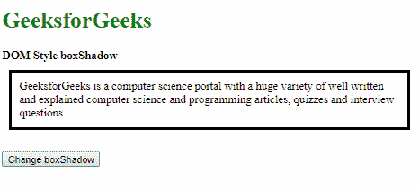

    **点击按钮后:**

    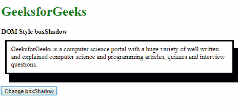

2.  **blur:** This is used to define the amount of blur to be used in the shadow.

    **示例-2:**

    ```html
    <!DOCTYPE html>
    <html lang="en">

    <head>
        <title>
            DOM Style boxShadow
        </title>

        <style>
            .elem {
                border-style: solid;
                margin: 10px;
                padding: 10px;
            }
        </style>
    </head>

    <body>
        <h1 style="color: green">
          GeeksforGeeks
        </h1>
        <b>
          DOM Style boxShadow
        </b>
        <p class="elem">
          GeeksforGeeks is a computer science
          portal with a huge variety of well 
          written and explained computer science
          and programming articles, quizzes and
          interview questions.
        </p>
        <button onclick="setShadow()" 
                style="margin-top: 20px;">
            Change boxShadow
        </button>

        <!-- Script to change boxShadow -->
        <script>
            function setShadow() {
                elem = document.querySelector('.elem');
                elem.style.boxShadow = '10px 20px 5px';
            }
        </script>
    </body>

    </html>
    ```

    **输出:**

    **点击按钮前:**

    

    **点击按钮后:**

    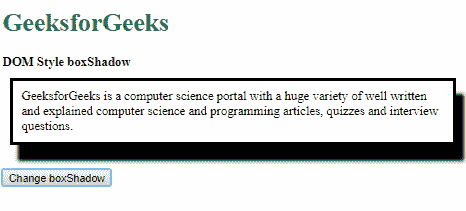

3.  **spread:** This is used to define the amount of spread of the shadow.

    **示例-3:**

    ```html
    <!DOCTYPE html>
    <html lang="en">

    <head>
        <title>
            DOM Style boxShadow
        </title>

        <style>
            .elem {
                border-style: solid;
                margin: 30px;
                padding: 10px;
            }
        </style>
    </head>

    <body>
        <h1 style="color: green">
          GeeksforGeeks
        </h1>
        <b>
          DOM Style boxShadow
        </b>
        <p class="elem">
          GeeksforGeeks is a computer science 
          portal with a huge variety of well 
          written and explained computer science 
          and programming articles, quizzes and
          interview questions.
        </p>
        <button onclick="setShadow()" 
                style="margin-top: 20px;">
            Change boxShadow
        </button>

        <!-- Script to change boxShadow -->
        <script>
            function setShadow() {
                elem = document.querySelector('.elem');
                elem.style.boxShadow = '10px 20px 0px 20px';
            }
        </script>
    </body>

    </html>
    ```

    **输出:**

    **点击按钮前:**

    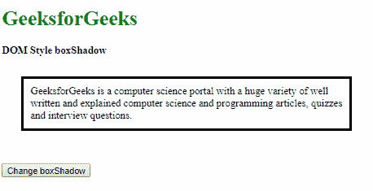

    **点击按钮后:**

    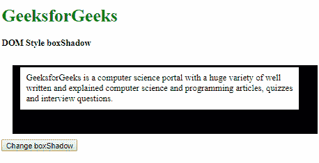

4.  **color:** This is used to define the color of the shadow to be used.

    **示例-4:**

    ```html
    <!DOCTYPE html>
    <html lang="en">

    <head>
        <title>
            DOM Style boxShadow
        </title>

        <style>
            .elem {
                border-style: solid;
                margin: 25px;
                padding: 10px;
            }
        </style>
    </head>

    <body>
        <h1 style="color: green">
          GeeksforGeeks
        </h1>
        <b>
          DOM Style boxShadow
        </b>
        <p class="elem">
          GeeksforGeeks is a computer science 
          portal with a huge variety of well 
          written and explained computer science 
          and programming articles, quizzes and 
          interview questions.
        </p>
        <button onclick="setShadow()" 
                style="margin-top: 20px;">
            Change boxShadow
        </button>

        <!-- Script to change boxShadow -->
        <script>
            function setShadow() {
                elem = document.querySelector('.elem');
                elem.style.boxShadow = '10px 20px green';
            }
        </script>
    </body>

    </html>
    ```

    **输出:**

    **点击按钮前:**

    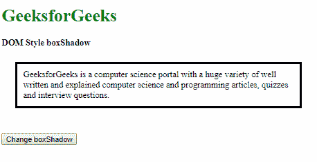

    **点击按钮后:**

    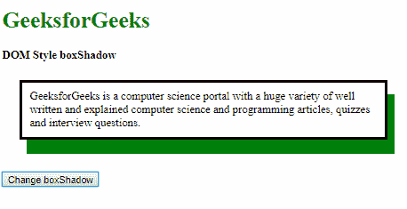

5.  **inset:** This is used to set the shadow to an inner one. Normally a shadow is an outset, that is outside.

    **示例-5:**

    ```html
    <!DOCTYPE html>
    <html lang="en">

    <head>
        <title>
            DOM Style boxShadow
        </title>

        <style>
            .elem {
                border-style: solid;
                margin: 25px;
                padding: 10px;
                box-shadow: 10px 20px;
            }
        </style>
    </head>

    <body>
        <h1 style="color: green">
          GeeksforGeeks
        </h1>
        <b>
          DOM Style boxShadow
        </b>
        <p class="elem">
          GeeksforGeeks is a computer science 
          portal with a huge variety of well 
          written and explained computer science 
          and programming articles, quizzes and 
          interview questions.
        </p>
        <button onclick="setShadow()" 
                style="margin-top: 20px;">
            Change boxShadow
        </button>

        <!-- Script to change boxShadow -->
        <script>
            function setShadow() {
                elem = document.querySelector('.elem');
                elem.style.boxShadow = '10px 20px inset';
            }
        </script>
    </body>

    </html>
    ```

    **输出:**

    **点击按钮前:**

    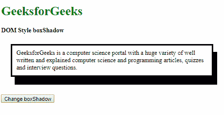

    **点击按钮后:**

    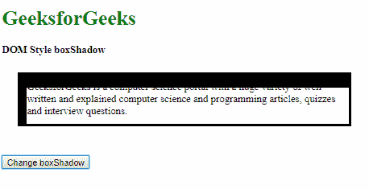

6.  **none:** This is used to remove any shadow present. This is the default value.

    **示例-6:**

    ```html
    <!DOCTYPE html>
    <html lang="en">

    <head>
        <title>
            DOM Style boxShadow
        </title>

        <style>
            .elem {
                border-style: solid;
                margin: 10px;
                padding: 10px;
                box-shadow: 10px 20px;
            }
        </style>
    </head>

    <body>
        <h1 style="color: green">
          GeeksforGeeks
        </h1>
        <b>
          DOM Style boxShadow
        </b>
        <p class="elem">
          GeeksforGeeks is a computer science
          portal with a huge variety of well 
          written and explained computer science 
          and programming articles, quizzes and 
          interview questions.
        </p>
        <button onclick="setShadow()" 
                style="margin-top: 20px;">
            Change boxShadow
        </button>

        <!-- Script to change boxShadow -->
        <script>
            function setShadow() {
                elem = document.querySelector('.elem');
                elem.style.boxShadow = 'none';
            }
        </script>
    </body>

    </html>
    ```

    **输出:**

    **点击按钮前:**

    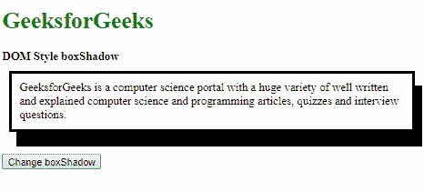

    **点击按钮后:**

    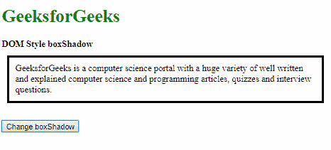

7.  **initial:** This is used to set this property to its default value.

    **示例-7:**

    ```html
    <!DOCTYPE html>
    <html lang="en">

    <head>
        <title>
            DOM Style boxShadow
        </title>

        <style>
            .elem {
                border-style: solid;
                padding: 10px;
                margin: 25px;
                box-shadow: 10px 20px green;
            }
        </style>
    </head>

    <body>
        <h1 style="color: green">
          GeeksforGeeks
        </h1>
        <b>
          DOM Style boxShadow
        </b>
        <p class="elem">
          GeeksforGeeks is a computer science 
          portal with a huge variety of well
          written and explained computer science
          and programming articles, quizzes and
          interview questions.
        </p>
        <button onclick="setShadow()"
                style="margin-top: 20px;">
            Change boxShadow
        </button>

        <!-- Script to change boxShadow -->
        <script>
            function setShadow() {
                elem = document.querySelector('.elem');
                elem.style.boxShadow = 'initial';
            }
        </script>
    </body>

    </html>
    ```

    **输出:**

    **点击按钮前:**

    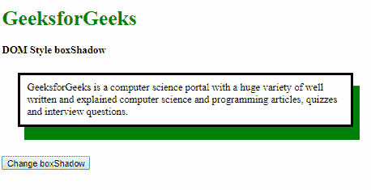

    **点击按钮后:**

    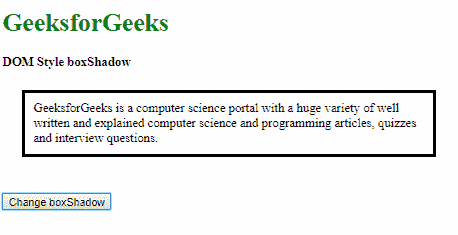

8.  **inherit:** This inherits the property from its parent.

    **示例-8:**

    ```html
    <!DOCTYPE html>
    <html lang="en">

    <head>
        <title>
            DOM Style boxShadow
        </title>

        <style>
            #parent {
                border-style: solid;
                padding: 10px;
                margin: 25px;
                box-shadow: 5px 10px green;
            }

            .elem {
                border-style: solid;
                padding: 10px;
            }
        </style>
    </head>

    <body>
        <h1 style="color: green">
          GeeksforGeeks
        </h1>
        <b>
          DOM Style boxShadow
        </b>
        <br>
        <br>
        <div id="parent">
            <p class="elem">
              GeeksforGeeks is a computer science
              portal with a huge variety of well 
              written and explained computer science
              and programming articles, quizzes and
              interview questions.
            </p>
        </div>
        <br>
        <button onclick="setShadow()" style="margin-top: 20px;">
            Change boxShadow
        </button>

        <!-- Script to change boxShadow -->
        <script>
            function setShadow() {
                elem = document.querySelector('.elem');
                elem.style.boxShadow = 'inherit';
            }
        </script>
    </body>

    </html>
    ```

    **输出:**

    **点击按钮前:**

    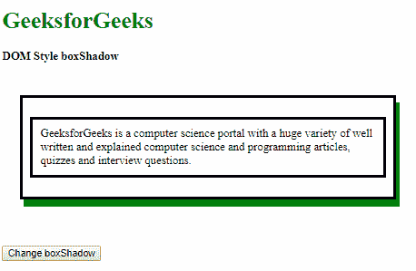

    **点击按钮后:**

    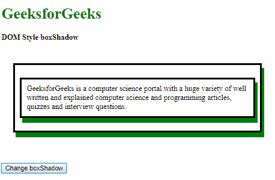

    **支持的浏览器:***box shadow*属性支持的浏览器如下:

    *   谷歌 Chrome
    *   Internet Explorer 9.0
    *   火狐浏览器
    *   歌剧
    *   Apple Safari 5.1.1