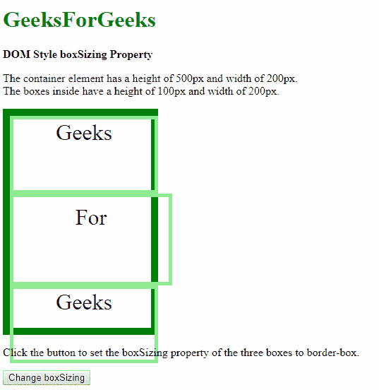
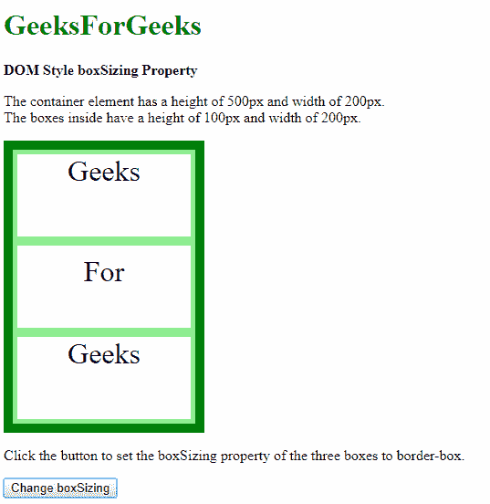
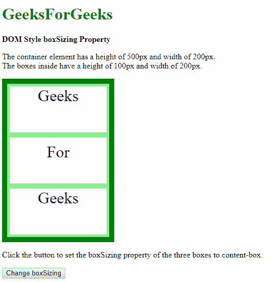
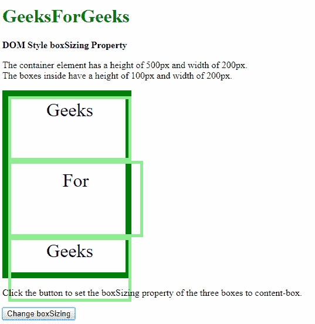
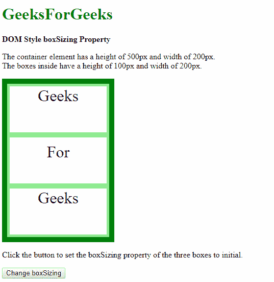
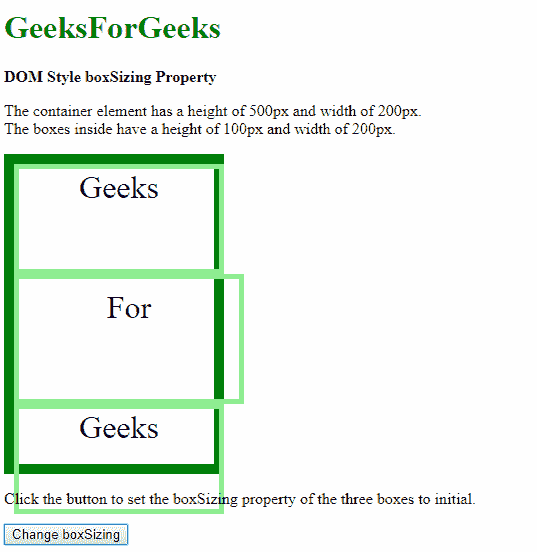
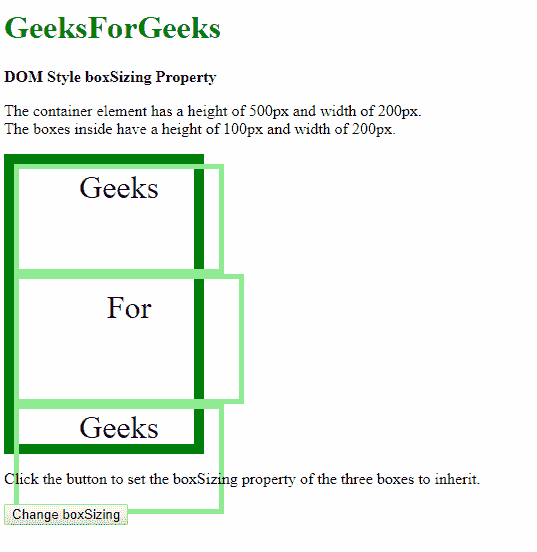
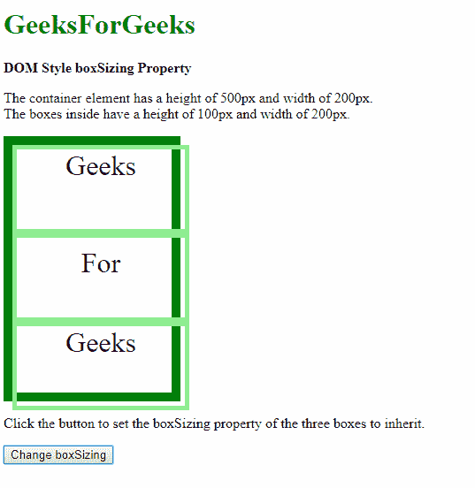

# HTML | DOM 样式框大小属性

> 原文:[https://www . geesforgeks . org/html-DOM-style-box size-property/](https://www.geeksforgeeks.org/html-dom-style-boxsizing-property/)

DOM Style**boxsize**属性用于**设置**或**返回** *一个对象应如何适合一个元素，并考虑其填充、边框和内容*。
当通过自动计算尺寸将元素装配到所需位置时，此属性会很有用。

**语法:**

*   它返回盒子大小属性:

    ```html
    object.style.boxSizing
    ```

*   用于设置装箱属性:

    ```html
    object.style.boxSizing = "border-box | content-box | initial | 
    inherit"
    ```

**返回值:**返回一个字符串值，代表元素的大小写属性。

**属性值:**

*   **border-box:** Using this value, any padding or border specified on the element is included and drawn inside the specified width and height. The dimensions of the content are calculated by subtracting the border and padding from the specified ‘width’ and ‘height’ properties of the element itself.

    **示例-1:**

    ```html
    <!DOCTYPE html>
    <html>

    <head>
        <title>
          DOM Style boxSizing Property
        </title>
        <style>
            .container {
                width: 200px;
                height: 300px;
                border: 10px solid green;
            }

            .box {
                width: 200px;
                height: 100px;
                border: 5px solid lightgreen;
                text-align: center;
                font-size: 2rem;
            }
        </style>
    </head>

    <body>
        <h1 style="color: green">
          GeeksForGeeks
        </h1>
        <b>
          DOM Style boxSizing Property
        </b>
        <p>
          The container element has a
          height of 500px and width of 200px.
            <br>The boxes inside have a height
          of 100px and width of 200px.
        </p>
        <div class="container">
            <div class="box" 
                 id="box-1">
              Geeks
          </div>
            <div class="box"
                 id="box-2"
                 style="padding: 10px;">
              For
          </div>
            <div class="box"
                 id="box-3">
              Geeks
          </div>
        </div>

        <p>
          Click the button to set the boxSizing 
          property of the three boxes to 
          border-box.
        </p>
        <button onclick="setBoxSizing()">
          Change boxSizing
        </button>
        <script>
            function setBoxSizing() {

                document.getElementById(
                  "box-1").style.boxSizing =
                  "border-box";

                document.getElementById(
                  "box-2").style.boxSizing = 
                  "border-box";

                document.getElementById(
                  "box-3").style.boxSizing = 
                  "border-box";
            }
        </script>
    </body>

    </html>
    ```

    **输出:**

    **点击按钮前:**
    

    **点击按钮后:**
    

*   **content-box:** Using this value, the specified width and height are applied to content-box of the element. Any padding and border specified on the element are added and drawn outside the specified dimensions of the box. This is the default value.

    **示例-2:**

    ```html
    <!DOCTYPE html>
    <html>

    <head>
        <title>
          DOM Style boxSizing Property
        </title>
        <style>
            .container {
                width: 200px;
                height: 300px;
                border: 10px solid green;
            }

            .box {
                width: 200px;
                height: 100px;
                border: 5px solid lightgreen;
                text-align: center;
                font-size: 2rem;
                box-sizing: border-box;
            }
        </style>
    </head>

    <body>
        <h1 style="color: green">
          GeeksForGeeks
        </h1>
        <b>
          DOM Style boxSizing Property
        </b>
        <p>
          The container element has a height 
          of 500px and width of 200px.
            <br>The boxes inside have a height
          of 100px and width of 200px.
        </p>
        <div class="container">
            <div class="box" 
                 id="box-1">
              Geeks
          </div>
            <div class="box" 
                 id="box-2"
                 style="padding: 10px;">
              For
          </div>
            <div class="box" 
                 id="box-3">
              Geeks
          </div>
        </div>

        <p>
          Click the button to set the boxSizing
          property of the three boxes to 
          content-box.
        </p>

        <button onclick="setBoxSizing()">
          Change boxSizing
        </button>

        <script>
            function setBoxSizing() {

                document.getElementById(
                  "box-1").style.boxSizing = "content-box";
                document.getElementById(
                  "box-2").style.boxSizing = "content-box";
                document.getElementById(
                  "box-3").style.boxSizing = "content-box";
            }
        </script>
    </body>

    </html>
    ```

    **输出:**
    **点击按钮前:**
    

    **点击按钮后:**
    

*   **initial:** This is used to set this property to its default value.

    **示例-3:**

    ```html
    <!DOCTYPE html>
    <html>

    <head>
        <title>
          DOM Style boxSizing Property
        </title>
        <style>
            .container {
                width: 200px;
                height: 300px;
                border: 10px solid green;
            }

            .box {
                width: 200px;
                height: 100px;
                border: 5px solid lightgreen;
                text-align: center;
                font-size: 2rem;
                box-sizing: border-box;
            }
        </style>
    </head>

    <body>
        <h1 style="color: green">
          GeeksForGeeks
        </h1>
        <b>
          DOM Style boxSizing Property
        </b>
        <p>
          The container element has a height 
          of 500px and width of 200px.
            <br>The boxes inside have a height
          of 100px and width of 200px.
        </p>
        <div class="container">
            <div class="box" 
                 id="box-1">
              Geeks
          </div>
            <div class="box" 
                 id="box-2"
                 style="padding: 10px;">
              For
          </div>
            <div class="box"
                 id="box-3">
              Geeks
          </div>
        </div>

        <p>
          Click the button to set the boxSizing 
          property of the three boxes to initial.
        </p>
        <button onclick="setBoxSizing()">
          Change boxSizing
        </button>
        <script>
            function setBoxSizing() {

                document.getElementById(
                  "box-1").style.boxSizing = "initial";

                document.getElementById(
                  "box-2").style.boxSizing = "initial";

                document.getElementById(
                  "box-3").style.boxSizing = "initial";
            }
        </script>
    </body>

    </html>
    ```

    **输出:**
    **点击按钮前:**
    

    **点击按钮后:**
    

*   **inherit:** This inherits the property from its parent.

    **示例-4:**

    ```html
    <!DOCTYPE html>
    <html>

    <head>
        <title>
          DOM Style boxSizing Property
        </title>
        <style>
            .container {
                width: 200px;
                height: 300px;
                border: 10px solid green;
                /* this acts as the parent */
                box-sizing: border-box;
            }

            .box {
                width: 200px;
                height: 100px;
                border: 5px solid lightgreen;
                text-align: center;
                font-size: 2rem;
            }
        </style>
    </head>

    <body>
        <h1 style="color: green">
          GeeksForGeeks
        </h1>
        <b>
          DOM Style boxSizing Property
        </b>
        <p>
          The container element has a 
          height of 500px and width of 200px.
            <br>The boxes inside have a 
          height of 100px and width of 200px.
        </p>
        <div class="container">
            <div class="box" 
                 id="box-1">
              Geeks
          </div>
            <div class="box" 
                 id="box-2" 
                 style="padding: 10px;">
              For
          </div>
            <div class="box" 
                 id="box-3">
              Geeks
          </div>
        </div>
        <p>
          Click the button to set the boxSizing
          property of the three boxes to inherit.
        </p>
        <button onclick="setBoxSizing()">
          Change boxSizing
        </button>
        <script>
            function setBoxSizing() {

                document.getElementById(
                  "box-1").style.boxSizing = "inherit";

                document.getElementById(
                  "box-2").style.boxSizing = "inherit";

                document.getElementById(
                  "box-3").style.boxSizing = "inherit";
            }
        </script>
    </body>

    </html>
    ```

    **输出:**
    **点击按钮前:**
    

    **点击按钮后:**
    

**支持的浏览器:**以下是*box size*属性支持的浏览器:

*   谷歌 Chrome
*   微软公司出品的 web 浏览器
*   火狐浏览器
*   歌剧
*   苹果 Safari