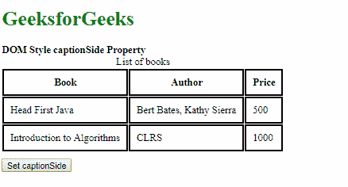
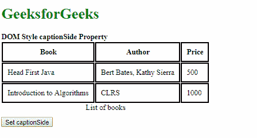
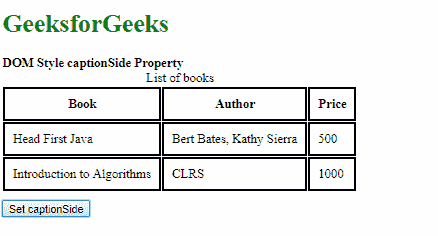
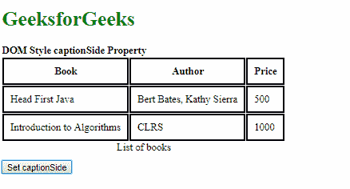

# HTML | DOM 样式标题侧属性

> 原文:[https://www . geesforgeks . org/html-DOM-style-caption side-property/](https://www.geeksforgeeks.org/html-dom-style-captionside-property/)

DOM Style **标题侧**属性用于**设置**或**返回** *表格中标题的位置*。

**语法:**

*   获取标题侧属性

    ```html
    object.style.captionSide
    ```

*   设置标题侧属性

    ```html
    object.style.captionSide = "bottom | top | initial | inherit"
    ```

**返回值:**返回一个字符串值，代表表格标题的位置。

**属性值:**

1.  **bottom:** This is used to position the caption on the bottom.

    **示例-1:**

    ```html
    <!DOCTYPE html>
    <html>

    <head>
        <title>
          DOM Style captionSide Property
        </title>
        <style>
            th,td {
                border: 2px solid black;
                padding: 10px;
                margin: 10px;
            }
        </style>
    </head>

    <body>
        <h1 style="color: green">
          GeeksforGeeks
        </h1>
        <b>
          DOM Style captionSide Property
        </b>
        <table>
            <caption id="caption1">
              List of books
            </caption>
            <tr>
                <th>Book</th>
                <th>Author</th>
                <th>Price</th>
            </tr>
            <tr>
                <td>Head First Java</td>
                <td>Bert Bates, Kathy Sierra</td>
                <td>500</td>
            </tr>
            <tr>
                <td>Introduction to Algorithms</td>
                <td>CLRS</td>
                <td>1000</td>
            </tr>
        </table>

        <button onclick="setCaptionSide()" 
                style="margin-top: 10px">
            Set captionSide
        </button>

        <!-- Script to set captionSide to bottom -->
        <script>
            function setCaptionSide() {

                elem = document.querySelector('#caption1');
                elem.style.captionSide = 'bottom';
            }
        </script>
    </body>

    </html>
    ```

    **输出:**

    **点击按钮前:**

    

    **点击按钮后:**

    

2.  **top:** This is used to position the caption on the top. This is the default value.

    **示例-2:**

    ```html
    <!DOCTYPE html>
    <html>

    <head>
        <title>
          DOM Style captionSide Property
        </title>
        <style>
            th,td {
                border: 2px solid black;
                padding: 10px;
                margin: 10px;
            }

            #caption1 {
                caption-side: bottom;
            }
        </style>
    </head>

    <body>
        <h1 style="color: green">
          GeeksforGeeks
        </h1>
        <b>
          DOM Style captionSide Property
        </b>
        <table>
            <caption id="caption1">
              List of books
            </caption>
            <tr>
                <th>Book</th>
                <th>Author</th>
                <th>Price</th>
            </tr>
            <tr>
                <td>Head First Java</td>
                <td>Bert Bates, Kathy Sierra</td>
                <td>500</td>
            </tr>
            <tr>
                <td>Introduction to Algorithms</td>
                <td>CLRS</td>
                <td>1000</td>
            </tr>
        </table>

        <button onclick="setCaptionSide()" 
                style="margin-top: 10px">
            Set captionSide
        </button>

        <!-- Script to set captionSide to top -->
        <script>
            function setCaptionSide() {
                elem = document.querySelector('#caption1');
                elem.style.captionSide = 'top';
            }
        </script>
    </body>

    </html>
    ```

    **输出:**

    **点击按钮前:**

    

    **点击按钮后:**

    

3.  **initial:** This is used to set this property to its default value.

    **示例-3:**

    ```html
    <!DOCTYPE html>
    <html>

    <head>
        <title>
          DOM Style captionSide Property
        </title>
        <style>
            th,td {
                border: 2px solid black;
                padding: 10px;
                margin: 10px;
            }

            #caption1 {
                caption-side: bottom;
            }
        </style>
    </head>

    <body>
        <h1 style="color: green">
          GeeksforGeeks
        </h1>
        <b>
          DOM Style captionSide Property
        </b>
        <table>
            <caption id="caption1">
              List of books
            </caption>
            <tr>
                <th>Book</th>
                <th>Author</th>
                <th>Price</th>
            </tr>
            <tr>
                <td>Head First Java</td>
                <td>Bert Bates, Kathy Sierra</td>
                <td>500</td>
            </tr>
            <tr>
                <td>Introduction to Algorithms</td>
                <td>CLRS</td>
                <td>1000</td>
            </tr>
        </table>

        <button onclick="setCaptionSide()"
                style="margin-top: 10px">
            Set captionSide
        </button>

        <!-- Script to set captionSide to initial -->
        <script>
            function setCaptionSide() {
                elem = document.querySelector('#caption1');
                elem.style.captionSide = 'initial';
            }
        </script>
    </body>

    </html>
    ```

    **输出:**

    **点击按钮前:**

    

    **点击按钮后:**

    

4.  **inherit:** This inherits the property from its parent.

    **示例-4:**

    ```html
    <!DOCTYPE html>
    <html>

    <head>
        <title>
          DOM Style captionSide Property
        </title>
        <style>
            th,td {
                border: 2px solid black;
                padding: 10px;
                margin: 10px;
            }

            #parent {
                caption-side: bottom;
            }
        </style>
    </head>

    <body>
        <h1 style="color: green">
          GeeksforGeeks
        </h1>
        <b>
          DOM Style captionSide Property
        </b>
        <div id="parent">
            <table>
                <caption id="caption1" 
                         style="caption-side: top">
                  List of books
                </caption>
                <tr>
                    <th>Book</th>
                    <th>Author</th>
                    <th>Price</th>
                </tr>
                <tr>
                    <td>Head First Java</td>
                    <td>Bert Bates, Kathy Sierra</td>
                    <td>500</td>
                </tr>
                <tr>
                    <td>Introduction to Algorithms</td>
                    <td>CLRS</td>
                    <td>1000</td>
                </tr>
            </table>
        </div>

        <button onclick="setCaptionSide()"
                style="margin-top: 10px">
            Set captionSide
        </button>

        <!-- Script to set captionSide to inherit -->
        <script>
            function setCaptionSide() {
                elem = document.querySelector('#caption1');
                elem.style.captionSide = 'inherit';
            }
        </script>
    </body>

    </html>
    ```

    **输出:**

    **点击按钮前:**

    

    **点击按钮后:**

    

    **支持的浏览器:**字幕侧属性支持的浏览器如下:

    *   谷歌 Chrome
    *   Internet Explorer 9.0
    *   火狐浏览器
    *   歌剧
    *   苹果 Safari