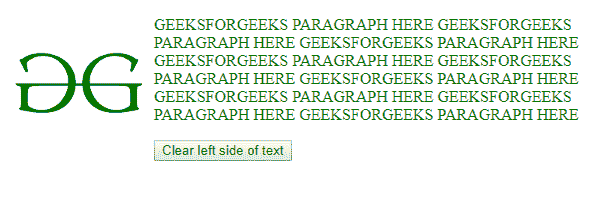
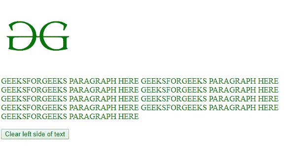
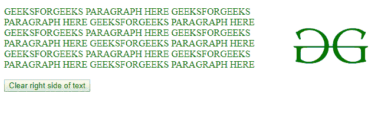
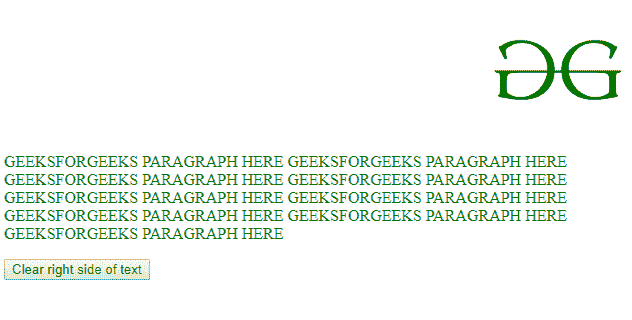
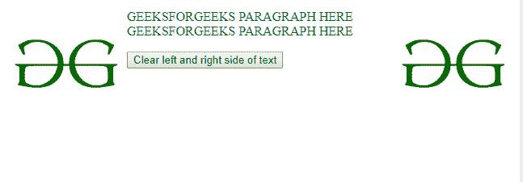
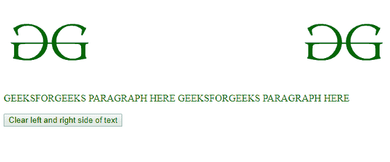

# HTML | DOM 样式清除属性

> 原文:[https://www . geesforgeks . org/html-DOM-style-clear-property/](https://www.geeksforgeeks.org/html-dom-style-clear-property/)

HTML 中的 **DOM Style clear** 属性用于*设置*或*获取*特定元素相对于浮动对象的位置。

**语法**

*   要获得清晰的属性:

    ```html
    object.style.clear

    ```

*   要设置清除属性:

    ```html
    object.style.clear = "none|left|right|both|initial|inherit"

    ```

**属性值:**

| 价值 | 描述 |
| 左边的 | 不允许元素左侧有浮动实体 |
| 正确 | 不允许元素右侧有浮动实体 |
| 两者 | 不允许元素左侧或右侧有浮动实体 |
| 没有人 | 允许元素左侧和右侧的浮动实体。这是默认设置 |
| 最初的 | 将属性值设置为默认值。 |
| 继承 | 继承该属性的值，即设置与父属性相同的值 |

**返回值:**返回一个字符串，表示元素相对于浮动对象的位置。

**示例-1:**

```html
<!DOCTYPE html>
<html>

<head>
    <title>
        HTML | DOM Style clear Property
    </title>
    <style>
        img {
            float: left;
        }
    </style>
</head>

<body>

    

    <p id="P" style="color:green">
      GEEKSFORGEEKS PARAGRAPH HERE GEEKSFORGEEKS PARAGRAPH HERE
      GEEKSFORGEEKS PARAGRAPH HERE GEEKSFORGEEKS PARAGRAPH HERE
      GEEKSFORGEEKS PARAGRAPH HERE GEEKSFORGEEKS PARAGRAPH HERE
      GEEKSFORGEEKS PARAGRAPH HERE GEEKSFORGEEKS PARAGRAPH HERE
      GEEKSFORGEEKS PARAGRAPH HERE
    </p>

    <button type="button" onclick="myFunction()">
      Clear left side of text</button>

    <script>
        function myFunction() {

            document.getElementById(
              "P").style.clear = "left";
        }
    </script>

</body>

</html>
```

**输出:**

*   **点击前:**
    
*   **After Click:**
    

    **示例-2:**

    ```html
    <!DOCTYPE html>
    <html>

    <head>
        <title>
            HTML | DOM Style clear Property
        </title>
        <style>
            img {
                float: right;
            }
        </style>
    </head>

    <body>

        

        <p id="P" style="color:green">
          GEEKSFORGEEKS PARAGRAPH HERE 
          GEEKSFORGEEKS PARAGRAPH HERE
          GEEKSFORGEEKS PARAGRAPH HERE 
          GEEKSFORGEEKS PARAGRAPH HERE 
          GEEKSFORGEEKS PARAGRAPH HERE
          GEEKSFORGEEKS PARAGRAPH HERE 
          GEEKSFORGEEKS PARAGRAPH HERE 
          GEEKSFORGEEKS PARAGRAPH HERE 
          GEEKSFORGEEKS PARAGRAPH HERE
        </p>

        <button type="button" onclick="myFunction()">
          Clear right side of text</button>

        <script>
            function myFunction() {

                document.getElementById(
                  "P").style.clear = "right";
            }
        </script>

    </body>

    </html>
    ```

    **输出:**

    *   **点击前:**
        
    *   **After Click:**
        

        **示例-3:**

        ```html
        <!DOCTYPE html>
        <html>

        <head>
            <title>
                HTML | DOM Style clear Property
            </title>
            <style>
                img {
                    float: right;
                }

                #i {
                    float: left;
                }
            </style>
        </head>

        <body>

            
            

            <p id="P" style="color:green">
              GEEKSFORGEEKS PARAGRAPH HERE
              GEEKSFORGEEKS PARAGRAPH HERE 
            </p>

            <button type="button" onclick="myFunction()">
              Clear left and right side of text
          </button>

            <script>
                function myFunction() {

                    document.getElementById(
                      "P").style.clear = "both";
                }
            </script>

        </body>

        </html>
        ```

        **输出:**

        *   **点击前:**
            
        *   **After Click:**
            

            **支持的浏览器:**支持的浏览器*HTML | DOM Style clear Property* 如下:

            *   谷歌 Chrome
            *   边缘
            *   Mozilla Firefox
            *   歌剧
            *   旅行队