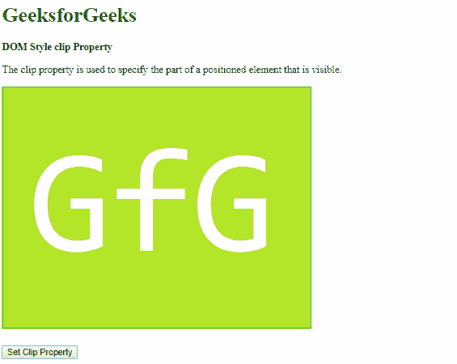
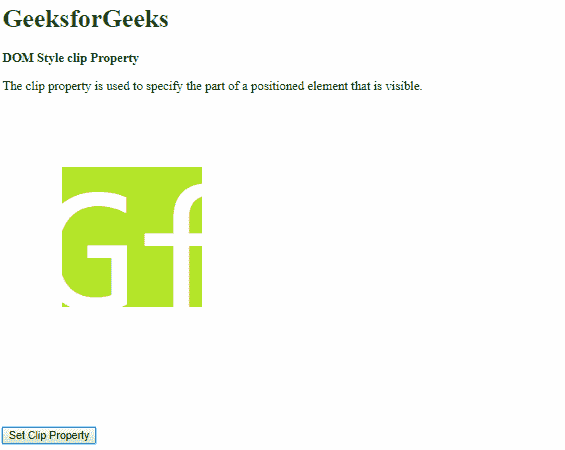
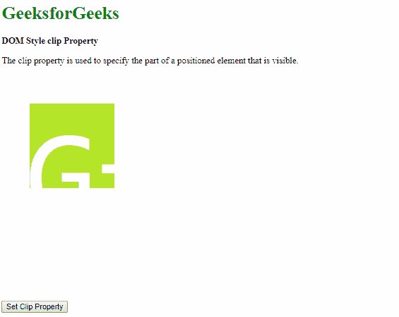
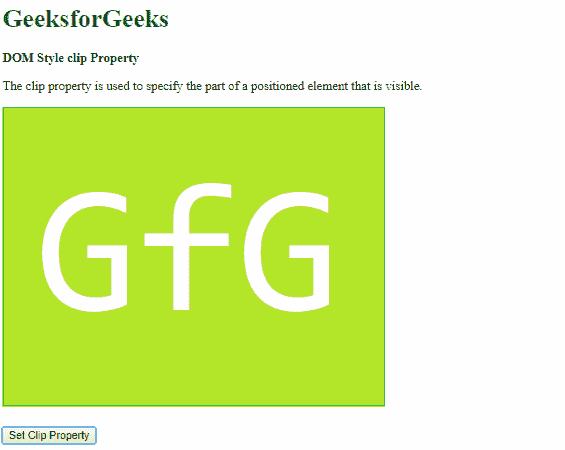
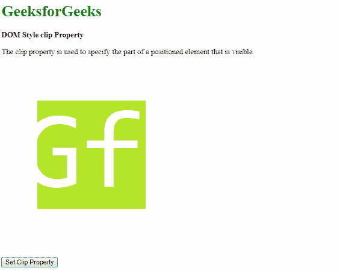
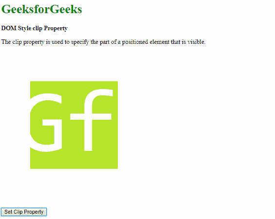

# HTML | DOM 样式剪辑属性

> 原文:[https://www.geeksforgeeks.org/html-dom-style-clip-property/](https://www.geeksforgeeks.org/html-dom-style-clip-property/)

HTML DOM 中的**样式剪辑**属性用于**设置**或**返回** *定位元素的可见部分。*

**语法:**

*   它返回剪辑属性。

    ```html
    object.style.clip
    ```

*   它用于设置剪辑属性。

    ```html
    object.style.clip = "rect(top right bottom left)|normal|initial|
    inherit"
    ```

**返回值:**返回一个字符串值，代表定位元素可见的部分。

**属性值:**

*   **rect(top right bottom left):** This value is used to clip the element in a rectangular shape. The top, right, bottom and left values are used to define the points of the rectangle.

    **示例-1:**

    ```html
    <!DOCTYPE html>
    <html>

    <head>
        <title>
          DOM Style clip Property
        </title>
        <style>
            #myImage {
                position: absolute;
            }

            button {
                margin-top: 400px;
            }
        </style>
    </head>

    <body>
        <h1 style="color: green">
          GeeksforGeeks
        </h1>
        <b>DOM Style clip Property</b>
        <p>
            The clip property is used to specify 
          the part of a positioned element that is visible.
        </p>

        

        <button onclick="setClip()">
          Set Clip Property
        </button>

        <!-- Script to set clip to rect() -->
        <script>
            function setClip() {
              elem = 
                document.querySelector('#myImage');

              elem.style.clip = 
                'rect(75px 250px 250px 75px)';
            }
        </script>
    </body>

    </html>
    ```

    **输出:**

    **点击按钮前:**
    

    **点击按钮后:**
    

*   **normal:** This value does not clip the element. This is the default value.

    **示例-2:**

    ```html
    <!DOCTYPE html>
    <html>

    <head>
        <title>
          DOM Style clip Property
        </title>
        <style>
            #myImage {
              position: absolute;
              clip: rect(50px 200px 200px 50px);
            }

            button {
                margin-top: 400px;
            }
        </style>
    </head>

    <body>
        <h1 style="color: green">
          GeeksforGeeks
        </h1>
        <b>DOM Style clip Property</b>
        <p>
            The clip property is used to specify
            the part of a positioned element
            that is visible.
        </p>

        

        <button onclick="setClip()">
          Set Clip Property
        </button>

        <!-- Script to set clip to auto -->
        <script>
            function setClip() {
                elem = 
                  document.querySelector('#myImage');

                elem.style.clip = 'auto';
            }
        </script>
    </body>

    </html>
    ```

    **输出:**

    **点击按钮前:**
    

    **点击按钮后:**
    

*   **initial:** This is used to set this property to its default value.

    **示例-3:**

    ```html
    <!DOCTYPE html>
    <html>

    <head>
        <title>
          DOM Style clip Property
        </title>

        <style>
            #myImage {
              position: absolute;
              clip: rect(75px 300px 300px 75px);
            }

            button {
                margin-top: 400px;
            }
        </style>
    </head>

    <body>
        <h1 style="color: green">
          GeeksforGeeks
        </h1>
        <b>
          DOM Style clip Property
        </b>
        <p>
            The clip property is used to specify
            the part of a positioned element 
            that is visible.
        </p>

        

        <button onclick="setClip()">
          Set Clip Property
        </button>

        <!-- Script to set clip to initial -->
        <script>
            function setClip() {
                elem = 
                  document.querySelector(
                  '#myImage');

                elem.style.clip = 'initial';
            }
        </script>
    </body>

    </html>
    ```

    **输出:**

    **点击按钮前:**
    

    **点击按钮后:**
    

*   **inherit:** This inherits the property from its parent.
    **Example-4:**

    ```html
    <!DOCTYPE html>
    <html>

    <head>
        <title>
          DOM Style clip Property
        </title>

        <style>
         #parent {
            clip: rect(75px 300px 300px 75px);
          }

            #myImage {
                position: absolute;
            }

            button {
                margin-top: 400px;
            }
        </style>
    </head>

    <body>
        <h1 style="color: green">
          GeeksforGeeks
        </h1>

        <b>DOM Style clip Property</b>
        <p>
            The clip property is used to specify
          the part of a positioned element that 
          is visible.
        </p>

        <div id="parent">
            
        </div>
        <button onclick="setClip()">
          Set Clip Property
        </button>

        <!-- Script to set clip to inherit -->
        <script> 
          function setClip() {
            elem = 
              document.querySelector(
              '#myImage');

            elem.style.clip = 'inherit';
            }
        </script>
    </body>

    </html>
    ```

    **输出:**

    **点击按钮前:**
    

    **点击按钮后:**
    

**支持的浏览器:***DOM Style 剪辑*属性支持的浏览器如下:

*   谷歌 Chrome
*   微软公司出品的 web 浏览器
*   火狐浏览器
*   歌剧
*   苹果 Safari