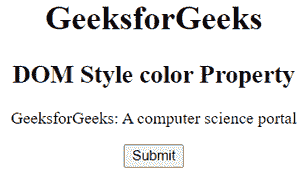
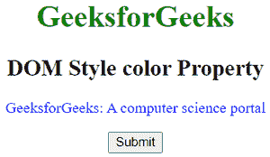
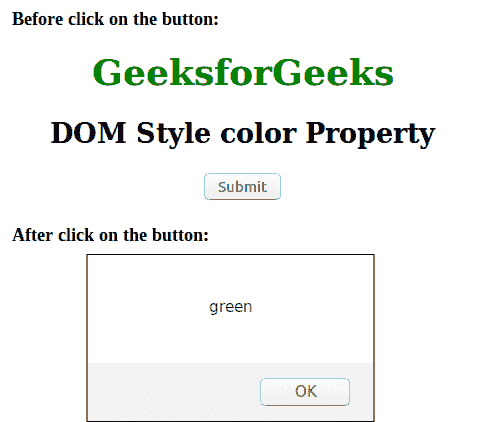

# HTML | DOM 样式颜色属性

> 原文:[https://www . geesforgeks . org/html-DOM-style-color-property/](https://www.geeksforgeeks.org/html-dom-style-color-property/)

**DOM 样式颜色属性**用于设置或返回文本的颜色。

**语法:**

*   它用于设置颜色属性。

```html
object.style.color
```

*   它用于返回颜色属性。

```html
object.style.color = "color|initial|inherit"
```

**返回值:**返回一个代表元素文本颜色的字符串值。

**属性值:**
**返回值:**返回一个代表元素文本颜色的字符串值。
**例:**

## 超文本标记语言

```html
<!DOCTYPE html>
<html>

<head>
    <title>DOM Style color Property</title>
</head>

<body style="text-align:center">

    <h1 id="geeks1">GeeksforGeeks</h1>
    <h2 id="geeks2">DOM Style color Property</h2>

    <p id="geeks3">
        GeeksforGeeks: A computer science portal
    </p>

    <button type="button" onclick="geeks()">
        Submit
    </button>

    <script>
        function geeks() {
            document.getElementById("geeks1").style.color 
                                = "green";
            document.getElementById("geeks2").style.color 
                                = "black";
            document.getElementById("geeks3").style.color 
                                 = "blue";
        }

    </script>
</body>

</html>  
```

**输出:**
**之前点击按钮:**



**点击按钮后:**



**例:2**

## 超文本标记语言

```html
<!DOCTYPE html>
<html>
    <head>
        <title>DOM Style color Property</title>
    </head>

    <body style = "text-align:center">

        <h1 style = "color:green;" id = "gfg">
            GeeksforGeeks
        </h1>

        <h2>DOM Style color Property</h2>

        <button type = "button" onclick = "geeks()">
            Submit
        </button>

        <script>
            function geeks() {
                alert(document.getElementById("gfg").style.color);
        }
        </script>
    </body>
</html>                    
```

**输出:**



**支持的浏览器:***DOM Style 颜色属性*支持的浏览器如下:

*   谷歌 Chrome
*   微软公司出品的 web 浏览器
*   火狐浏览器
*   歌剧
*   苹果 Safari