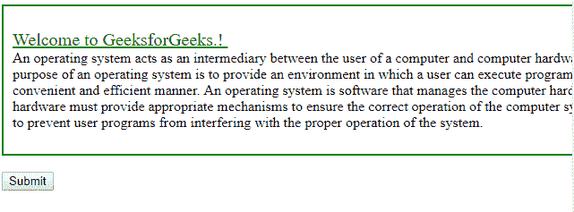
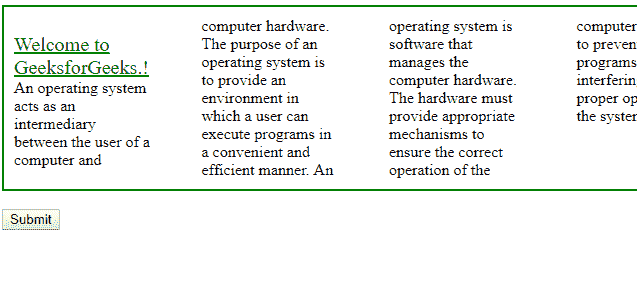
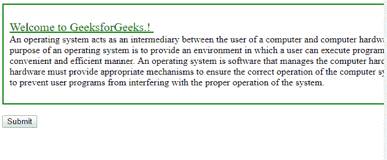
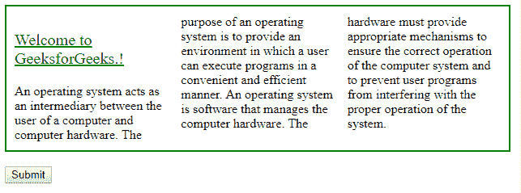
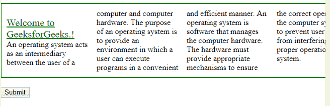
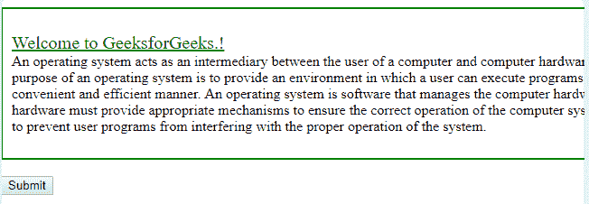
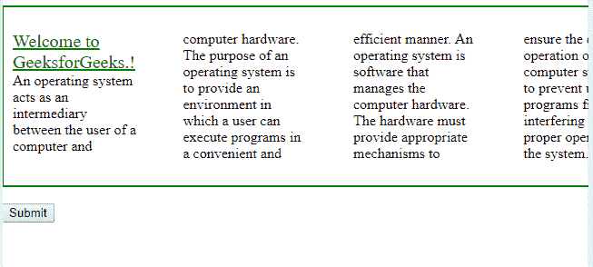
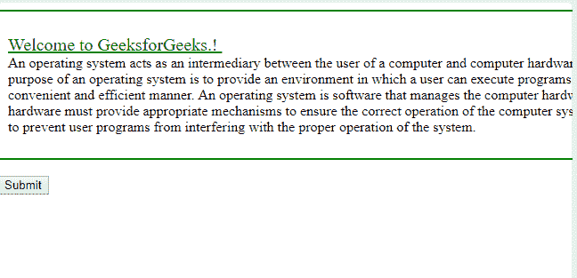

# HTML | DOM 样式列计数属性

> 原文:[https://www . geesforgeks . org/html-DOM-style-column count-property/](https://www.geeksforgeeks.org/html-dom-style-columncount-property/)

**DOM Style columnCount** 属性指定了一个数字，该数字定义了元素应该划分的列数。

**语法:**

*   **返回数值:**

    ```html
    object.style.columnCount

    ```

*   **设置值:**

    ```html
    object.style.columnCount = "number|auto|initial|inherit"

    ```

**属性值:**

*   **数字:**指定列数。
*   **自动:**默认值，取决于某些属性。
*   **初始值:**设置默认值。
*   **继承:**从父元素继承属性。

**返回值:**这将返回一个表示元素列数属性的字符串。

1.  **数字:**指定所有文本将流入的列数。
    **示例-1:**

    ```html
    <!DOCTYPE html>
    <html>

    <head>
        <title>
            HTML | DOM Style columnCount Property
        </title>
        <style>
            #mainDIV {
                width: 700px;
                height: 50%;
                border: 2px solid green;
                padding: 10px;
                column-gap: 50px;
            }

            #p1 {
                column-gap: 50px;
            }
        </style>
    </head>

    <body>

        <div id="mainDIV">
            <p id="p1">
                <u style="color: green; 
                      font-size: 20px;">
                Welcome to GeeksforGeeks.!
            </u><br> 
            An operating system acts as an intermediary
            between the user of a computer and computer 
            hardware. The purpose of an operating system
            is to provide an environment in which a user
            can execute programs in a convenient and 
            efficient manner. An operating system is 
            software that manages the computer hardware.
            The hardware must provide appropriate 
            mechanisms to ensure the correct operation
            of the computer system and to prevent a user
            programs from interfering with the proper 
            operation of the system.

          </p>
        </div>
        <br>
        <input type="button" 
               onclick="mainFunction()" value="Submit" />
        <script>
            function mainFunction() {

                //  Set columnCount.
                document.getElementById(
                  "mainDIV").style.columnCount = "4";
            }
        </script>

    </body>

    </html>
    ```

    **Output :**
    *   **点击前:**
        
    *   **点击后:**
        
2.  **自动:**是默认值，取决于像列宽这样的属性。
    **示例-2:**

    ```html
    <!DOCTYPE html>
    <html>

    <head>
        <title>
            HTML | DOM Style columnCount Property
        </title>
        <style>
            #mainDIV {
                width: 700px;
                height: 50%;
                border: 2px solid green;
                padding: 10px;
            }

            #p1 {
                column-gap: 50px;
            }
        </style>
    </head>

    <body>

        <div id="mainDIV">
            <p id="p1"><u style="color: green;
                                 font-size: 20px;">
              Welcome to GeeksforGeeks.!
            </u><br>
            An operating system acts as an intermediary
            between the user of a computer and computer 
            hardware. The purpose of an operating system
            is to provide an environment in which a user
            can execute programs in a convenient and 
            efficient manner. An operating system is 
            software that manages the computer hardware.
            The hardware must provide appropriate 
            mechanisms to ensure the correct operation
            of the computer system and to prevent user
            programs from interfering with the proper 
            operation of the system.
            </p>
        </div>
        <br>
        <input type="button" 
               onclick="mainFunction()"
               value="Submit" />
        <script>
            function mainFunction() {

                document.getElementById(
                  "mainDIV").style.columnWidth = "100px";

                //  Set columnCount.
                document.getElementById(
                  "mainDIV").style.columnCount = "auto";
            }
        </script>

    </body>

    </html>
    ```

    **Output:**
    *   **点击前:**
        
    *   **点击后:**
        
3.  **初始值:**将属性值设置为该属性的默认值。
    **例-3:**

    ```html
    <!DOCTYPE html>
    <html>

    <head>
        <title>
            HTML | DOM Style columnCount Property
        </title>
        <style>
            #mainDIV {
                width: 700px;
                height: 50%;
                border: 2px solid green;
                padding: 10px;
                column-count: 4;
            }

            #p1 {
                column-gap: 50px;
            }
        </style>
    </head>

    <body>

        <div id="mainDIV">
            <p id="p1"><u style="color: green; 
                                 font-size: 20px;">
              Welcome to GeeksforGeeks.!
            </u><br>
            An operating system acts as an intermediary
            between the user of a computer and computer 
            hardware. The purpose of an operating system
            is to provide an environment in which a user
            can execute programs in a convenient and 
            efficient manner. An operating system is 
            software that manages the computer hardware.
            The hardware must provide appropriate 
            mechanisms to ensure the correct operation
            of the computer system and to prevent user
            programs from interfering with the proper 
            operation of the system.
          </p>
        </div>
        <br>
        <input type="button" onclick="mainFunction()"
               value="Submit" />

      <script>
            function mainFunction() {

                //  Set columnCount.
                document.getElementById(
                  "mainDIV").style.columnCount = "initial";
            }
        </script>

    </body>

    </html>
    ```

    **Output:**
    *   **点击前:**
        
    *   **点击后:**
        
4.  **inherit:** It inherits this property from its parent element.
    **Example-4:**

    ```html
    <!DOCTYPE html>
    <html>

    <head>
        <title>
            HTML | DOM Style columnCount Property
        </title>
        <style>
            #mainDIV {
                width: 700px;
                height: 50%;
                border: 2px solid green;
                padding: 10px;
            }

            #p1 {
                column-gap: 50px;
                column-count: 4;
            }
        </style>
    </head>

    <body>

        <div id="mainDIV">
            <p id="p1"><u style="color: green; 
                                 font-size: 20px;">
              Welcome to GeeksforGeeks.!
            </u><br> 
            An operating system acts as an intermediary
            between the user of a computer and computer 
            hardware. The purpose of an operating system
            is to provide an environment in which a user
            can execute programs in a convenient and 
            efficient manner. An operating system is 
            software that manages the computer hardware.
            The hardware must provide appropriate 
            mechanisms to ensure the correct operation
            of the computer system and to prevent user
            programs from interfering with the proper 
            operation of the system.
          </p>
        </div>
        <br>
        <input type="button" onclick="mainFunction()"
               value="Submit" />

      <script>
            function mainFunction() {

              //  Set columnCount.
              document.getElementById(
                  "p1").style.columnCount = "inherit";
            }
        </script>

    </body>

    </html>
    ```

    **Output:**
    *   **点击前:**
        
    *   **点击后:**
        

    **注意:**对 Mozilla Firefox 使用 **MozColumnRule** 。

    **支持的浏览器:**支持的浏览器*HTML | DOM Style column count Property
    T4 如下:*

    *   谷歌 Chrome
    *   边缘
    *   火狐浏览器
    *   歌剧
    *   旅行队