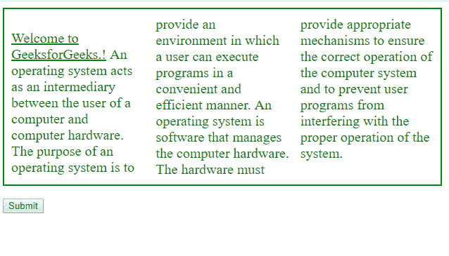
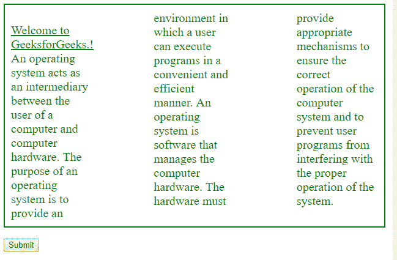
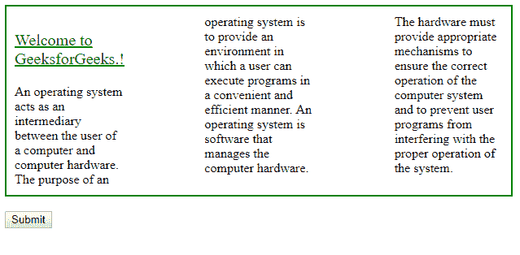
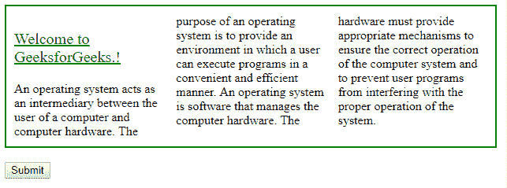
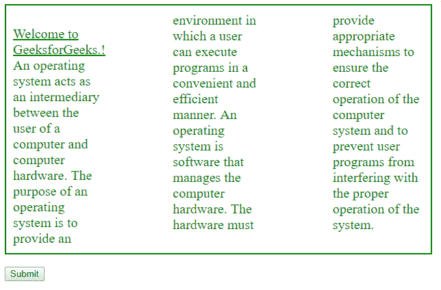
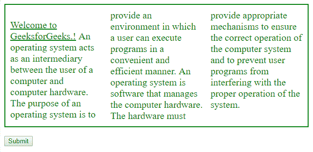
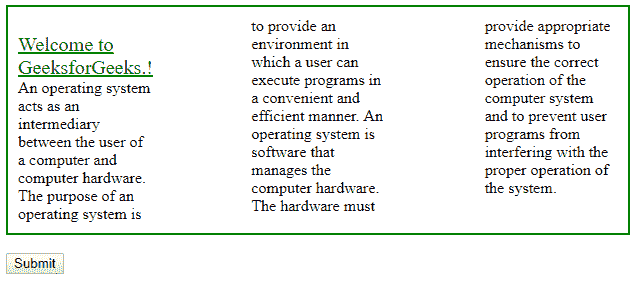
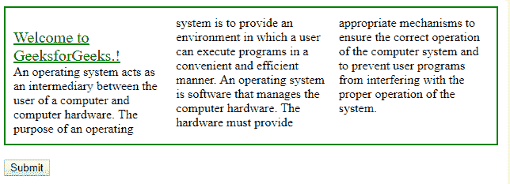

# HTML | DOM 样式列间隙属性

> 原文:[https://www . geesforgeks . org/html-DOM-style-column gap-property/](https://www.geeksforgeeks.org/html-dom-style-columngap-property/)

**DOM Style columnGap** 属性指定列之间的间距。

**语法:**

*   对于返回值:

    ```html
    object.style.columnGap

    ```

*   用于设置值:

    ```html
    object.style.columnGap = "length|normal|initial|inherit"

    ```

**属性值:**

*   **长度:**以长度单位设置柱距。
*   **正常:**柱距默认值。
*   **初始值:**设置默认值。
*   **继承:**从父元素继承属性。

**返回值:**这将返回一个代表元素的列间隙属性的字符串。

1.  **Length:** This specifies a length that will set the gap between the columns.
    **Example-1:**

    ```html
    <!DOCTYPE html>
    <html>

    <head>
        <title>
            HTML | DOM Style columnGap Property
        </title>
        <style>
            #myDIV {
                width: 600px;
                height: 70%;
                border: 2px solid green;
                padding: 10px;
                column-count: 3;
            }

            #p1 {
                font-size: 20px;
                color: green;
            }
        </style>
    </head>

    <body>

        <div id="myDIV">
            <p id="p1">
              <u>Welcome to GeeksforGeeks.!</u> 
              An operating system acts as an intermediary
              between the user of a computer and computer 
              hardware. The purpose of an operating system
              is to provide an environment in which a user
              can execute programs in a convenient and 
              efficient manner. An operating system is 
              software that manages the computer hardware. 
              The hardware must provide appropriate mechanisms
              to ensure the correct operation of the computer 
              system and to prevent user programs from 
              interfering with the proper operation of the system.
            </p>
        </div>
        <br>

        <input type="button" onclick="mainFunction()" 
                                                value="Submit" />
        <script>
            function mainFunction() {

                //  Set columnGap in length.
                document.getElementById(
                    "myDIV").style.columnGap = "100px";
            }
        </script>

    </body>

    </html>
    ```

    **输出:**

    *   **Before Click:**

        

    *   **After Click:**

        

2.  **normal:** This specifies a normal gap between the columns.
    **Example-2:**

    ```html
    <!DOCTYPE html>
    <html>

    <head>
        <title>
            HTML | DOM Style columnGap Property
        </title>
        <style>
            #myDIV {
                width: 600px;
                height: 70%;
                border: 2px solid green;
                padding: 10px;
                column-count: 3;
                column-gap: 100px;
            }

            #p1 {
                font-size: 20px;
                color: green;
            }
        </style>
    </head>

    <body>

        <div id="myDIV">
            <p id="p1">
              <u>Welcome to GeeksforGeeks.!</u> 
              An operating system acts as an intermediary
              between the user of a computer and computer 
              hardware. The purpose of an operating system
              is to provide an environment in which a user
              can execute programs in a convenient and 
              efficient manner. An operating system is 
              software that manages the computer hardware. 
              The hardware must provide appropriate mechanisms
              to ensure the correct operation of the computer 
              system and to prevent user programs from 
              interfering with the proper operation of the system.
            </p>
        </div>
        <br>

        <input type="button" onclick="mainFunction()"
         value="Submit" />
        <script>
            function mainFunction() {

                //  Set columnGap to normal.
                document.getElementById(
                "myDIV").style.columnGap = "normal";
            }
        </script>

    </body>

    </html>
    ```

    **输出:**

    *   **Before Click:**

        

    *   **After Click:**

        

3.  **initial:** This sets this property to its default value.
    **Example-3:**

    ```html
    <!DOCTYPE html>
    <html>

    <head>
        <title>
            HTML | DOM Style columnGap Property
        </title>
        <style>
            #myDIV {
                width: 600px;
                height: 70%;
                border: 2px solid green;
                padding: 10px;
                column-count: 3;
                column-gap: 100px;
            }

            #p1 {
                font-size: 20px;
                color: green;
            }
        </style>
    </head>

    <body>

        <div id="myDIV">
            <p id="p1">
                <u>Welcome to GeeksforGeeks.!</u>
              An operating system acts as an intermediary
              between the user of a computer and computer 
              hardware. The purpose of an operating system 
              is to provide an environment in which a user 
              can execute programs in a convenient and 
              efficient manner. An operating system is
              software that manages the computer hardware.
              The hardware must provide appropriate mechanisms
              to ensure the correct operation of the computer
              system and to prevent user programs from 
              interfering with the proper operation of the 
              system.
            </p>
        </div>
        <br>

        <input type="button" onclick="mainFunction()" 
                                             value="Submit" />

        <script>
            function mainFunction() {

                //  set columnGap into normal.
                document.getElementById(
                    "myDIV").style.columnGap = "initial";
            }
        </script>

    </body>

    </html>
    ```

    **输出:**

    *   **Before Click:**

        

    *   **After Click:**

        

4.  **inherit:** This inherits this property from its parent element.
    **Example-4:**

    ```html
    <!DOCTYPE html>
    <html>

    <head>
        <title>
            HTML | DOM Style columnGap Property
        </title>
        <style>
            #myDIV {
                width: 600px;
                height: 60%;
                border: 2px solid green;
                padding: 10px;
                column-count: 3;
                column-gap: 100px;
            }

            #p1 {
                column-gap: 50px;
            }
        </style>
    </head>

    <body>

        <div id="myDIV">
            <p id="p1">
                <u style="color: green ;
                          font-size: 20px;">
                  Welcome to GeeksforGeeks.!</u>

              <br>
              An operating system acts as an intermediary
              between the user of a computer and computer 
              hardware. The purpose of an operating system 
              is to provide an environment in which a user
              can execute programs in a convenient and 
              efficient manner. An operating system is 
              software that manages the computer hardware.
              The hardware must provide appropriate mechanisms 
              to ensure the correct operation of the computer 
              system and to prevent user programs from 
              interfering with the proper operation of the 
              system.
            </p>
        </div>
        <br>

        <input type="button" onclick="mainFunction()" 
                                             value="Submit" />

        <script>
            function mainFunction() {

                //  Set columnGap "inherit".
                document.getElementById(
                    "myDIV").style.columnGap = "inherit";
            }
        </script>

    </body>

    </html>
    ```

    **输出:**

    *   **Before Click:**

        

    *   **After Click:**

        

**注意:**对 Mozilla Firefox 使用 **MozColumnRule** 。

**支持的浏览器:**支持的浏览器*HTML | DOM Style column gap Property
T4 如下:*

*   谷歌 Chrome
*   边缘
*   歌剧
*   旅行队