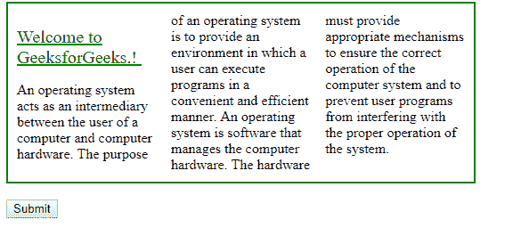
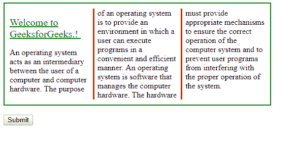

# HTML | DOM 样式列规则属性

> 原文:[https://www . geesforgeks . org/html-DOM-style-column rule-property/](https://www.geeksforgeeks.org/html-dom-style-columnrule-property/)

**DOM Style columnRule** 属性设置列间规则的宽度、样式和颜色。

**Syntax :**

*   获取列规则属性

    ```html
    object.style.columnRule = value

    ```

    *   TO set the columnRule property

    ```html
    object.style.columnRule = "column-rule-width column-rule-style 
    column-rule-color|initial|inherit"

    ```

    **Property Values:**
    *   **columnRuleWidth:** 默认值为中。设置列之间的宽度。
    *   **columnRuleStyle:** 设置规则的样式。“无”是默认值。
    *   **columnRuleColor:** 设置规则的颜色。元素颜色是默认值。
    *   **初始值:**设置默认值。
    *   **继承:**从父元素继承属性。

    **返回值:**这将返回一个代表所选元素的列规则属性的字符串。

    **示例-1:** columnRuleWidth、columnRuleStyle 和 columnRuleColor。

    ```html
    <!DOCTYPE html>
    <html>

    <head>
        <title>
            HTML | DOM Style columnRule Property
        </title>
        <style>
            #mainDIV {
                width: 80%;
                height: 50%;
                border: 2px solid green;
                padding: 10px;
                column-count: 3;
            }
        </style>
    </head>

    <body>

        <div id="mainDIV">
            <p id="p1"><u style="color: green ;font-size: 20px;">
             Welcome to GeeksforGeeks.!
             </u>
                <br>
            </p>
             An operating system acts as an intermediary
             between the user of a computer and computer
             hardware. The purpose of an operating system
             is to provide an environment in which a user
             can execute programs in a convenient and 
             efficient manner.

               An operating system is a software that manages
               the computer hardware. The hardware must 
               provide appropriate mechanisms to ensure 
               the correct operation of the computer system 
               and to prevent user programs from interfering
               with the proper operation of the system.

        </div>
        <br>
        <input type="button" onclick="mainFunction()" 
                                          value="Submit" />

        <script>
            function mainFunction() {
                document.getElementById(
                "mainDIV").style.columnRuleWidth = "3px";
                document.getElementById(
                "mainDIV").style.columnRuleStyle = "solid";
                document.getElementById(
                "mainDIV").style.columnRuleColor = "red";
            }
        </script>

    </body>

    </html>
    ```

    **输出:**
    **点击前:**
    
    **点击后:**
    

    **示例-2:** 这将属性值设置为属性的默认值。对于初始值，规则样式和规则颜色将为无和默认颜色。

    ```html
    <!DOCTYPE html>
    <html>

    <head>
        <title>
            HTML | DOM Style columnRule Property
        </title>
        <style>
            #mainDIV {
                width: 80%;
                height: 50%;
                border: 2px solid green;
                padding: 10px;
                column-count: 3;
                column-rule-style: solid;
                column-rule-width: 3px;
                column-rule-color: red;
            }
        </style>
    </head>

    <body>

        <div id="mainDIV">
            <p id="p1"><u style="color: green ;font-size: 20px;">
            Welcome to GeeksforGeeks.!
            </u>
                <br>
            </p>
             An operating system acts as an intermediary
             between the user of a computer and computer
             hardware. The purpose of an operating system
             is to provide an environment in which a user
             can execute programs in a convenient and 
             efficient manner.

               An operating system is a software that manages
               the computer hardware. The hardware must 
               provide appropriate mechanisms to ensure 
               the correct operation of the computer system 
               and to prevent user programs from interfering
               with the proper operation of the system.

        </div>
        <br>
        <input type="button" onclick="mainFunction()" 
                                          value="Submit" />

        <script>
            function mainFunction() {
                document.getElementById(
                "mainDIV").style.columnRule = "initial";
            }
        </script>

    </body>

    </html>
    ```

    **输出:**
    **点击前:**
    

    **点击后:**
    

    **示例-3:** 从其父元素继承属性。在这里，通过使用 inherit，我们可以设置不同的规则样式和规则颜色。

    ```html
    <!DOCTYPE html>
    <html>

    <head>
        <title>
            HTML | DOM Style columnRule Property
        </title>
        <style>
            #mainDIV {
                width: 80%;
                height: 50%;
                border: 2px solid green;
                padding: 10px;
                column-count: 3;
                column-rule-style: solid;
                column-rule-width: 3px;
                column-rule-color: red;
            }
        </style>
    </head>

    <body>

        <div id="mainDIV">
            <p id="p1"><u style="color: green ;font-size: 20px;">
            Welcome to GeeksforGeeks.!
            </u>
                <br>
            </p>
             An operating system acts as an intermediary
             between the user of a computer and computer
             hardware. The purpose of an operating system
             is to provide an environment in which a user
             can execute programs in a convenient and 
             efficient manner.

               An operating system is software that manages
               the computer hardware. The hardware must 
               provide appropriate mechanisms to ensure 
               the correct operation of the computer system 
               and to prevent user programs from interfering
               with the proper operation of the system.
        </div>
        <br>
        <input type="button" onclick="mainFunction()" 
                                             value="Submit" />

        <script>
            function mainFunction() {
                document.getElementById(
                "mainDIV").style.columnRule = "initial";
            }
        </script>

    </body>

    </html>
    ```

    **输出:**
    **点击前:**
    

    **点击后:**
    

    **注意:**对 Mozilla Firefox 使用 **MozColumnRule** 。

    **Supported Browsers:**

    *HTML | DOM Style columnRule Property*
    *   谷歌 Chrome*   边缘*   歌剧*   狩猎