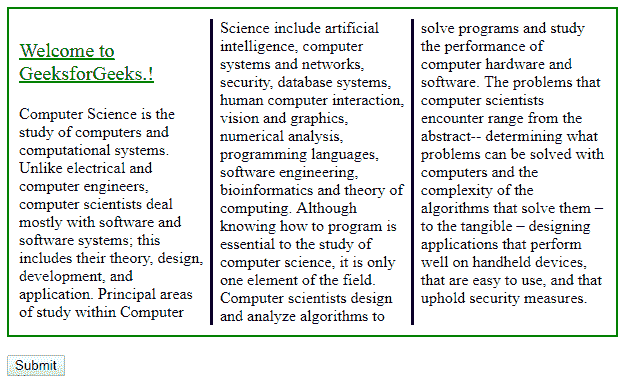

# HTML | DOM Style column rule color 属性

> 原文:[https://www . geesforgeks . org/html-DOM-style-column rulecolor-property/](https://www.geeksforgeeks.org/html-dom-style-columnrulecolor-property/)

**DOM Style columnRuleColor** 属性指定列间规则的颜色。

**语法:**

*   用于设置 columnRuleColor 属性:

    ```html
    object.style.columnRuleColor = "color|initial|inherit"

    ```

*   返回 columnRuleColor 属性:

    ```html
    object.style.columnRuleColor

    ```

**属性值:**

*   **颜色:**用于指定规则的颜色。
*   **初始值:**用于设置默认值。
*   **继承:**用于从父元素继承属性。

**返回值:**返回代表元素的列规则颜色属性的单个字符串。

1.  **Color:** This specifies the color of the rule.
    **Example-1:**

    ```html
    <!DOCTYPE html>
    <html>

    <head>
        <title>
            HTML | DOM Style columnRuleColor Property
        </title>
        <style>
            #myDIV {
                width: 90%;
                height: 70%;
                border: 2px solid green;
                padding: 10px;
                column-count: 3;
                column-rule: 3px outset red;
            }

            #p1 {
                font-size: 20px;
                color: green;
            }
        </style>
    </head>

    <body>

        <div id="myDIV">
            <p id="p1">
              <u>Welcome to GeeksforGeeks.!</u>
            </p>

            <p>
              Computer Science is the study of 
              computers and computational systems. 
              Unlike electrical and computer engineers,
              computer scientists deal mostly with 
              software and software systems; this 
              includes their theory, design, development,
              and application. Principal areas of study 
              within Computer Science include artificial
              intelligence, computer systems and networks,
              security, database systems, human computer 
              interaction, vision and graphics, numerical
              analysis, programming languages, software 
              engineering, bioinformatics and theory of
              computing. Although knowing how to program
              is essential to the study of computer science,
              it is only one element of the field. Computer
              scientists design and analyze algorithms to 
              solve programs and study the performance of 
              computer hardware and software. The problems
              that computer scientists encounter range from
              the abstract-- determining what problems can 
              be solved with computers and the complexity 
              of the algorithms that solve them – to the 
              tangible – designing applications that 
              perform well on handheld devices, that 
              are easy to use, and that uphold security
              measures.
        </div>
        <br>

        <input type="button" onclick="mainFunction()" 
                                           value="Submit" />

        <script>
            function mainFunction() {

                document.getElementById(

                        //  Define color.
                        "myDIV").style.columnRuleColor =
                    "green";
            }
        </script>

    </body>

    </html>
    ```

    **输出:**

    **点击前:**
    

    **点击后:**
    

2.  **initial:** This set the color of the rule to the **“initial”**. By default it is black.
    **Example-2:**

    ```html
    <!DOCTYPE html>
    <html>

    <head>
        <title>
            HTML | DOM Style columnRuleColor Property
        </title>
        <style>
            #myDIV {
                width: 90%;
                height: 70%;
                border: 2px solid green;
                padding: 10px;
                column-count: 3;
                column-rule: 3px outset red;
            }

            #p1 {
                font-size: 20px;
                color: green;
            }
        </style>
    </head>

    <body>

        <div id="myDIV">
            <p id="p1">
              <u>Welcome to GeeksforGeeks.!</u>
            </p>

            <p>
              Computer Science is the study of 
              computers and c omputational systems.
              Unlike electrical and computer engineers,
              computer scientists deal mostly with 
              software and software systems; this 
              includes their theory, design, development,
              and application. Principal areas of study 
              within Computer Science include artificial
              intelligence, computer systems and networks,
              security, database systems, human computer 
              interaction, vision and graphics, numerical
              analysis, programming languages, software 
              engineering, bioinformatics and theory of 
              computing. Although knowing how to program
              is essential to the study of computer science,
              it is only one element of the field. Computer
              scientists design and analyze algorithms to 
              solve programs and study the performance of 
              computer hardware and software. The problems
              that computer scientists encounter range from
              the abstract-- determining what problems can 
              be solved with computers and the complexity 
              of the algorithms that solve them – to the 
              tangible – designing applications that perform
              well on handheld devices, that are easy to use,
              and that uphold security measures.
          </p>
        </div>
        <br>

        <input type="button" onclick="mainFunction()" 
                                           value="Submit" />
        <script>
            function mainFunction() {

                //  Set column color.
                document.getElementById(
                        "myDIV").style.columnRuleColor =
                    "initial";
            }
        </script>

    </body>

    </html>
    ```

    **输出:**

    **点击前:**
    

    **点击后:**
    

3.  **inherit:** This inherits this property from its parent element. This mean that this will make the same color as of the color of the parent element.
    **Example-1:**

    ```html
    <!DOCTYPE html>
    <html>

    <head>
        <title>
            HTML | DOM Style columnRuleColor Property
        </title>
        <style>
            #myDIV {
                width: 90%;
                height: 70%;
                border: 2px solid green;
                padding: 10px;
                color: red;
                column-count: 3;
                column-rule: 3px solid green;
            }

            #p1 {
                font-size: 20px;
                color: green;
            }
        </style>
    </head>

    <body>

        <div id="myDIV">
            <p id="p1">
              <u>Welcome to GeeksforGeeks.!</u>
            </p>

            <p>
              Computer Science is the study of 
              computers and c omputational systems.
              Unlike electrical and computer engineers,
              computer scientists deal mostly with 
              software and software systems; this 
              includes their theory, design, development,
              and application. Principal areas of study 
              within Computer Science include artificial
              intelligence, computer systems and networks,
              security, database systems, human computer 
              interaction, vision and graphics, numerical
              analysis, programming languages, software 
              engineering, bioinformatics and theory of 
              computing. Although knowing how to program
              is essential to the study of computer science,
              it is only one element of the field. Computer
              scientists design and analyze algorithms to 
              solve programs and study the performance of 
              computer hardware and software. The problems
              that computer scientists encounter range from
              the abstract-- determining what problems can 
              be solved with computers and the complexity 
              of the algorithms that solve them – to the 
              tangible – designing applications that perform
              well on handheld devices, that are easy to use,
              and that uphold security measures.
          </p>    
        </div>
        <br>
        <input type="button" onclick="mainFunction()" 
                                             value="Submit" />
        <script>
            function mainFunction() {

                //  Set color using inherit.
                document.getElementById(
                        "myDIV").style.columnRuleColor =
                    "inherit";
            }
        </script>

    </body>

    </html>
    ```

    **输出:**

    **点击前:**
    

    **点击后:**
    

    **支持的浏览器:**以下列出了*HTML | DOM Style column rule color Property*支持的浏览器:

    *   谷歌 Chrome
    *   边缘
    *   旅行队
    *   歌剧