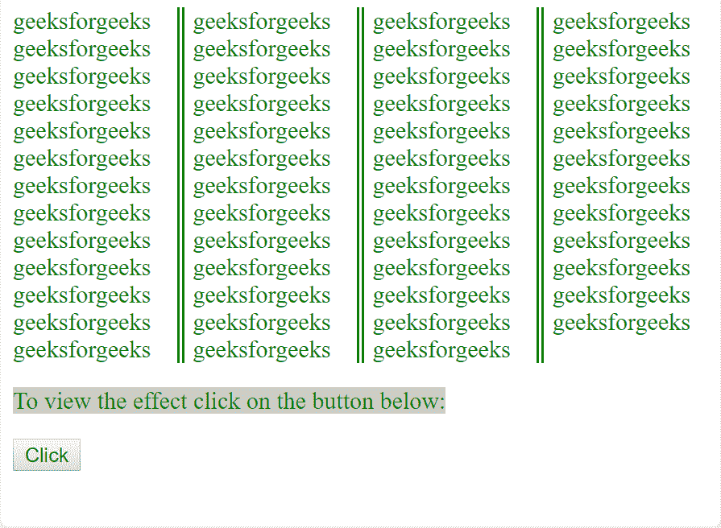

# HTML | DOM Style columnRulestyle 属性

> 原文:[https://www . geesforgeks . org/html-DOM-style-column rulestyle-property/](https://www.geeksforgeeks.org/html-dom-style-columnrulestyle-property/)

HTML 中的 DOM **样式 columnRuleStyle** 属性用于定义或确定列间规则的样式。

**语法:**

*   **设置属性:**

    ```html
    object.style.columnRuleStyle = "none|hidden|dotted|dashed|solid|
    double|groove|ridge|inset|outset|initial|inherit"

    ```

*   **归还财产:**

    ```html
    object.style.columnRuleStyle"

    ```

**属性值:**

| 价值 | 影响 |
| --- | --- |
| 没有人 | 没有创建边框。这是默认值。 |
| 隐藏的 | 视觉上与“无”相同，只是它在表格元素的边界冲突解决过程中有所帮助。 |
| 有点的 | 圆点用作边框。 |
| 虚线 | 虚线用作边框。 |
| 固体 | 一条实线用作边框。 |
| 两倍 | 两条线用作边框。 |
| 律动 | 将显示三维凹槽边框。效果取决于边框颜色值。 |
| 山脉 | 将显示三维脊状边框。效果取决于边框颜色值。 |
| 插入物 | 将显示三维插入边框。效果取决于边框颜色值。 |
| 开始 | 将显示三维起始边框。效果取决于边框颜色值。 |
| 最初的 | 将属性设置为其初始值。 |
| 继承 | 设置从其父级继承的属性。 |

**返回值**返回一个代表元素属性的字符串。

**示例-1:** 虚线创建一个虚线规则。

```html
<!DOCTYPE html>
<html>

<head>
    <title>
        HTML | DOM Style columnRuleStyle Property
    </title>
    <style>
        #gfgdiv {
            column-count: 4;
            column-rule: 5px green;
        }
    </style>
</head>

<body>

    <div class="container" style="color:green" id="gfgdiv">
      geeksforgeeks geeksforgeeks geeksforgeeks
      geeksforgeeks geeksforgeeks geeksforgeeks 
      geeksforgeeks geeksforgeeks geeksforgeeks
      geeksforgeeks geeksforgeeks geeksforgeeks
      geeksforgeeks geeksforgeeks geeksforgeeks
      geeksforgeeks geeksforgeeks geeksforgeeks
      geeksforgeeks geeksforgeeks geeksforgeeks
      geeksforgeeks geeksforgeeks geeksforgeeks
      geeksforgeeks geeksforgeeks geeksforgeeks 
      geeksforgeeks geeksforgeeks geeksforgeeks 
      geeksforgeeks geeksforgeeks geeksforgeeks 
      geeksforgeeks geeksforgeeks geeksforgeeks
      geeksforgeeks geeksforgeeks geeksforgeeks
      geeksforgeeks geeksforgeeks geeksforgeeks 
      geeksforgeeks geeksforgeeks geeksforgeeks 
      geeksforgeeks geeksforgeeks geeksforgeeks 
      geeksforgeeks geeksforgeeks geeksforgeeks
    </div>

    <p>To view the effect click on the button below:</p>
    <button onclick="GFGFunction()">Click</button>
    <script>
        function GFGFunction() {

            //  Set dotted property.
            document.getElementById(
          "gfgdiv").style.columnRuleStyle = "dotted";
        }
    </script>

</body>

</html>
```

**输出:**

<il>**Before Click:**
*   **点击后:**
    </il>

**示例-2:** 虚线创建虚线规则。

```html
<!DOCTYPE html>
<html>

<head>
    <title>
        HTML | DOM Style columnRuleStyle Property
    </title>
    <style>
        #gfgdiv {
            column-count: 4;
            column-rule: 5px green;
        }
    </style>
</head>

<body>

    <div class="container" style="color:green"
         id="gfgdiv">
      geeksforgeeks geeksforgeeks geeksforgeeks
      geeksforgeeks geeksforgeeks geeksforgeeks 
      geeksforgeeks geeksforgeeks geeksforgeeks 
      geeksforgeeks geeksforgeeks geeksforgeeks
      geeksforgeeks geeksforgeeks geeksforgeeks
      geeksforgeeks geeksforgeeks geeksforgeeks
      geeksforgeeks geeksforgeeks geeksforgeeks
      geeksforgeeks geeksforgeeks geeksforgeeks
      geeksforgeeks geeksforgeeks geeksforgeeks
      geeksforgeeks geeksforgeeks geeksforgeeks
      geeksforgeeks geeksforgeeks geeksforgeeks
      geeksforgeeks geeksforgeeks geeksforgeeks
      geeksforgeeks geeksforgeeks geeksforgeeks 
      geeksforgeeks geeksforgeeks geeksforgeeks
      geeksforgeeks geeksforgeeks geeksforgeeks 
      geeksforgeeks geeksforgeeks geeksforgeeks 
      geeksforgeeks geeksforgeeks geeksforgeeks
    </div>

    <p>To view the effect click on the button below:</p>

    <button onclick="GFGFunction()">Click</button>
    <script>
        function GFGFunction() {

            document.getElementById(
            "gfgdiv").style.columnRuleStyle = "dashed";
        }
    </script>

</body>

</html>
```

**输出:**

*   **点击前:**
    
*   **点击后:**
    

**示例-3:** 双重创建双重规则。

```html
<!DOCTYPE html>
<html>

<head>
    <title>
        HTML | DOM Style columnRuleStyle Property
    </title>
    <style>
        #gfgdiv {
            column-count: 4;
            column-rule: 5px green;
        }
    </style>
</head>

<body>

    <div class="container" style="color:green" 
         id="gfgdiv">
      geeksforgeeks geeksforgeeks geeksforgeeks
      geeksforgeeks geeksforgeeks geeksforgeeks 
      geeksforgeeks geeksforgeeks geeksforgeeks
      geeksforgeeks geeksforgeeks geeksforgeeks
      geeksforgeeks geeksforgeeks geeksforgeeks
      geeksforgeeks geeksforgeeks geeksforgeeks 
      geeksforgeeks geeksforgeeks geeksforgeeks 
      geeksforgeeks geeksforgeeks geeksforgeeks 
      geeksforgeeks geeksforgeeks geeksforgeeks
      geeksforgeeks geeksforgeeks geeksforgeeks
      geeksforgeeks geeksforgeeks geeksforgeeks
      geeksforgeeks geeksforgeeks geeksforgeeks
      geeksforgeeks geeksforgeeks geeksforgeeks
      geeksforgeeks geeksforgeeks geeksforgeeks
      geeksforgeeks geeksforgeeks geeksforgeeks
      geeksforgeeks geeksforgeeks geeksforgeeks
      geeksforgeeks geeksforgeeks geeksforgeeks
    </div>

    <p>To view the effect click on the button below:</p>
    <button onclick="GFGFunction()">Click</button>
    <script>
        function GFGFunction() {

            document.getElementById(
            "gfgdiv").style.columnRuleStyle = "double";
        }
    </script>

</body>

</html>
```

**输出:**

<il>**Before Click:**
*   **点击后:**
    </il>

**示例-4:** 实体创建实体规则。

```html
<!DOCTYPE html>
<html>

<head>
    <title>
        HTML | DOM Style columnRuleStyle Property
    </title>
    <style>
        #gfgdiv {
            column-count: 4;
            column-rule: 5px green;
        }
    </style>
</head>

<body>

    <div class="container" style="color:green" 
         id="gfgdiv">
      geeksforgeeks geeksforgeeks geeksforgeeks
      geeksforgeeks geeksforgeeks geeksforgeeks
      geeksforgeeks geeksforgeeks geeksforgeeks
      geeksforgeeks geeksforgeeks geeksforgeeks
      geeksforgeeks geeksforgeeks geeksforgeeks
      geeksforgeeks geeksforgeeks geeksforgeeks
      geeksforgeeks geeksforgeeks geeksforgeeks
      geeksforgeeks geeksforgeeks geeksforgeeks 
      geeksforgeeks geeksforgeeks geeksforgeeks 
      geeksforgeeks geeksforgeeks geeksforgeeks
      geeksforgeeks geeksforgeeks geeksforgeeks 
      geeksforgeeks geeksforgeeks geeksforgeeks 
      geeksforgeeks geeksforgeeks geeksforgeeks
      geeksforgeeks geeksforgeeks geeksforgeeks
      geeksforgeeks geeksforgeeks geeksforgeeks
      geeksforgeeks geeksforgeeks geeksforgeeks 
      geeksforgeeks geeksforgeeks geeksforgeeks
    </div>
    <p>To view the effect click on the button below:</p>

    <button onclick="GFGFunction()">Click</button>
    <script>
        function GFGFunction() {

            document.getElementById(
              "gfgdiv").style.columnRuleStyle = "solid";
        }
    </script>

</body>

</html>
```

**输出:**

*   **点击前:**
    
*   **点击后:**
    

**示例-5:** 凹槽创建三维凹槽规则。

```html
<!DOCTYPE html>
<html>

<head>
    <title>
        HTML | DOM Style columnRuleStyle Property
    </title>
    <style>
        #gfgdiv {
            column-count: 4;
            column-rule: 5px green;
        }
    </style>
</head>

<body>

    <div class="container" style="color:green" 
         id="gfgdiv">
      geeksforgeeks geeksforgeeks geeksforgeeks
      geeksforgeeks geeksforgeeks geeksforgeeks 
      geeksforgeeks geeksforgeeks geeksforgeeks
      geeksforgeeks geeksforgeeks geeksforgeeks 
      geeksforgeeks geeksforgeeks geeksforgeeks
      geeksforgeeks geeksforgeeks geeksforgeeks
      geeksforgeeks geeksforgeeks geeksforgeeks
      geeksforgeeks geeksforgeeks geeksforgeeks 
      geeksforgeeks geeksforgeeks geeksforgeeks
      geeksforgeeks geeksforgeeks geeksforgeeks 
      geeksforgeeks geeksforgeeks geeksforgeeks
      geeksforgeeks geeksforgeeks geeksforgeeks 
      geeksforgeeks geeksforgeeks geeksforgeeks
      geeksforgeeks geeksforgeeks geeksforgeeks
      geeksforgeeks geeksforgeeks geeksforgeeks 
      geeksforgeeks geeksforgeeks geeksforgeeks 
      geeksforgeeks geeksforgeeks geeksforgeeks
    </div>

    <p>To view the effect click on the button below:</p>
    <button onclick="GFGFunction()">Click</button>
    <script>
        function GFGFunction() {

            document.getElementById(
              "gfgdiv").style.columnRuleStyle = "groove";
        }
    </script>

</body>

</html>
```

**输出:**

*   **点击前:**
    
*   **点击后:**
    

**示例-6:** 脊线创建 3D 脊线规则。

```html
<!DOCTYPE html>
<html>

<head>
    <title>
        HTML | DOM Style columnRuleStyle Property
    </title>
    <style>
        #gfgdiv {
            column-count: 4;
            column-rule: 5px green;
        }
    </style>
</head>

<body>

    <div class="container" style="color:green" 
         id="gfgdiv">
      geeksforgeeks geeksforgeeks geeksforgeeks
      geeksforgeeks geeksforgeeks geeksforgeeks
      geeksforgeeks geeksforgeeks geeksforgeeks
      geeksforgeeks geeksforgeeks geeksforgeeks
      geeksforgeeks geeksforgeeks geeksforgeeks
      geeksforgeeks geeksforgeeks geeksforgeeks
      geeksforgeeks geeksforgeeks geeksforgeeks
      geeksforgeeks geeksforgeeks geeksforgeeks 
      geeksforgeeks geeksforgeeks geeksforgeeks
      geeksforgeeks geeksforgeeks geeksforgeeks 
      geeksforgeeks geeksforgeeks geeksforgeeks 
      geeksforgeeks geeksforgeeks geeksforgeeks 
      geeksforgeeks geeksforgeeks geeksforgeeks 
      geeksforgeeks geeksforgeeks geeksforgeeks
      geeksforgeeks geeksforgeeks geeksforgeeks 
      geeksforgeeks geeksforgeeks geeksforgeeks
      geeksforgeeks geeksforgeeks geeksforgeeks
    </div>

    <p>To view the effect click on the button below:</p>
    <button onclick="GFGFunction()">Click</button>
    <script>
        function GFGFunction() {

            document.getElementById(
              "gfgdiv").style.columnRuleStyle = "ridge";
        }
    </script>

</body>

</html>
```

**输出:**

*   **点击前:**
    
*   **点击后:**
    

**示例-7:** 插入创建三维插入规则。

```html
<!DOCTYPE html>
<html>

<head>
    <title>
        HTML | DOM Style columnRuleStyle Property
    </title>
    <style>
        #gfgdiv {
            column-count: 4;
            column-rule: 5px green;
        }
    </style>
</head>

<body>

    <div class="container" style="color:green" 
         id="gfgdiv">
      geeksforgeeks geeksforgeeks geeksforgeeks
      geeksforgeeks geeksforgeeks geeksforgeeks
      geeksforgeeks geeksforgeeks geeksforgeeks
      geeksforgeeks geeksforgeeks geeksforgeeks
      geeksforgeeks geeksforgeeks geeksforgeeks 
      geeksforgeeks geeksforgeeks geeksforgeeks 
      geeksforgeeks geeksforgeeks geeksforgeeks
      geeksforgeeks geeksforgeeks geeksforgeeks
      geeksforgeeks geeksforgeeks geeksforgeeks 
      geeksforgeeks geeksforgeeks geeksforgeeks
      geeksforgeeks geeksforgeeks geeksforgeeks
      geeksforgeeks geeksforgeeks geeksforgeeks
      geeksforgeeks geeksforgeeks geeksforgeeks
      geeksforgeeks geeksforgeeks geeksforgeeks
      geeksforgeeks geeksforgeeks geeksforgeeks 
      geeksforgeeks geeksforgeeks geeksforgeeks 
      geeksforgeeks geeksforgeeks geeksforgeeks
    </div>
    <p>To view the effect click on the button below:</p>
    <button onclick="GFGFunction()">Click</button>
    <script>
        function GFGFunction() {

            document.getElementById(
              "gfgdiv").style.columnRuleStyle = "inset";
        }
    </script>

</body>

</html>
```

**输出:**

*   **点击前:**
    
*   **点击后:**
    

**示例-8:** 开始创建 3D 开始规则。

```html
<!DOCTYPE html>
<html>

<head>
    <title>
        HTML | DOM Style columnRuleStyle Property
    </title>
    <style>
        #gfgdiv {
            column-count: 4;
            column-rule: 5px green;
        }
    </style>
</head>

<body>

    <div class="container" style="color:green" 
         id="gfgdiv">
      geeksforgeeks geeksforgeeks geeksforgeeks
      geeksforgeeks geeksforgeeks geeksforgeeks
      geeksforgeeks geeksforgeeks geeksforgeeks 
      geeksforgeeks geeksforgeeks geeksforgeeks 
      geeksforgeeks geeksforgeeks geeksforgeeks
      geeksforgeeks geeksforgeeks geeksforgeeks
      geeksforgeeks geeksforgeeks geeksforgeeks
      geeksforgeeks geeksforgeeks geeksforgeeks
      geeksforgeeks geeksforgeeks geeksforgeeks 
      geeksforgeeks geeksforgeeks geeksforgeeks 
      geeksforgeeks geeksforgeeks geeksforgeeks
      geeksforgeeks geeksforgeeks geeksforgeeks
      geeksforgeeks geeksforgeeks geeksforgeeks
      geeksforgeeks geeksforgeeks geeksforgeeks
      geeksforgeeks geeksforgeeks geeksforgeeks
      geeksforgeeks geeksforgeeks geeksforgeeks 
      geeksforgeeks geeksforgeeks geeksforgeeks
    </div>

    <p>To view the effect click on the button below:</p>
    <button onclick="GFGFunction()">Click</button>
    <script>
        function GFGFunction() {

            document.getElementById(
              "gfgdiv").style.columnRuleStyle = "outset";
        }
    </script>

</body>

</html>
```

**输出:**

*   **点击前:**
    
*   **点击后:**
    

**支持的浏览器**支持 H *TML | DOM 样式列规则样式属性*的浏览器如下

*   谷歌 Chrome
*   微软公司出品的 web 浏览器
*   歌剧
*   苹果 Safari