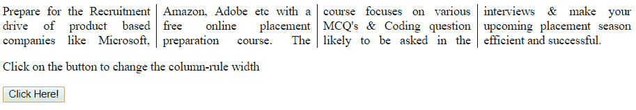
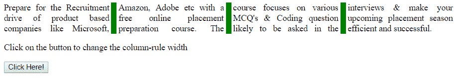
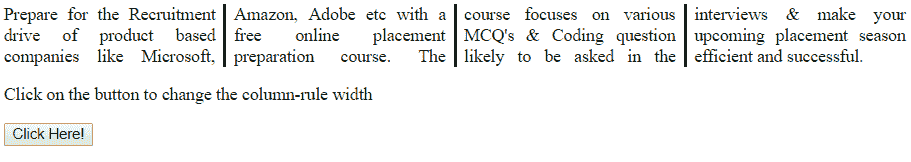

# HTML | DOM Style column rule width 属性

> 原文:[https://www . geesforgeks . org/html-DOM-style-column rule width-property/](https://www.geeksforgeeks.org/html-dom-style-columnrulewidth-property/)

HTML DOM 中的 Style columnRuleWidth 属性用于定义或确定列之间的规则宽度。

**语法:**

*   它返回 columnRuleWidth 属性。

    ```html
    object.style.columnRuleWidth
    ```

*   它用于设置 columnRuleWidth 属性。

    ```html
    object.style.columnRuleWidth = "medium|thin|thick|length|
    initial|inherit"
    ```

**属性值:**

*   **精简:**用于在列之间设置精简规则。
*   **中等:**用于在列之间创建中等宽度规则。这是默认宽度。
*   **粗:**它在列之间创建粗宽度规则。
*   **长度:**用于按长度设置宽度。它不取负值。
*   **初始值:**用于将 columnRuleWidth 属性设置为默认值。
*   **inherit:** 此属性从其父级继承。

**返回值:**返回一个字符串，代表元素的列宽属性。

**示例 1:** 本示例描述长度属性值。

```html
<!DOCTYPE html>
<html>

<head>
    <title>
        HTML | DOM Style columnRuleWidth Property
    </title>
    <style>
        #GFG {

            /* For old Chrome and Safari browsers */
            -webkit-column-count:4;
            -webkit-column-rule: 1px green solid;

            /* For Firefox browser */
            -moz-column-count:4;
            -moz-column-rule: 1px green solid;

            -webkit-column-count:4;
            -webkit-column-rule: 1px green solid;
            text-align:justify;
        }
    </style>
</head>

<body>
    <div id = "GFG">
        Prepare for the Recruitment drive of product 
        based companies like Microsoft, Amazon, Adobe 
        etc with a free online placement preparation 
        course. The course focuses on various MCQ's  
        & Coding question likely to be asked in the  
        interviews & make your upcoming placement 
        season efficient and successful. 
    </div>

    <p>
        Click on the button to change the
        column-rule width
    </p>

    <button onclick = "myGeeks()">
        Click Here!
    </button>

    <script>
        function myGeeks() {
            document.getElementById("GFG").style.columnRuleWidth
                    = "10px";
        }
    </script>
</body>

</html>                                
```

**输出:**
**点击按钮前:**

**点击按钮后:**


**例 2:** 本例描述中等属性值。

```html
<!DOCTYPE html>
<html>

<head>
    <title>
        HTML | DOM Style columnRuleWidth Property
    </title>
    <style>
        #GFG {

            /* For old Chrome and Safari browsers */
            -webkit-column-count:4;
            -webkit-column-rule: 1px green solid;

            /* For Firefox browser */
            -moz-column-count:4;
            -moz-column-rule: 1px green solid;

            -webkit-column-count:4;
            -webkit-column-rule: 1px green solid;
            text-align:justify;
        }
    </style>
</head>

<body>
    <div id = "GFG">
        Prepare for the Recruitment drive of product 
        based companies like Microsoft, Amazon, Adobe 
        etc with a free online placement preparation 
        course. The course focuses on various MCQ's  
        & Coding question likely to be asked in the  
        interviews & make your upcoming placement 
        season efficient and successful. 
    </div>

    <p>
        Click on the button to change the
        column-rule width
    </p>

    <button onclick = "myGeeks()">
        Click Here!
    </button>

    <script>
        function myGeeks() {
            document.getElementById("GFG").style.columnRuleWidth
                    = "medium";
        }
    </script>
</body>

</html>                    
```

**输出:**
**点击按钮前:**

**点击按钮后:**


**支持的浏览器:**以下列出了 *DOM Style columnRuleStyle 属性*支持的浏览器:

*   谷歌 Chrome
*   火狐使用 MozColumnRuleWidth
*   微软公司出品的 web 浏览器
*   歌剧
*   苹果 Safari