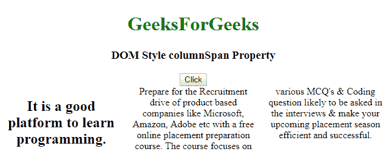
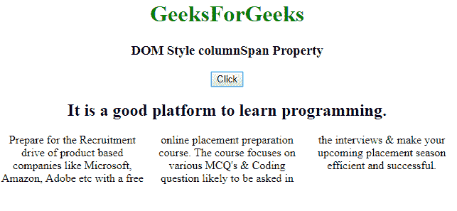
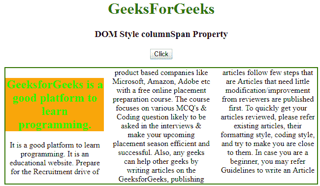
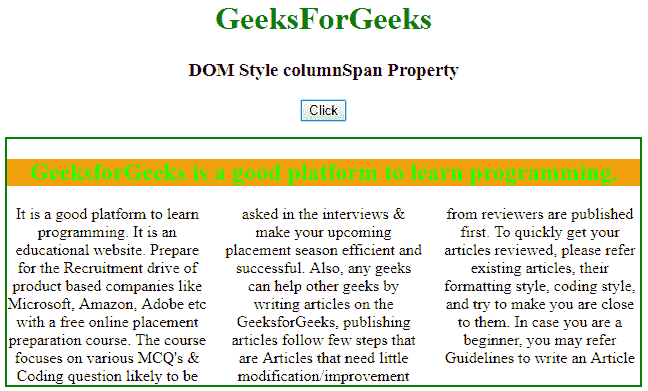

# HTML | DOM 样式列跨度属性

> 原文:[https://www . geesforgeks . org/html-DOM-style-column span-property/](https://www.geeksforgeeks.org/html-dom-style-columnspan-property/)

**DOM 样式的 columnspan 属性**用于指定一个元素应该跨越多少列。

**Syntax:**

*   它返回 columnSpan 属性:

    ```html
    object.style.columnSpan

    ```

    *   It set the columnSpan property:

    ```html
    object.style.columnSpan = "1|all|initial|inherit"

    ```

    **属性值:**

    *   **1:** 元素的默认值。用于跨元素一列。
    *   **all:** 用于将元素跨到所有列。
    *   **初始值:**用于设置默认值。
    *   **继承:**用于从其父级设置属性。

    **返回值:**该属性返回一个字符串，代表元素的列跨度属性。
    **示例-1:** 将 columnSpan 属性设置为“全部”。

    ```html
    <!DOCTYPE html>
    <html>

    <head>
        <title>
            HTML | DOM Style columnSpan Property
        </title>
        <style>
            #main {
                column-count: 3;
                /* Standard syntax */
            }
        </style>
    </head>

    <body>
        <center>
            <h1 style="color:green;">GeeksForGeeks</h1>
            <h3>DOM Style columnSpan Property </h3>

            <button onclick="geeks()">Click</button>

            <div id="main">
                <h2 id="h2tag"> 
                  It is a good platform to learn programming.
                </h2> 
              Prepare for the Recruitment drive of product
              based companies like Microsoft, Amazon,
              Adobe etc with a free online placement 
              preparation course. The course focuses
              on various MCQ's & Coding question likely 
              to be asked in the interviews & make your 
              upcoming placement season efficient and 
              successful.
            </div>

            <script>
                function geeks() {
                    // Code for old Chrome, Safari, Opera
                    document.getElementById("h2tag").style.WebkitColumnSpan =
                                                                        "all";

                    // Foe other standard browsers.  
                    document.getElementById("h2tag").style.columnSpan = "all";
                }
            </script>
        </center>
    </body>

    </html>
    ```

    **输出:**

    **之前点击按钮:**
    

    **点击按钮后:**
    

    **示例-2:** 将 columnSpan 属性设置为“全部”。

    ```html
    <!DOCTYPE html>
    <html>

    <head>
        <title>
            HTML | DOM Style columnSpan Property
        </title>
        <style>
            #main {
                column-count: 3;
                /* Standard syntax */
                border: 2px solid green;
            }

            #h2tag {
                background-color: orange;
                color: lime;
            }
        </style>
    </head>

    <body>
        <center>
            <h1 style="color:green;">GeeksForGeeks</h1>
            <h3>DOM Style columnSpan Property </h3>

            <button onclick="geeks()">Click</button>
            <br>
            <div id="main">
                <h2 id="h2tag">
                  GeeksforGeeks is a good platform to learn 
                  programming.
                </h2>
              It is a good platform to learn programming. 
              It is an educational website. Prepare for 
              the Recruitment drive of product based 
              companies like Microsoft, Amazon, Adobe 
              etc with a free online placement preparation
              course. The course focuses on various MCQ's &
              Coding question likely to be asked in the 
              interviews & make your upcoming placement
              season efficient and successful. Also, any 
              geeks can help other geeks by writing articles
              on the GeeksforGeeks, publishing articles follow
              few steps that are Articles that need little 
              modification/improvement from reviewers are 
              published first. To quickly get your articles 
              reviewed, please refer existing articles, their
              formatting style, coding style, and try to make 
              you are close to them. In case you are a beginner,
              you may refer Guidelines to write an Article
            </div>

            <script>
                function geeks() {
                    // Code for old Chrome, Safari, Opera
                    document.getElementById("h2tag").style.WebkitColumnSpan
                                                = "all";

                    // For other standard browsers.
                    document.getElementById("h2tag").style.columnSpan
                                                   = "all";
                }
            </script>
        </center>
    </body>

    </html>
    ```

    **输出:**
    **之前点击按钮:**
    

    **点击按钮后:**
    

    **支持的浏览器:**以下是*HTML | DOM Style column span Property*支持的浏览器:

    *   谷歌 Chrome 50.0
    *   Internet Explorer 10.0
    *   Opera 37.0
    *   Safari 9.0