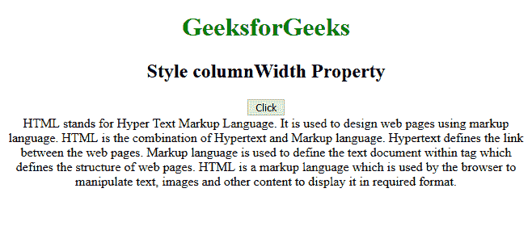
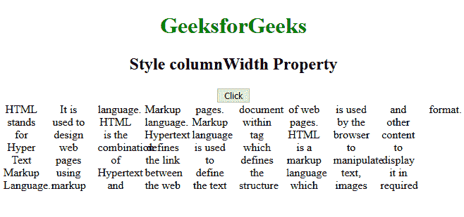

# HTML | DOM 样式列宽属性

> 原文:[https://www . geesforgeks . org/html-DOM-style-column width-property/](https://www.geeksforgeeks.org/html-dom-style-columnwidth-property/)

DOM 中的 columnWidth 属性用于指定列的宽度。

**语法:**

*   **返回列宽属性:**

    ```html
    object.style.columnWidth
    ```

*   **设置列宽属性:**

    ```html
    object.style.columnWidth = "auto | length | initial | inherit" 
    ```

**返回值:**返回一个字符串值，代表元素的列宽属性。

**属性值:**

*   **自动:**默认值。列宽将由浏览器决定*   **长度:**指定列宽度的长度*   **初始值:**将该属性设置为默认值。阅读关于初始*   **inherit:** Inherits this property from its parent element. Read about inherit

    **示例:**

    ```html
    <!DOCTYPE html>
    <html>

    <body>
        <center>
            <h1 style="color:green">GeeksforGeeks</h1>
            <h2>Style columnWidth Property</h2>
            <button onclick="GFGFun()">Click</button>

            <div id="DIVid">
                HTML stands for Hyper Text Markup Language.
              It is used to design web pages using markup language.
              HTML is the combination of Hypertext and 
              Markup language. Hypertext defines the link 
              between the web pages. Markup language is used 
              to define the text document within tag which 
              defines the structure of web pages. HTML is 
              a markup language which is used by the browser
              to manipulate text, images and other content 
              to display it in required format.
            </div>

            <script>
                function GFGFun() {
                  //Chrome, Safari, Opera
                    document.getElementById("DIVid").style.WebkitColumnWidth="50px"; 
                    // Firefox
                    document.getElementById("DIVid").style.MozColumnWidth="50px"; 
                    document.getElementById("DIVid").style.columnWidth="50px";
                }
            </script>
        </center>
    </body>

    </html>
    ```

    **输出:**
    **前:**
    
    **后:**
    

    **支持的浏览器:****HTML DOM Style column width Property**支持的浏览器如下:

    *   谷歌 Chrome
    *   微软公司出品的 web 浏览器
    *   Firefox *MozColumnWidth*
    *   苹果 Safari
    *   歌剧