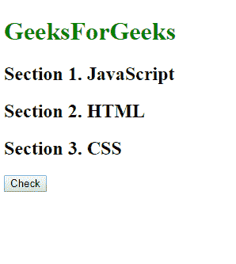
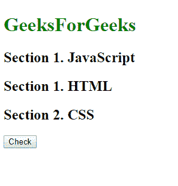
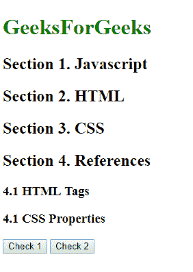
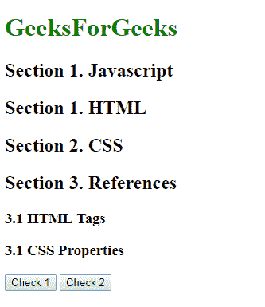
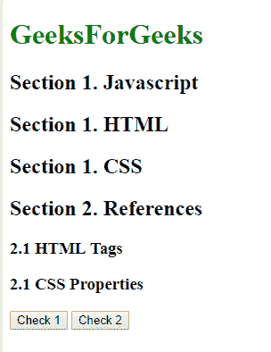

# HTML | DOM 样式反创建属性

> 原文:[https://www . geesforgeks . org/html-DOM-style-antifcrement-property/](https://www.geeksforgeeks.org/html-dom-style-counterincrement-property/)

HTML DOM 中的**样式反规则属性**指定选择器每次出现时计数器应该增加多少。增量的默认值为 1。

**语法:**

*   返回“反违反”属性:

```html
object.style.counterIncrement
```

*   设置反冲突属性:

```html
object.style.counterIncrement = "none|number|initial|inherit"
```

**属性值:**

*   **无:**为默认值。该值不会重置计数器。
*   **数字:**每次元素出现时为指定的计数器设置一个增量。这个增量可以是零，甚至是负的。如果未指定，默认值为 1。
*   **初始:**将元素设置为其初始位置。
*   **继承:**元素从父元素继承其属性。

**示例-1:** 更改反冲突属性。

## 超文本标记语言

```html
<!DOCTYPE html>
<html lang="en">

<head>
    <title>
        HTML | DOM Style counterIncrement Property
    </title>
    <style type="text/css">
        body {
            counter-reset: section;
        }

        h1 {
            color: green;
        }

        h2 {
            counter-increment: section;
        }

        h2:before {
            content: "Section "
              counter(section) ". ";
        }
    </style>
</head>

<body>
    <h1>GeeksForGeeks</h1>
    <h2>JavaScript</h2>
    <h2 id="h">HTML</h2>
    <h2>CSS </h2>
    <button onclick="myFunction()">
      Check
  </button>

    <script>
        function myFunction() {
            document.getElementById(
              "h").style.counterIncrement =
              "subsection";
        }
    </script>
</body>

</html>
```

**输出:**
**前:**



**之后:**



**示例- 2:** 反竞争属性。

## 超文本标记语言

```html
<!DOCTYPE html>
<html lang="en">

<head>
    <title>
        HTML | DOM Style counterIncrement Property
    </title>
    <style type="text/css">
        body {
            counter-reset: section;
        }

        h1 {
            color: green;
        }

        h2 {
            counter-increment: section;
        }

        h2:before {
            content:
              "Section " counter(section) ". ";
        }

        h3:before {
            counter-increment: category;
            content: counter(section) "." counter(category) " ";
        }
    </style>
</head>

<body>
    <h1>GeeksForGeeks</h1>
    <h2>Javascript</h2>
    <h2 id="h">HTML</h2>
    <h2 id="H">CSS </h2>
    <h2>References</h2>
    <h3>HTML Tags</h3>
    <h3>CSS Properties</h3>
    <button onclick="myFunction()"
            >Check 1
  </button>

    <button onclick="Function()">
      Check 2
  </button>

    <script>
        function myFunction() {
            document.getElementById(
              "h").style.counterIncrement =
              "subsection";
        }

        function Function() {
            document.getElementById(
              "H").style.counterIncrement =
              "subsection";
        }
    </script>
</body>

</html>
```

**输出:**
**前:**



**先查后:**



**第二次检查后:**



**支持的浏览器:**以下是 *HTML | DOM Style 计数器增量属性*支持的浏览器:

*   谷歌 Chrome
*   微软公司出品的 web 浏览器
*   火狐浏览器
*   歌剧
*   旅行队