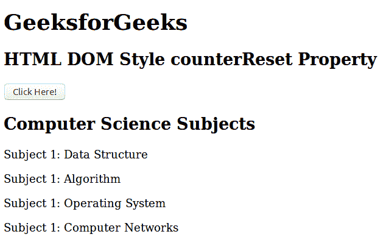
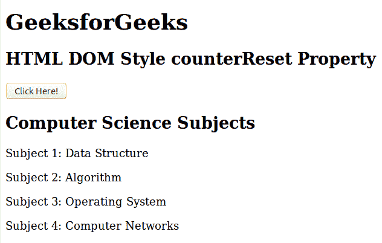

# HTML | DOM 样式反重置属性

> 原文:[https://www . geesforgeks . org/html-DOM-style-counter reset-property/](https://www.geeksforgeeks.org/html-dom-style-counterreset-property/)

HTML DOM 中的**样式计数器重置属性**用于创建或重置计数器。该属性与**反冲突**属性和内容属性一起使用。

**语法:**

*   它用于返回 counterReset 属性。

    ```html
    object.style.counterReset
    ```

*   它用于设置 counterReset 属性。

    ```html
    object.style.counterReset = "none|name|number|initial|inherit"
    ```

**属性值**

| 价值 | 描述 |
| 没有人 | 这是默认值，不会重置任何计数器。 |
| 名字 | 它保存将要重置的计数器的名称。 |
| 数字 | 它保存着计数器将要复位的数字。 |
| 最初的 | 将此属性设置为默认值。 |
| 继承 | 从其父元素继承属性。 |

**返回值:**这个方法返回一个包含元素的反增量属性的字符串。

**示例:**

```html
<!DOCTYPE html>
<html>

<head>
    <title>
        HTML DOM Style counterReset Property
    </title>

    <style>
        p:before {
            counter-increment: subj;
            content: "Subject " counter(subj) ": ";
        }
    </style>
</head>

<body>

    <h1>GeeksforGeeks</h1>

    <h2>
        HTML DOM Style counterReset Property
    </h2>

    <button onclick = "myFunction()">
        Click Here!
    </button>

    <h2>Computer Science Subjects</h2>

    <p>Data Structure</p>
    <p>Algorithm</p>
    <p>Operating System</p>
    <p>Computer Networks</p>

    <script>
        function myFunction() {
            document.body.style.counterReset = "subj";
        }
    </script>
</body>

</html>                    
```

**输出:**
**之前点击按钮:**

**之后点击按钮:**


**支持的浏览器:***DOM counterReset 属性*支持的浏览器如下:

*   谷歌 Chrome
*   微软公司出品的 web 浏览器
*   火狐浏览器
*   歌剧
*   旅行队