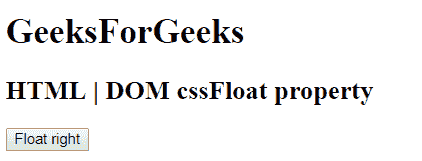
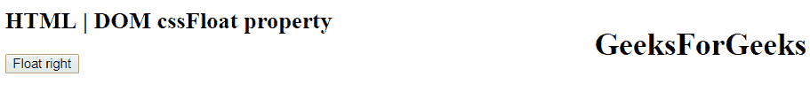
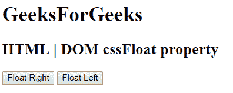
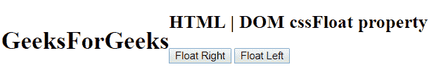
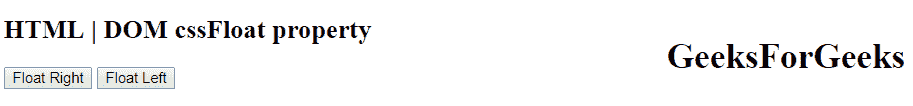

# HTML | DOM 样式 cssFloat 属性

> 原文:[https://www . geesforgeks . org/html-DOM-style-CSS float-property/](https://www.geeksforgeeks.org/html-dom-style-cssfloat-property/)

HTML DOM 中的样式 cssFloat 属性用于设置或返回元素的水平对齐方式。此属性允许元素浮动在父体的右侧或左侧，其余元素环绕在它周围。

**语法:**

*   它返回 cssFloat 属性。

    ```html
    object.style.cssFloat
    ```

    *   It is used to set the cssFloat property.

    ```html
    object.style.cssFloat = "left|right|none|initial|inherit"
    ```

    **返回值:**返回一个字符串值，代表元素的水平对齐方式

    **属性值:**

    *   **无:**为默认值。该值不会产生浮点。
    *   **左侧:**将元素浮动到父体/容器的左侧。
    *   **右侧:**将元素浮动到父体/容器的右侧。
    *   **初始:**将元素设置为其初始位置。
    *   **继承:**元素从父元素继承其浮动属性。

    **例 1:**

    ```html
    <!DOCTYPE html>
    <html>

    <head>
        <title>
            HTML DOM Style cssFloat Property
        </title>
    </head>

    <body>
        <h1 id = "GFG">GeeksForGeeks</h1>

        <h2>HTML | DOM cssFloat property</h2>

        <button onclick = "RightFloat()">
            Float right
        </button>

        <!-- script to set float of element -->
        <script>
            function RightFloat() {
                document.getElementById("GFG").style.cssFloat
                        = "right";
            }
        </script>
    </body>

    </html>                    
    ```

    **输出:**
    **点击按钮前:**
    
    **点击按钮后:**
    

    **例 2:**

    ```html
    <!DOCTYPE html>
    <html>

    <head>
        <title>
            HTML DOM Style cssFloat Property
        </title>
    </head>

    <body>
        <h1 id = "GFG">GeeksForGeeks</h1>

        <h2>HTML | DOM cssFloat property</h2>

        <button onclick = "RightFloat()">
            Float Right
        </button>

        <button onclick = "LeftFloat()">
            Float Left
        </button>

        <!-- script to set float of element -->
        <script>
            function RightFloat() {
                document.getElementById("GFG").style.cssFloat
                        = "right";
            }

            function LeftFloat() {
                document.getElementById("GFG").style.cssFloat
                        = "left";
            }
        </script>
    </body>

    </html>                    
    ```

    **输出:**
    **前点击按钮:**
    
    **后点击浮动左按钮:**
    
    **后点击浮动右按钮:**
    

    **支持的浏览器:**下面列出了 *Style cssFloat 属性*支持的浏览器:

    *   谷歌 Chrome
    *   微软公司出品的 web 浏览器
    *   Mozilla Firefox
    *   旅行队
    *   歌剧