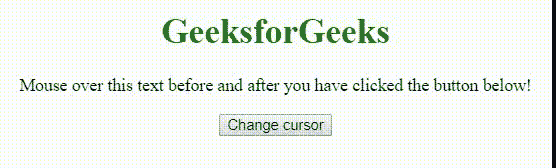

# HTML | DOM 样式光标属性

> 原文:[https://www . geesforgeks . org/html-DOM-style-cursor-property/](https://www.geeksforgeeks.org/html-dom-style-cursor-property/)

**光标属性**在 HTML DOM 中用于**设置**或**返回** *鼠标指针*要显示的光标类型。

**语法:**

*   返回光标属性:

    ```html
    object.style.cursor
    ```

*   设置光标属性:

    ```html
    object.style.cursor=value
    ```

**属性值:**

*   **别名:**该属性用于显示光标指示要创建的内容。
*   **全滚动:**在该属性中，光标表示滚动。
*   **自动:**这是浏览器设置光标的默认属性。
*   **单元格:**在该属性中，光标表示选择了一个单元格或一组单元格。
*   **上下文菜单:**在该属性中，光标表示上下文菜单可用。
*   **col-resize:** 在该属性中，光标表示可以水平调整列的大小。
*   **复制:**在该属性中，光标表示要复制的内容。
*   **十字准线:**在该属性中，光标呈现为十字准线。
*   **默认:**默认光标。
*   **e-resize:** 在此属性中，光标指示框的边缘将向右移动。
*   **ew-resize:** 在该属性中，光标表示双向调整光标大小。
*   **帮助:**在该属性中，光标表示帮助可用。
*   **移动:**在该属性中，光标表示要移动的东西
*   **n-调整大小:**在该属性中，光标指示要上移的框的边缘。
*   **ne-resize:** 在该属性中，光标指示框的一条边要向上和向右移动。
*   **nesw-resize:** 该属性表示双向调整光标大小。
*   **ns-resize:** 该属性表示双向调整光标大小。
*   **NW-调整大小:**在该属性中，光标指示框的边缘将上下移动。
*   **nwse-resize:** 该属性表示双向调整光标大小。
*   **不拖放:**在该属性中，光标表示被拖动的项目不能放在这里。
*   **无:**该属性表示没有为元素渲染光标。
*   **不允许:**在该属性中，光标表示不会执行请求的动作。
*   **指针:**在该属性中，光标是指针，表示链接
*   **进度:**在该属性中，光标表示程序正忙。
*   **行-调整大小:**在该属性中，光标表示行可以垂直调整大小。
*   **s-调整大小:**在该属性中，光标指示要向下移动的框的边缘。
*   **se-resize:** 在该属性中，光标指示要向下和向右移动的框的边缘。
*   **sw-resize:** 在该属性中，光标指示要向下和向左移动的框的边缘。
*   **文本:**在该属性中，光标表示可以选择的文本。
*   **URL:** 在该属性中，自定义游标的 URL 列表以逗号分隔，列表末尾有一个通用游标。
*   **竖排文字:**在该属性中，光标表示可以选择的竖排文字。
*   **w-调整大小:**在此属性中，光标指示框的边缘将向左移动。
*   **等待:**在该属性中，光标表示程序正忙。
*   **放大:**在该属性中，光标表示有东西可以放大。
*   **缩小:**在该属性中，光标表示有东西可以缩小。
*   **初始值:**该属性用于设置为默认值。
*   **继承:**从其父元素继承。

**返回值:**它返回一个字符串，该值代表当鼠标指针在一个元素上时显示的鼠标光标

**示例:**

```html
<!DOCTYPE html>
<html>

<head>
    <title>
        HTML | DOM Style cursor Property
    </title>
    <style>
        .wait {
            cursor: wait;
        }

        h1 {
            color: green;
        }
    </style>
</head>

<body>
    <center>

        <h1>GeeksforGeeks</h1>
        <p id="myP">
          Mouse over this text before and 
          after you have clicked the button below!
        </p>

        <button type="button"
                onclick="myFunction()">
          Change cursor
        </button>

        <script>
            function myFunction() {
                document.getElementById(
                  "myP").style.cursor = "pointer";
            }
        </script>
    </center>
</body>

</html>
```

**输出:**

**支持的浏览器:**支持的浏览器如下:

*   谷歌 Chrome
*   边缘
*   Mozilla Firefox
*   歌剧
*   旅行队