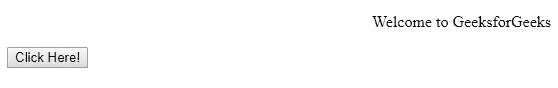
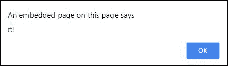

# HTML | DOM 样式方向属性

> 原文:[https://www . geesforgeks . org/html-DOM-style-direction-property/](https://www.geeksforgeeks.org/html-dom-style-direction-property/)

HTML DOM 中的**样式方向属性**用于设置或返回元素的文本方向。

**语法:**

*   用于设置文字方向。

    ```html
    object.style.direction = "ltr|rtl|initial|inherit"
    ```

*   它返回文本方向。

    ```html
    object.style.direction
    ```

**属性值:**

*   **ltr:** 将方向指定为从左到右，这也是默认方向。
*   **rtl:** 指定从右向左的方向。
*   **初始值:**将属性设置为默认值。
*   **继承:**从父元素继承属性。

**返回值:**返回文本内容的文本方向。

**示例 1:** 本示例将文本方向从*从右向左设置为*。

```html
<!DOCTYPE html>
<html>

<head>
    <title>
        HTML DOM Style direction Property
    </title>
</head>

<body>
    <div>

        <!-- Style direction Property used here -->
        <p id = "para">
            Welcome to GeeksforGeeks
        </p>
    </div>

    <input type = "button" value = "Click Here!"
    onclick = "myGeeks()" />

    <!-- script to set text direction -->
    <script>
        function myGeeks() {
            document.getElementById("para").style.direction
                                                   = "rtl";
        }
    </script>
</body>

</html>                    
```

**输出:**
**点击按钮前:**

**点击按钮后:**


**示例 2:** 本示例返回文本内容的方向。

```html
<!DOCTYPE html>
<html>

<head>
    <title>
        HTML DOM Style direction Property
    </title>
</head>

<body>
    <div>
        <p id = "para" style = "direction: rtl">
            Welcome to GeeksforGeeks
        </p>
    </div>

    <input type = "button" value = "Click Here!"
        onclick = "myGeeks()" />

    <!-- script returns the content direction -->
    <script>
        function myGeeks() {
            alert(document.getElementById("para").style.direction);
        }
    </script>
</body>

</html>                    
```

**输出:**
**点击按钮前:**

**点击按钮后:**


**支持的浏览器:***风格方向属性*支持的浏览器如下:

*   谷歌 Chrome
*   微软公司出品的 web 浏览器
*   火狐浏览器
*   歌剧
*   旅行队