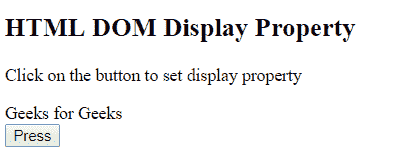
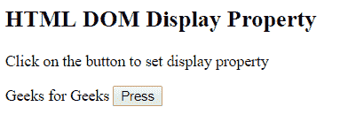
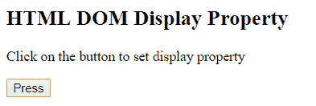
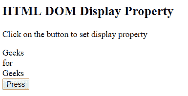

# HTML | DOM 样式显示属性

> 原文:[https://www . geesforgeks . org/html-DOM-style-display-property/](https://www.geeksforgeeks.org/html-dom-style-display-property/)

HTML DOM 中的 Style 显示属性用于设置或返回元素的显示类型。它类似于显示或隐藏元素的可见性属性。显示略有不同:无，隐藏整个元素，而可见性:隐藏意味着只有元素的内容将不可见，但元素将保持其原始位置和大小。

**语法:**

*   它返回显示属性。

    ```html
    object.style.display
    ```

*   它设置显示属性。

    ```html
    object.style.display = value;
    ```

**属性值:**

*   **内联:**为默认值。它将元素呈现为内联元素。
*   **块:**它将元素呈现为块级元素。
*   **compact:** 它根据上下文将元素呈现为块级或内嵌。
*   **伸缩:**它将元素渲染为块级伸缩框。
*   **内嵌块:**它将元素呈现为内嵌框内的块框。
*   **内联伸缩:**它将元素呈现为内联级别的伸缩框。
*   **内联表:**它将元素呈现为一个内联表。
*   **列表项:**它将元素呈现为列表。
*   **标记:**将框前或框后的内容设置为标记。
*   **无:**不显示任何元素。
*   **磨合:**它根据上下文将元素呈现为块级或内嵌。
*   **表格:**它将元素渲染为块表格，表格前后有一个换行符。
*   **表格标题:**它将元素呈现为表格标题。
*   **表格单元格:**它将元素呈现为表格单元格。
*   **table-column:** 它将元素呈现为一列单元格。
*   **表-列-组:**它将元素呈现为一个或多个列的组。
*   **表尾组:**将元素渲染为表尾行。
*   **表头组:**将元素渲染为表头行。
*   **表格行:**它将元素呈现为表格行。
*   **表格-行-组:**元素呈现为一个或多个行的组。
*   **初始值:**将显示属性设置为默认值。
*   **继承:**它从其父元素继承显示属性值。

**返回值:**返回一个字符串，代表元素的显示类型。

**示例 1:** 本示例描述了内联属性值。

```html
<!DOCTYPE html>
<html>

<head>
    <title>
        HTML DOM Style display Property
    </title>
</head>

<body>
    <h2>
        HTML DOM Display Property
    </h2>

    <p>
        Click on the button to set
        display property
    </p>

    <div id = "GFG">
        Geeks for Geeks
    </div>

    <button onclick="myGeeks()">
        Press
    </button>

    <!-- script to set display property -->
    <script>
        function myGeeks() {
            document.getElementById("GFG").style.display
                    = "inline";
        }
    </script>
</body>

</html>                    
```

**输出:**
**之前点击按钮:**

**之后点击按钮:**


**示例 2:** 本示例描述了 none 属性值。

```html
<!DOCTYPE html>
<html>

<head>
    <title>
        HTML DOM Style display Property
    </title>
</head>

<body>
    <h2>
        HTML DOM Display Property
    </h2>

    <p>
        Click on the button to set
        display property
    </p>

    <div id = "GFG">
        Geeks for Geeks
    </div>

    <button onclick="myGeeks()">
        Press
    </button>

    <!-- script to set display property -->
    <script>
        function myGeeks() {
            document.getElementById("GFG").style.display
                    = "none";
        }
    </script>
</body>

</html>                    
```

**输出:**
**之前点击按钮:**


**点击按钮后:**


**示例 3:** 本示例描述了表格标题属性值。

```html
<!DOCTYPE html>
<html>

<head>
    <title>
        HTML DOM Style display Property
    </title>
</head>

<body>
    <h2>
        HTML DOM Display Property
    </h2>

    <p>
        Click on the button to set
        display property
    </p>

    <div id = "GFG">
        Geeks for Geeks
    </div>

    <button onclick="myGeeks()">
        Press
    </button>

    <!-- script to set display property -->
    <script>
        function myGeeks() {
            document.getElementById("GFG").style.display
                    = "table-caption";
        }
    </script>
</body>

</html>                    
```

**输出:**
**之前点击按钮:**


**点击按钮后:**


**示例 4:** 本示例描述了块属性值。

```html
<!DOCTYPE html>
<html>

<head>
    <title>
        HTML DOM Style display Property
    </title>
</head>

<body>
    <h2>
        HTML DOM Display Property
    </h2>

    <p>
        Click on the button to set
        display property
    </p>

    <div id = "GFG">
        Geeks for Geeks
    </div>

    <button onclick="myGeeks()">
        Press
    </button>

    <!-- script to set display property -->
    <script>
        function myGeeks() {
            document.getElementById("GFG").style.display
                    = "block";
        }
    </script>
</body>

</html>                    
```

**输出:**
**之前点击按钮:**


**点击按钮后:**


**支持的浏览器:***DOM 样式显示属性*支持的浏览器如下:

*   谷歌 Chrome
*   微软公司出品的 web 浏览器
*   火狐浏览器
*   歌剧
*   旅行队