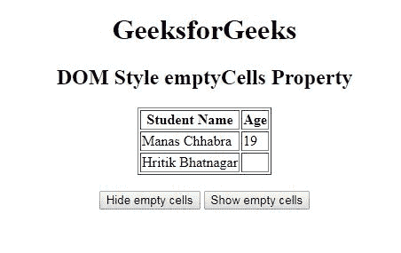
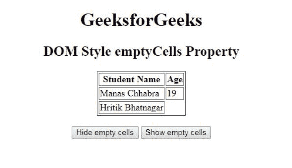
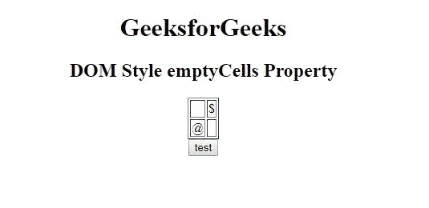
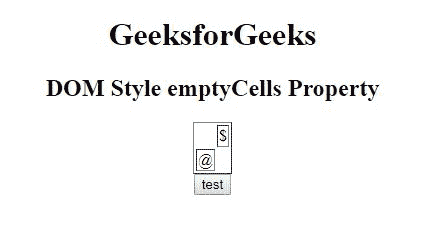

# HTML | DOM 样式 emptyCells 属性

> 原文:[https://www . geesforgeks . org/html-DOM-style-emptycells-property/](https://www.geeksforgeeks.org/html-dom-style-emptycells-property/)

有时 [HTML 表格](https://www.geeksforgeeks.org/html-tables/)包含空单元格。 **DOM Style 空单元格**用于显示空单元格的边框和背景。

**语法:**

*   它用于返回 emptyCells 属性。

    ```html
    object.style.emptyCells
    ```

*   用于设置 emptyCells 属性。

    ```html
    object.style.emptyCells = "show|hide|initial|inherit"
    ```

**返回值:**代表空单元格边框和背景的字符串。

**属性值:**

*   **显示:**表示显示空单元格上的边框和背景。这是此属性的默认值。
*   **隐藏:**表示不会显示空单元格上的边框和背景。
*   **初始值:**使属性使用默认值(即 show)。
*   **inherit:** 它从其父元素继承属性。

**示例-1:** 下面的代码显示了如何在显示和隐藏之间设置 emptyCells 属性。

```html
<!DOCTYPE html>
<html>

<head>
    <title>
        DOM Style emptyCells Property
    </title>
</head>

<body>
    <center>
        <h1>GeeksforGeeks</h1>
        <h2>DOM Style emptyCells Property</h2>

        <table id="a1" border="1">
            <tr>
                <th>Student Name</th>
                <th>Age</th>
            </tr>
            <tr>
                <td>Manas Chhabra</td>
                <td>19</td>
            </tr>
            <tr>
                <td>Hritik Bhatnagar</td>
                <td></td>
            </tr>
        </table>
        <br>

        <button type="button" onclick="hide()">
          Hide empty cells
        </button>

        <button type="button" onclick="show()">
          Show empty cells
        </button>

        <!-- script to show or hide emptyCell border -->
        <script>
            function hide() {
                document.getElementById("a1").style.emptyCells 
                                              = "hide";
            }

            function show() {
                document.getElementById("a1").style.emptyCells 
                                              = "show";
            }
        </script>
    </center>
</body>

</html>
```

**输出:**

*   **Before click on Hide button:**

    

*   **点击隐藏按钮后:**
    

**示例-2:** 下面的代码显示了如何获取 emptyCells 属性。

```html
<!DOCTYPE html>
<html>

<head>
    <title>
        DOM Style emptyCells Property
    </title>
</head>

<body>
    <center>
        <h1>GeeksforGeeks</h1>
        <h2>DOM Style emptyCells Property</h2>
        <table id="a1" border="1" 
               style="empty-cells:hide;">
            <tr>
                <td></td>
                <td>{content}lt;/td>
            </tr>
            <tr>
                <td>@</td>
                <td></td>
            </tr>
        </table>
        <button type="button" onclick="myFunction()">
          test
        </button>
    </center>

    <script>
        function myFunction() {
            console.log(document.getElementById("a1"
                   ).style.emptyCells);
        }
    </script>
</body>

</html>
```

**输出:**

*   **点击测试按钮前:**
    
*   **点击测试按钮后:**
    

**支持的浏览器:**T2 DOM Style emptyCells 属性支持的浏览器如下:

*   谷歌 Chrome 1.2
*   Internet Explorer 4.0
*   Firefox 1.0
*   Opera 4.0
*   苹果 Safari 1.0