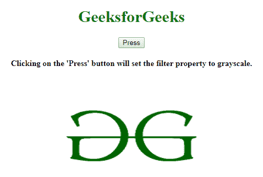
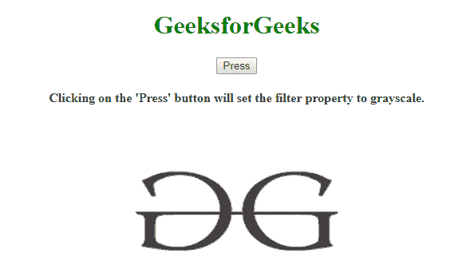
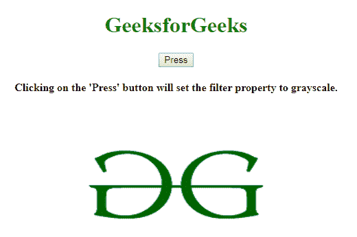
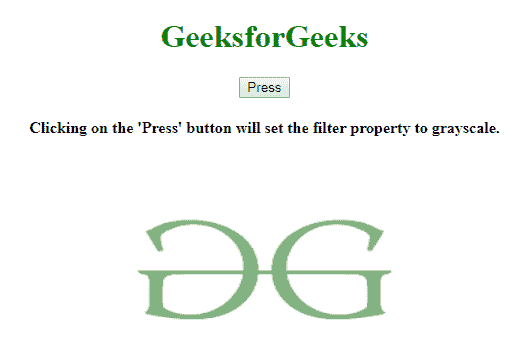
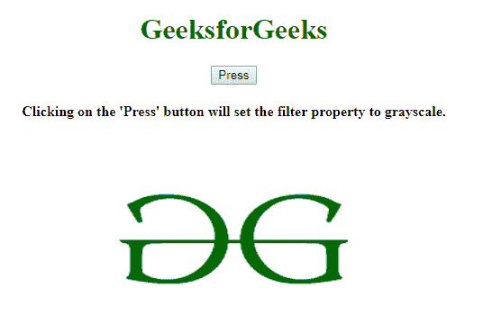
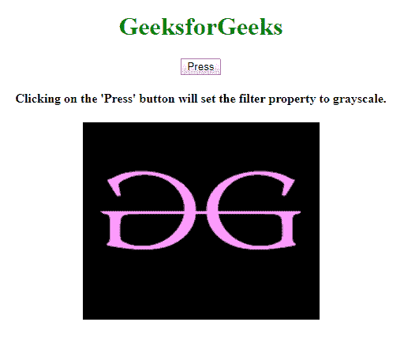

# HTML | DOM 样式过滤器属性

> 原文:[https://www . geesforgeks . org/html-DOM-style-filter-property/](https://www.geeksforgeeks.org/html-dom-style-filter-property/)

HTML DOM 中的 **DOM 样式滤镜属性**用于**为图像添加** *视觉效果或滤镜效果。*

**语法:**

*   返回过滤器属性:

    ```html
    object.style.filter
    ```

*   设置过滤属性:

    ```html
    object.style.filter = "none| blur() |brightness() |contrast() | 
    drop-shadow() |grayscale() |hue-rotate() |invert() |opacity() |
    saturate() | sepia()"
    ```

**功能:**

| 过滤器 | 描述 |
| 没有人 | 它将效果设置为无。 |
| 虚化 | 它将效果设置为模糊。 |
| 亮度(%) | 它调节亮度。 |
| 对比度(%) | 它调整图像的对比度。 |
| 投影 | 它将效果设置为阴影。 |
| h 形阴影 | 它设置水平阴影。 |
| v 形阴影 | 它设置垂直阴影。 |
| 虚化 | 它以像素为单位设置模糊效果。 |
| 范围 | 它设置图像增长和扩展。 |
| 颜色 | 它给阴影增加了色彩。 |
| 灰度(%) | 它将图像设置为灰度。 |
| 色调-旋转（你） | 它在图像上设置色调旋转。 |
| 反转(%) | 它反转图像中的样本。 |
| 不透明度(%) | 它设置图像的不透明度。 |
| 饱和(%) | 它使图像饱和。 |
| 乌贼(%) | 它将图像设置为棕褐色。 |

**返回值:**返回添加了视觉效果的图像。

**示例-1:** 将滤镜属性设置为**灰度**。

```html
<!DOCTYPE html>
<html>

<head>
    <title>
        HTML | DOM Style filter Property
    </title>
    <style>
        h1 {
            color: green;
        }
    </style>
</head>

<body>
    <center>
        <h1>
          GeeksforGeeks
        </h1>
        <button onclick="img()">Press</button>

        <h4>
          Clicking on the 'Press' button will 
          set the filter property to grayscale.
        </h4>

        

        <script>
            function img() {

                document.getElementById(
                    "gfg").style.filter = "grayscale(100%)";

            }
        </script>
    </center>
</body>

</html>
```

**输出:**
**点击按钮前:**

**点击按钮后:**


**示例-2:** 将滤镜属性设置为**不透明度**。

```html
<!DOCTYPE html>
<html>

<head>
    <title>
        HTML | DOM Style filter Property
    </title>
    <style>
        h1 {
            color: green;
        }
    </style>
</head>

<body>
    <center>
        <h1>
          GeeksforGeeks
      </h1>
        <button onclick="img()">
            Press
        </button>

        <h4>
          Clicking on the 'Press' button will 
          set the filter property to grayscale.
        </h4>

        

        <script>
            function img() {

                document.getElementById(
                    "gfg").style.filter = "opacity(50%)";

            }
        </script>
    </center>
</body>

</html>
```

**输出:**
**点击按钮前:**

**点击按钮后:**


**示例-3:** 将过滤器属性设置为**反转**。

```html
<!DOCTYPE html>
<html>

<head>
    <title>
        HTML | DOM Style filter Property
    </title>
    <style>
        h1 {
            color: green;
        }
    </style>
</head>

<body>
    <center>
        <h1>
          GeeksforGeeks
      </h1>
        <button onclick="img()">
            Press
        </button>

        <h4>
              Clicking on the 'Press' button will 
              set the filter property to grayscale.
      </h4>

        

        <script>
            function img() {

                document.getElementById(
                    "gfg").style.filter = "invert(100%)";

            }
        </script>
    </center>
</body>

</html>
```

**输出:**
**点击按钮前:**

**点击按钮后:**


**浏览器支持:***HTML DOM Style 过滤器属性*支持的浏览器如下:

*   谷歌 Chrome 53.0
*   Internet Explorer 13.0
*   Firefox 35.0
*   Opera 40.0
*   Safari 9.1