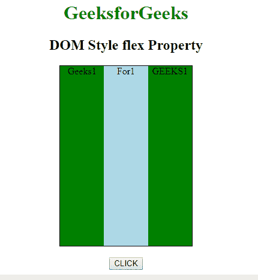

# HTML | DOM 样式伸缩属性

> 原文:[https://www.geeksforgeeks.org/html-dom-style-flex-property/](https://www.geeksforgeeks.org/html-dom-style-flex-property/)

**HTML DOM Style flex** 属性设置/返回项目相对于同一容器内其他灵活项目的长度。
弹性增长、弹性收缩和弹性基础是**弹性属性**的属性。

**语法:**

*   用于返回样式 flex 属性:

    ```html
     object.style.flex

    ```

*   用于设置 flex 属性:

    ```html
    object.style.flex = "flex-grow flex-shrink flex-basis|auto|
    initial|inherit"
    ```

**返回值:**返回一个字符串值，代表元素的伸缩属性

**属性值:**

| 价值 | 描述 |
| 伸缩生长 | 它指定项目相对于其他灵活项目将增长多少 |
| 伸缩收缩 | 它指定了项目相对于其他灵活项目的收缩程度 |
| 弹性基础 | 它指定项目的长度。合法值:“自动”、“继承”和后跟“%”、“px”、“em”的数字 |
| 汽车 | 与 1 1 汽车相同 |
| 最初的 | 与 0 1 自动相同 |
| 继承 | 从其父元素继承属性。 |

**示例-1:** 所有 div 的长度相同。

```html
<!DOCTYPE html>
<html>

<head>
    <title>
        HTML | DOM Style flex Property
    </title>
    <style>
        #gfg {
            width: 220px;
            height: 60px;
            border: 1px solid black;
            display: -webkit-flex;
            /* Safari */
            display: flex;
        }
    </style>
</head>

<body>
    <center>
        <h1 style="color: green;">
          GeeksforGeeks
        </h1>

        <h2 style="color: black;">
          DOM Style flex Property
        </h2>

      <div id="gfg">
         <div style="background-color:green;">Geeks
            <div style="background-color:lightblue;">For
                    <div style="background-color:green;">
                      Geeks
                    </div>
            </div>
         </div>
      </div>
        <br>

        <button onclick="GEEKS()">CLICK</button>

        <script>
            function GEEKS() {
                var x = document.getElementById("gfg");
                var y = x.getElementsByTagName("DIV");
                var i = 0;
                for (i; i < y.length; i++) {
                    // IE10
                    y[i].style.msFlex = "1"; 

                    // Safari 6.1+
                    y[i].style.WebkitFlex = "1"; 
                    y[i].style.flex = "1";
                }
            }
        </script>
    </center>
</body>

</html>
```

**输出:**

**之前点击按钮:**


**点击按钮后:**


**示例-2:** 根据内容灵活选择项目:

```html
<!DOCTYPE html>
<html>

<head>
    <title>
        HTML | DOM Style flex Property
    </title>
    <style>
        #gfg {
            width: 220px;
            height: 300px;
            border: 1px solid black;
            display: -webkit-flex;
            /* Safari */
            display: flex;
        }
    </style>
</head>

<body>
    <center>
        <h1 style="color: green;">
          GeeksforGeeks
        </h1>
        <h2 style="color: black;">
          DOM Style flex Property
        </h2>
        <div id="gfg">
            <div style="background-color:green;">
              Geeks1 
          </div>
            <div style="background-color:lightblue;">
              For1
          </div>
            <div style="background-color:green;">
              GEEKS1
          </div>
        </div>
        <br>

        <button onclick="GEEKS()">CLICK</button>

        <script>
            function GEEKS() {
                var x = 
                 document.getElementById("gfg");
                var y = 
                 x.getElementsByTagName("DIV");
                var i = 0;
                for (i; i < y.length; i++) {
                    // IE10
                    y[i].style.msFlex = "0"; 
                    // Safari 6.1+
                    y[i].style.WebkitFlex = "0"; 
                    y[i].style.flex = "1 125px";
                }
            }
        </script>
    </center>
</body>

</html>
```

**输出:**
**之前点击按钮:**


**点击按钮后:**


**支持的浏览器:**T2 DOM Style borderCollapse 属性支持的浏览器如下:

*   谷歌 Chrome 1.2
*   Internet Explorer 4.0
*   Firefox 1.0
*   Opera 4.0
*   苹果 Safari 1.0