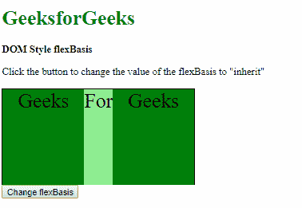

# HTML | DOM 样式灵活基础属性

> 原文:[https://www . geesforgeks . org/html-DOM-style-flex basis-property/](https://www.geeksforgeeks.org/html-dom-style-flexbasis-property/)

DOM Style **flexBasis** 属性用于**设置**或**返回**一个灵活项目的初始长度。
**注意:**如果元素不是柔性物品，这个属性就没有作用。

**语法:**

*   它返回弹性基属性:

    ```html
    object.style.flexBasis
    ```

*   用于设置弹性基础属性:

    ```html
    object.style.flexBasis = "number | auto | initial | inherit"
    ```

**返回值:**它返回一个字符串值，该值代表元素的弹性基属性。

**属性值:**

*   **数字:**这用于根据固定的长度单位或百分比来指定初始长度。
*   **自动:**用于根据柔性项的长度设置长度。但是，如果没有指定长度，长度将根据内容而定。这是默认值。
*   **初始值:**用于将该属性设置为默认值。
*   **继承:**这将从其父级继承属性。

**示例-1:** 使用数值。

```html
<!DOCTYPE html>
<html>

<head>
    <title>
        DOM Style flexBasis property
    </title>

    <style>
        .main {
            width: 300px;
            height: 150px;
            border: 1px solid;
            display: flex;
        }

        .main div {
            width: 250px;
            height: 150px;
            font-size: 2rem;
            text-align: center;
        }
    </style>
</head>

<body>
    <h1 style="color: green">
      GeeksforGeeks
  </h1>
    <b>DOM Style flexBasis</b>

    <p>
      Click the button to change the value
      of the flexBasis to "100px"
    </p>

    <div class="main">
        <div style="background-color:green;">
            Geeks</div>
        <div id="div1"
             style="background-color:lightgreen;">
            For</div>
        <div style="background-color:green;">
            Geeks</div>
    </div>

    <button onclick="changeFlexBasis()">
        Change flexBasis
    </button>

    <script>
        function changeFlexBasis() {
            document.querySelector(
                '#div1').style.flexBasis = "100px";
        }
    </script>

</body>

</html>
```

**输出:**

**点击按钮前:**


**点击按钮后:**


**示例-2:** 使用自动值。

```html
<!DOCTYPE html>
<html>
<head>
    <title>
        DOM Style flexBasis property
    </title>

    <style>
        .main {
            width: 300px;
            height: 150px;
            border: 1px solid;
            display: flex;
        }

        .main div {
            width: 250px;
            height: 150px;
            font-size: 2rem;
            text-align: center;
        }

        #div1 {
            flex-basis: 50px;
        }
    </style>
</head>

<body>
    <h1 style="color: green">
      GeeksforGeeks
  </h1>
    <b>DOM Style flexBasis</b>

    <p>
      Click the button to change the
      value of the flexBasis to "auto"
    </p>

    <div class="main">
        <div style="background-color:green;">
            Geeks</div>
        <div id="div1" 
             style="background-color:lightgreen;">
            For</div>
        <div style="background-color:green;">
            Geeks</div>
    </div>

    <button onclick="changeFlexBasis()">
        Change flexBasis
    </button>

    <script>
        function changeFlexBasis() {
            document.querySelector(
                '#div1').style.flexBasis = "auto";
        }
    </script>

</body>

</html>
```

**输出:**

**点击按钮前:**


**点击按钮后:**


**示例-3:** 使用初始值。

```html
<!DOCTYPE html>
<html>

<head>
    <title>
        DOM Style flexBasis property
    </title>

    <style>
        .main {
            width: 300px;
            height: 150px;
            border: 1px solid;
            display: flex;
        }

        .main div {
            width: 250px;
            height: 150px;
            font-size: 2rem;
            text-align: center;
        }

        #div1 {
            flex-basis: 50px;
        }
    </style>
</head>

<body>
    <h1 style="color: green">
      GeeksforGeeks
  </h1>
    <b>DOM Style flexBasis</b>

    <p>
      Click the button to change the 
      value of the flexBasis to "initial"
    </p>

    <div class="main">
        <div style="background-color:green;">
            Geeks</div>
        <div id="div1" style="background-color:lightgreen;">
            For</div>
        <div style="background-color:green;">
            Geeks</div>
    </div>

    <button onclick="changeFlexBasis()">
        Change flexBasis
    </button>

    <script>
        function changeFlexBasis() {
            document.querySelector(
                '#div1').style.flexBasis = "initial";
        }
    </script>

</body>

</html>
```

**输出:**

**点击按钮前:**


**点击按钮后:**


**示例-4:** 使用继承值。

```html
<!DOCTYPE html>
<html>

<head>
    <title>
        DOM Style flexBasis property
    </title>

    <style>
        #parent {
            flex-basis: 50%;
        }

        .main {
            width: 300px;
            height: 150px;
            border: 1px solid;
            display: flex;
        }

        .main div {
            width: 250px;
            height: 150px;
            font-size: 2rem;
            text-align: center;
        }

        #div1 {
            flex-basis: 50px;
        }
    </style>
</head>

<body>
    <h1 style="color: green">
      GeeksforGeeks
  </h1>
    <b>DOM Style flexBasis</b>

    <p>
      Click the button to change the value
      of the flexBasis to "inherit"
    </p>
    <div id="parent">
        <div class="main">
            <div style="background-color:green;">
                Geeks</div>
            <div id="div1" 
                 style="background-color:lightgreen;">
                For</div>
            <div style="background-color:green;">
                Geeks
            </div>
        </div>
    </div>
    <button onclick="changeFlexBasis()">
        Change flexBasis
    </button>

    <script>
        function changeFlexBasis() {
            document.querySelector(
                '#div1').style.flexBasis = "inherit";
        }
    </script>

</body>

</html>
```

**输出:**
**点击按钮前:**


**点击按钮后:**


**支持的浏览器:**以下列出了 *flexBasis* 属性支持的浏览器:

*   谷歌 Chrome
*   Internet Explorer 11.0
*   火狐浏览器
*   歌剧
*   苹果 Safari 6.1