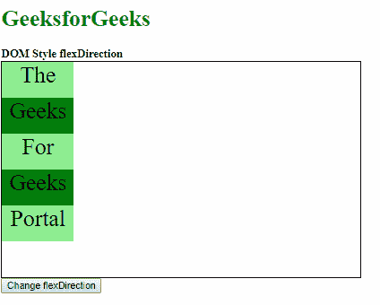
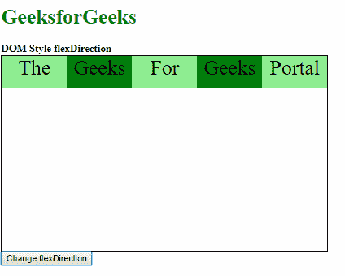
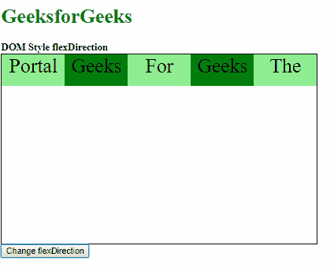
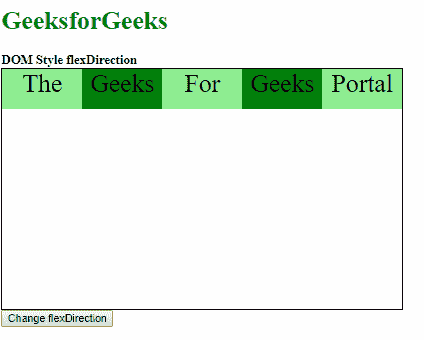
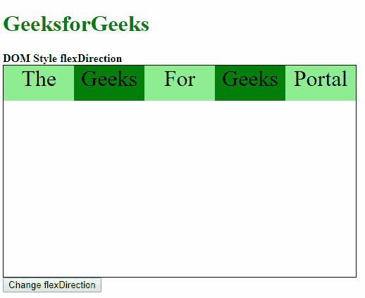
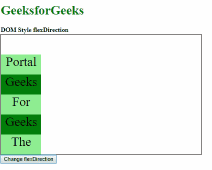

# HTML | DOM 样式 flexDirection 属性

> 原文:[https://www . geeksforgeeks . org/html-DOM-style-flex direction-property/](https://www.geeksforgeeks.org/html-dom-style-flexdirection-property/)

DOM Style **flexDirection** 属性用于**设置**或**返回**柔性项的主轴方向。

**语法:**

*   它返回弹性方向属性

    ```html
    object.style.flexDirection
    ```

*   用于设置弹性方向属性

    ```html
    object.style.flexDirection = "row | row-reverse | column | 
    column-reverse | initial | inherit"
    ```

**返回值:**返回一个字符串，代表元素的伸缩方向属性

**属性值:**

| 价值 | 描述 |
| 排 | 这用于将柔性项水平显示为一行。 |
| 行反转 | 这与一行相同，但顺序相反。 |
| 圆柱 | 这用于以列的形式垂直显示柔性项。 |
| 列反转 | 这与列相同，但顺序相反。 |
| 最初的 | 这用于将此属性设置为默认值。 |
| 继承 | 这将从其父级继承属性。 |

**示例-1:** 使用行值。

```html
<!DOCTYPE html>
<html>
<head>
    <title>
        DOM Style flexDirection property
    </title>
    <style>
        .main {
            width: 500px;
            height: 300px;
            border: 1px solid;
            display: flex;
            flex-direction: column;
        }

        .main div {
            width: 100px;
            height: 50px;
            font-size: 2rem;
            text-align: center;
        }
    </style>
</head>

<body>
    <h1 style="color: green">
      GeeksforGeeks
    </h1>
    <b>
      DOM Style flexDirection
    </b>

    <div class="main">
        <div style="background-color:lightgreen;">
          The
        </div>

        <div style="background-color:green;">
          Geeks
        </div>

        <div style="background-color:lightgreen;">
          For
        </div>

        <div style="background-color:green;">
          Geeks
        </div>

        <div style="background-color:lightgreen;">
          Portal
        </div>
    </div>

    <button onclick="changeFlexDirection()">
        Change flexDirection
    </button>

    <script>
        function changeFlexDirection() {
            document.querySelector(
                '.main').style.flexDirection = "row";
        }
    </script>

</body>

</html>
```

**输出:**

**点击按钮前:**


**点击按钮后:**


**示例-2:** 使用行反转值。

```html
<!DOCTYPE html>
<html>

<head>
    <title>
        DOM Style flexDirection property
    </title>

    <style>
        .main {
            width: 500px;
            height: 300px;
            border: 1px solid;
            display: flex;
            flex-direction: column;
        }

        .main div {
            width: 100px;
            height: 50px;
            font-size: 2rem;
            text-align: center;
        }
    </style>
</head>

<body>
    <h1 style="color: green">
      GeeksforGeeks
  </h1>
    <b>
      DOM Style flexDirection
  </b>

    <div class="main">
        <div style="background-color:lightgreen;">
          The
        </div>

        <div style="background-color:green;">
          Geeks
        </div>

        <div style="background-color:lightgreen;">
          For
        </div>

        <div style="background-color:green;">
          Geeks
        </div>

        <div style="background-color:lightgreen;">
          Portal
        </div>
    </div>

    <button onclick="changeFlexDirection()">
        Change flexDirection
    </button>

    <script>
        function changeFlexDirection() {
            document.querySelector(
                    '.main').style.flexDirection =
                "row-reverse";
        }
    </script>

</body>

</html>
```

**输出:**

**点击按钮前:**


**点击按钮后:**


**示例-3:** 使用列值。

```html
<!DOCTYPE html>
<html>

<head>
    <title>
        DOM Style flexDirection property
    </title>

    <style>
        .main {
            width: 500px;
            height: 300px;
            border: 1px solid;
            display: flex;
        }

        .main div {
            width: 100px;
            height: 50px;
            font-size: 2rem;
            text-align: center;
        }
    </style>
</head>

<body>
    <h1 style="color: green">GeeksforGeeks</h1>
    <b>DOM Style flexDirection</b>

    <div class="main">
        <div style="background-color:lightgreen;">
          The
        </div>

        <div style="background-color:green;">
          Geeks
        </div>

        <div style="background-color:lightgreen;">
          For
        </div>

        <div style="background-color:green;">
          Geeks
        </div>

        <div style="background-color:lightgreen;">
          Portal
        </div>
    </div>

    <button onclick="changeFlexDirection()">
        Change flexDirection
    </button>

    <script>
        function changeFlexDirection() {
            document.querySelector(
                '.main').style.flexDirection = "column";
        }
    </script>

</body>

</html>
```

**输出:**

**点击按钮前:**



**点击按钮后:**


**示例-4:** 使用列反转值。

```html
<!DOCTYPE html>
<html>

<head>
    <title>
        DOM Style flexDirection property
    </title>

    <style>
        .main {
            width: 500px;
            height: 300px;
            border: 1px solid;
            display: flex;
        }

        .main div {
            width: 100px;
            height: 50px;
            font-size: 2rem;
            text-align: center;
        }
    </style>
</head>

<body>
    <h1 style="color: green">
      GeeksforGeeks
  </h1>
    <b>
      DOM Style flexDirection
  </b>

    <div class="main">
        <div style="background-color:lightgreen;">
          The
        </div>

        <div style="background-color:green;">
          Geeks
        </div>

        <div style="background-color:lightgreen;">
          For
        </div>

        <div style="background-color:green;">
          Geeks
        </div>

        <div style="background-color:lightgreen;">
          Portal
        </div>
    </div>

    <button onclick="changeFlexDirection()">
        Change flexDirection
    </button>

    <script>
        function changeFlexDirection() {
            document.querySelector(
                    '.main').style.flexDirection =
                "column-reverse";
        }
    </script>

</body>

</html>
```

**输出:**

**点击按钮前:**



**点击按钮后:**



**示例-5:** 使用初始值。

```html
<!DOCTYPE html>
<html>

<head>
    <title>
        DOM Style flexDirection property
    </title>

    <style>
        .main {
            width: 500px;
            height: 300px;
            border: 1px solid;
            display: flex;
            flex-direction: column;
        }

        .main div {
            width: 100px;
            height: 50px;
            font-size: 2rem;
            text-align: center;
        }
    </style>
</head>

<body>
    <h1 style="color: green">
      GeeksforGeeks
  </h1>
    <b>
      DOM Style flexDirection
  </b>

    <div class="main">
        <div style="background-color:lightgreen;">
          The
        </div>

        <div style="background-color:green;">
          Geeks
        </div>

        <div style="background-color:lightgreen;">
          For
        </div>

        <div style="background-color:green;">
          Geeks
        </div>

        <div style="background-color:lightgreen;">
          Portal
        </div>
    </div>

    <button onclick="changeFlexDirection()">
        Change flexDirection
    </button>

    <script>
        function changeFlexDirection() {
            document.querySelector(
                    '.main').style.flexDirection =
                "initial";
        }
    </script>

</body>

</html>
```

**输出:**

**点击按钮前:**


**点击按钮后:**


**示例-6:** 使用继承值。

```html
<!DOCTYPE html>
<html>
<head>
<title>
  DOM Style flexDirection property
  </title>

    <style>
        #parent {
            flex-direction: column-reverse;
        }

        .main {
            width: 500px;
            height: 300px;
            border: 1px solid;
            display: flex;
        }

        .main div {
            width: 100px;
            height: 50px;
            font-size: 2rem;
            text-align: center;
        }
    </style>

</head>

<body>
    <h1 style="color: green">
      GeeksforGeeks
  </h1>
    <b>
      DOM Style flexDirection
  </b>
    <div id="parent">
        <div class="main">
            <div style=
                 "background-color:lightgreen;">The</div>

            <div style=
                 "background-color:green;">Geeks</div>

            <div style=
                 "background-color:lightgreen;">For</div>

            <div style=
                 "background-color:green;">Geeks</div>

            <div style=
                 "background-color:lightgreen;">Portal</div>

        </div>
    </div>
    <button onclick="changeFlexDirection()">
      Change flexDirection
  </button>

    <script>
        function changeFlexDirection() {
            document.querySelector(
              '.main').style.flexDirection =
              "inherit";
        }
    </script>

</body>

</html>
```

**输出:**

**点击按钮前:**


**点击按钮后:**


**支持的浏览器:**以下列出了 *flexDirection* 属性支持的浏览器:

*   谷歌 Chrome
*   Internet Explorer 11.0
*   火狐浏览器
*   歌剧
*   苹果 Safari 6.1