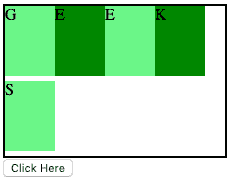
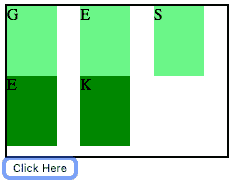
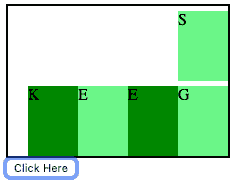
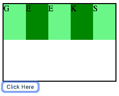

# HTML | DOM 样式 flexFlow 属性

> 原文:[https://www . geesforgeks . org/html-DOM-style-flex flow-property/](https://www.geeksforgeeks.org/html-dom-style-flexflow-property/)

HTML DOM 中的**样式 flexFlow 属性**用于指定 flexDirection 属性和 flexWrap 属性两个不同属性的值。flexDirection 属性用于指定弹性项的方向，flexWrap 属性用于指定弹性项是否应该换行。

**语法:**

*   它返回表示元素的 flexFlow 属性的字符串。

    ```html
    object.style.flexFlow
    ```

*   它用于设置 flexFlow 属性值。

    ```html
    object.style.flexFlow = "flex-direction flex-wrap|initial|
    inherit"
    ```

**返回值:**它返回一个字符串，代表一个元素的伸缩流属性

**属性值:**

*   **flex-direction flex-wrap:** The flewFlow property is the combination of flexDirection and flexWrap property. The default value of flex-direction flex-wrap is row nowrap. Following are the list of possible values of flexDirection and flexWrap properties.

    ```html
    flex-direction = "row |row-reverse |column |column-reverse |
    initial |inherit";
    ```

    ```html
    flex-wrap = "nowrap |wrap |wrap-reverse |initial |inherit";
    ```

    **示例 1:** 它将 flexFlow 属性值从“行换行”更改为“列换行”。

    ```html
    <!DOCTYPE html>
    <html>

    <head>
        <title>
            HTML DOM Style flexFlow Property
        </title>

        <style> 
            #GFG {
                width: 220px;
                height: 150px;
                border: 2px solid black;

                 /* For Safari browsers */
                display: -webkit-flex;

                 /* For Safari 6.1+ browsers  */
                -webkit-flex-flow: row wrap;
                display: flex;
                flex-flow: row wrap;
            }
            #GFG div {
                width: 50px;
                height: 70px;
            }
        </style>
    </head>

    <body>
        <div id="GFG">
            <div style="background-color:lightgreen;">G</div>
            <div style="background-color:green;">E</div>
            <div style="background-color:lightgreen;">E</div>
            <div style="background-color:green;">K</div>
            <div style="background-color:lightgreen;">S</div>
        </div>

        <button onclick="myGeek()">
            Click Here
        </button>

        <script>
            function myGeek() {

                /* For Safari Browsers */
                document.getElementById("GFG").style.WebkitFlexFlow
                        = "column wrap";

                document.getElementById("GFG").style.FlexFlow
                        = "column wrap";
            }
        </script>
    </body>

    </html>                    
    ```

    **输出:**
    **之前点击按钮:**
    
    **之后点击按钮:**
    

*   **Example 2:** It changes the flexFlow property value from “row wrap” to “row-reverse wrap-reverse”.

    ```html
    <!DOCTYPE html>
    <html>

    <head>
        <title>
            HTML DOM Style flexFlow Property
        </title>

        <style> 
            #GFG {
                width: 220px;
                height: 150px;
                border: 2px solid black;

                 /* For Safari browsers */
                display: -webkit-flex;

                 /* For Safari 6.1+ browsers  */
                -webkit-flex-flow: row wrap;
                display: flex;
                flex-flow: row wrap;
            }
            #GFG div {
                width: 50px;
                height: 70px;
            }
        </style>
    </head>

    <body>
        <div id="GFG">
            <div style="background-color:lightgreen;">G</div>
            <div style="background-color:green;">E</div>
            <div style="background-color:lightgreen;">E</div>
            <div style="background-color:green;">K</div>
            <div style="background-color:lightgreen;">S</div>
        </div>

        <button onclick="myGeek()">
            Click Here
        </button>

        <script>
            function myGeek() {

                /* For Safari Browsers */
                document.getElementById("GFG").style.WebkitFlexFlow
                        = "row-reverse wrap-reverse";

                document.getElementById("GFG").style.FlexFlow
                        = "row-reverse wrap-reverse";
            }
        </script>
    </body>

    </html>                    
    ```

    **输出:**
    **之前点击按钮:**
    
    **之后点击按钮:**
    

*   **initial:** It set the flexFlow property to its default value.
    **Example 3:**

    ```html
    <!DOCTYPE html>
    <html>

    <head>
        <title>
            HTML DOM Style flexFlow Property
        </title>

        <style> 
            #GFG {
                width: 220px;
                height: 150px;
                border: 2px solid black;

                 /* For Safari browsers */
                display: -webkit-flex;

                 /* For Safari 6.1+ browsers  */
                -webkit-flex-flow: row wrap;
                display: flex;
                flex-flow: row wrap;
            }
            #GFG div {
                width: 50px;
                height: 70px;
            }
        </style>
    </head>

    <body>
        <div id="GFG">
            <div style="background-color:lightgreen;">G</div>
            <div style="background-color:green;">E</div>
            <div style="background-color:lightgreen;">E</div>
            <div style="background-color:green;">K</div>
            <div style="background-color:lightgreen;">S</div>
        </div>

        <button onclick="myGeek()">
            Click Here
        </button>

        <script>
            function myGeek() {

                /* For Safari Browsers */
                document.getElementById("GFG").style.WebkitFlexFlow
                        = "initial";

                document.getElementById("GFG").style.FlexFlow
                        = "initial";
            }
        </script>
    </body>

    </html>                    
    ```

    **输出:**
    **之前点击按钮:**
    
    **之后点击按钮:**
    

*   **inherit:** It inherits the property from its parent element.

    **例 4:**

    ```html
    <!DOCTYPE html>
    <html>

    <head>
        <title>
            HTML DOM Style flexFlow Property
        </title>

        <style> 
            #GFG {
                width: 220px;
                height: 150px;
                border: 2px solid black;

                 /* For Safari browsers */
                display: -webkit-flex;

                 /* For Safari 6.1+ browsers  */
                -webkit-flex-flow: row wrap;
                display: flex;
                flex-flow: row wrap;
            }
            #GFG div {
                width: 50px;
                height: 70px;
            }
        </style>
    </head>

    <body>
        <div id="GFG">
            <div style="background-color:lightgreen;">G</div>
            <div style="background-color:green;">E</div>
            <div style="background-color:lightgreen;">E</div>
            <div style="background-color:green;">K</div>
            <div style="background-color:lightgreen;">S</div>
        </div>

        <button onclick="myGeek()">
            Click Here
        </button>

        <script>
            function myGeek() {

                /* For Safari Browsers */
                document.getElementById("GFG").style.WebkitFlexFlow
                        = "inherit";

                document.getElementById("GFG").style.FlexFlow
                        = "inherit";
            }
        </script>
    </body>

    </html>                    
    ```

    **输出:**
    **之前点击按钮:**
    
    **之后点击按钮:**
    

**支持的浏览器:***DOM Style flexFlow 属性*支持的浏览器如下:

*   谷歌 Chrome
*   Internet Explorer 11.0
*   火狐浏览器
*   歌剧
*   safari 6.1 webkitflexlow